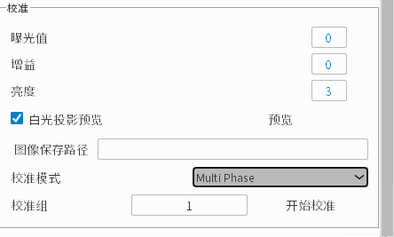
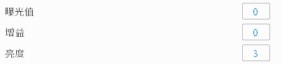
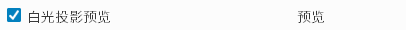
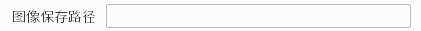
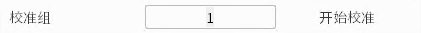

.. 中文only

.. _校准模式:

校准模式
========

在"帮助"->"系统"界面启用校准模式后, 会显示以下的界面, 并提供相机校准数据的收集功能。

|

曝光值, 亮度, 和增益参数与 :ref:`帧值参数` 同理。

|

可以勾选白光投影预览, 并点击右边的"预览"按钮来预览图片。

|

过曝区域会以红色标识出来, 可以根据预览功能调整合适的亮度, 曝光和增益参数避免过曝的情况。

.. figure:: images/preview_2.png
   :align: center

|

点击"图像保存路径"选择校准图片保存的位置。

|

校准模式请选择"Multi Phase"模式。

.. figure:: images/cali_mode.png
   :align: center

|

点击右边的"开始校准"进行校准图片的拍摄, 然后会在上面选择的路径下生成一个Group_<校准组>文件夹并保存图片。
校准组会在点击开始校准后自动增量1, 也可以手动更改。

.. Warning::
    当路径下已有Group_1文件夹时, 手动更改校准组为1会覆盖里面的内容。

|
