Dealing With HightLights and Shiny Objects
===============================================

.. contents::
    :local:

Introduction
----------------

This article will discuss the specific challenge of dealing with highlights that may occur when capturing point clouds 
of very shiny objects and how to deal with it. 

In the presence of a shiny object, there is a chance that certain regions of that object cause a direct reflection from 
the DaoAI camera’s projector to the imaging sensor. If this object is extremely specular, then the amount of reflected 
light can be thousands of times stronger than other light sources in the image. This is then likely to cause the pixel 
to become oversaturated. An example of such regions can be seen in the images below.

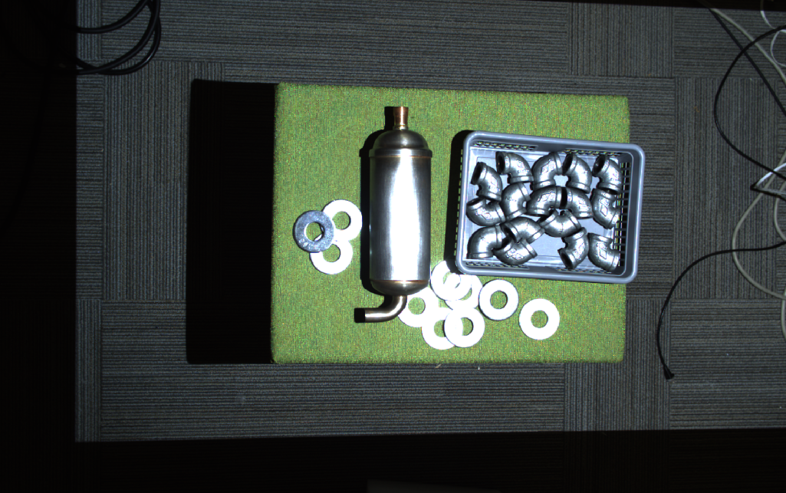

|

Oversaturated pixels often “bleed” light onto their surrounding pixels. This lens blurring causes results in a 
Contrast Distortion Artifact. This effect is evident on black to white transitions and shiny cylinders; see the image below.

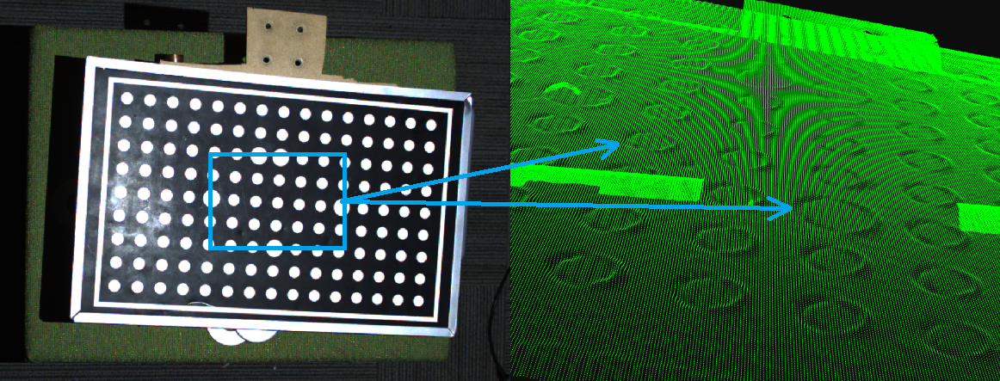

|

Check if the projector causes the highlight
------------------------------------------------

Some simple methods can be applied to determine if a highlight is caused by the DaoAI projector, as exemplified in the image above.

1. Study the 2D image and consider the different angles in the surfaces where highlights occur. This method requires some practice.

2. Perform a differential measurement by taking an additional image. Try to kill the projector light by setting projector brightness to 0, or cover the projector lens with, e.g., your hand and capture a second image. If the highlights disappear in the second image, you can conclude that the source is from the projector.

Maximize the dynamic range of the 3D sensor to capture highlights
-----------------------------------------------------------------------

Getting good point clouds of shiny objects requires that you can capture both highlights and lowlights. 
The DaoAI 3D camera has a wide dynamic range, making it possible to take images of both dark and bright objects.

Very challenging scenes (as the one below) typically require 3 HDR acquisition frames or more. Challenging scenes should typically have:

- 1-2 acquisition frames to cover the strongest highlights (very low exposure).

- 1-2 acquisition frames to cover most of the scene (medium exposure).

- 1-2 acquisition frames to cover the darkest regions (very high exposure).

The following two principles should be applied:

1. Keep the exposure very low.

2. It may be necessary to reduce the projector brightness to keep the projected pattern amplitude within the imaging sensor’s dynamic range.

In principle, what we are trying to achieve, by limiting projector brightness, is to bring the signal back, from the over-saturated region, 
to the healthy region. This is illustrated in the figure below.

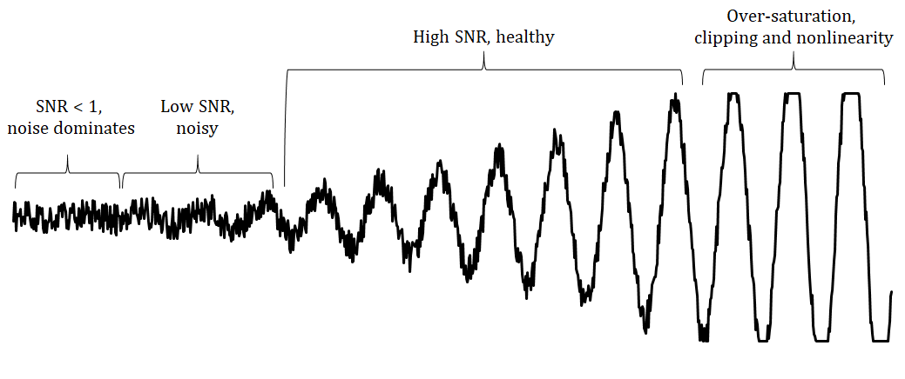

|

We will now focus on capturing the highlights. We assume that we have identified extreme highlights in our scene by 
using the method described above.

Let us assume the scene below.

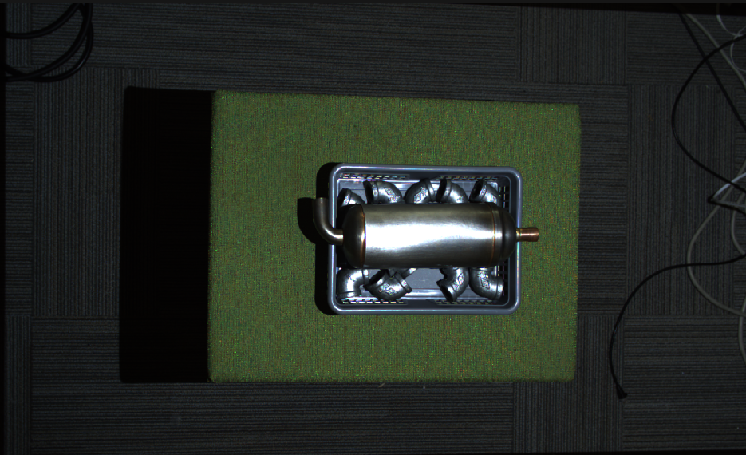

|

We can clearly see strong highlights in the scene.

Highlight Frames
~~~~~~~~~~~~~~~~~

First we begin by adjusting 1-2 acquisition frame settings to best capture the highlight area of the object. 
In this case, we want to minimize the amount of projector light that shines on the object.

We begin with a single acquisition frame of lowest brightness settings. 

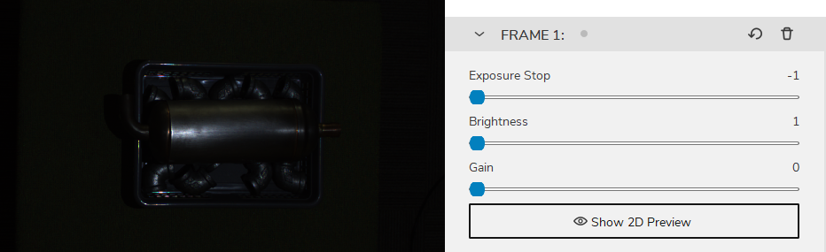

|

Then gradually increase the brightness until the highlight area of the object is best captured and without introducing missing pointcloud and contrast distortion artifacts

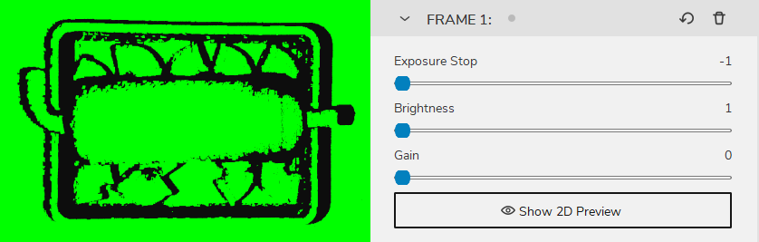

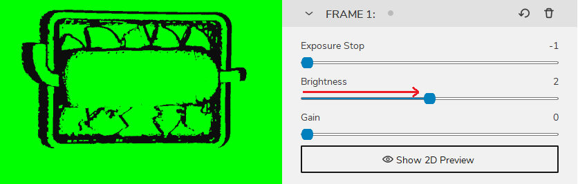

|

And this will be our highlight frame. Note down this frame settings and delete it for now, and we begin to find our main frame.

Main Frames
~~~~~~~~~~~~~~~

Next we use 1-2 acquisition frames to best capture the main areas of the object. So that every detail of the object, apart from the highlight area can be best captured.

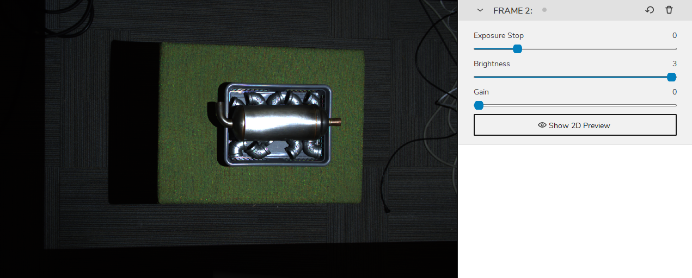

|

And this will be our main frame. Note down this frame settings and delete it for now, and we begin to find our background frame.

Background frames
~~~~~~~~~~~~~~~~~~~~

Then we can add a acquisition frame to cover the rest of the scene and the background.

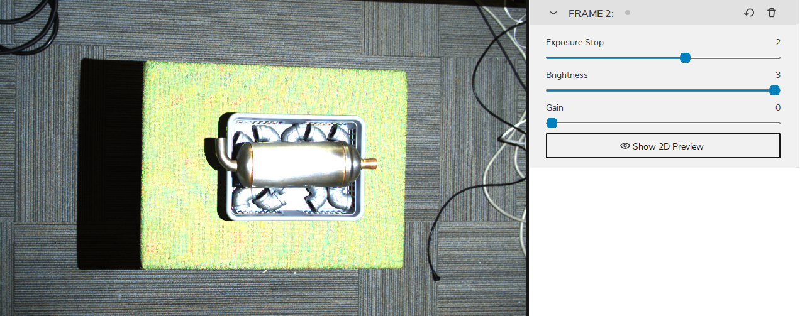

|

Then finally, we add back our highlight frame and main frame, and enable HDR mode.

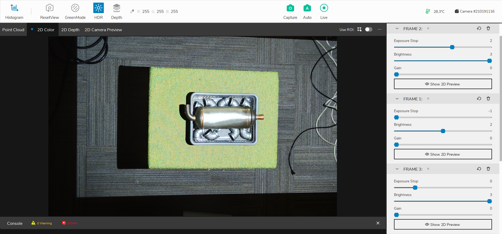

|

and the point cloud is as the following

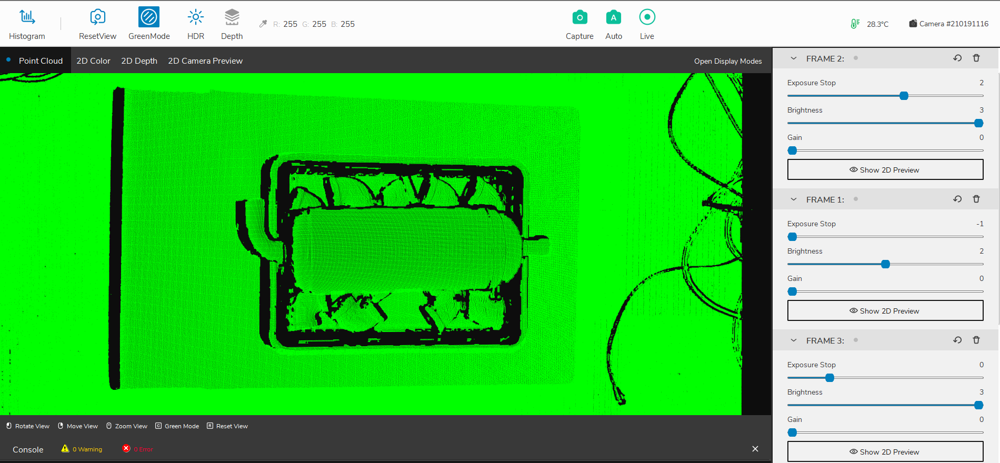

|

Deal with the contrast distortion
-------------------------------------

There are mainly two ways to deal with Contrast Distortion. We can reduce the effect by maximizing the dynamic range of our camera 
and place the camera in strategic areas. Then we can use the Contrast Distortion Filter to correct/remove the remaining points that are affected.

Rotate and align objects in the scene
~~~~~~~~~~~~~~~~~~~~~~~~~~~~~~~~~~~~~~~~

The first thing to remember is that this is an effect that occurs in the 3D sensor’s x-axis. 
The Contrast distortion effect can be greatly mitigated if your application allows for rotating 
troublesome regions in the camera’s y-axis to its x-axis. By rotating, for instance, a shiny 
cylinder 90°, the overexposed region along the cylinder follows the camera’s baseline, as illustrated in the figure below.

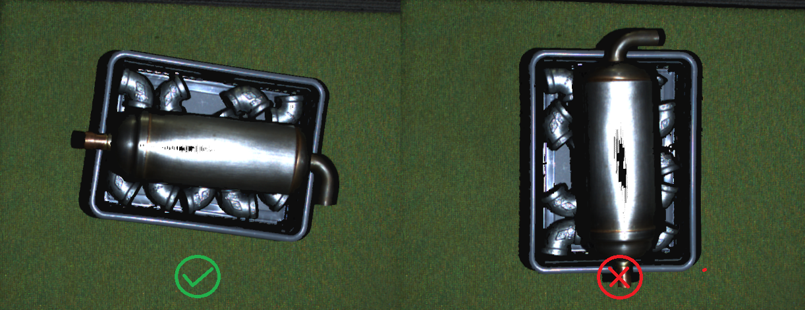

|

Match the background’s reflectivity to the specific object’s reflectivity
~~~~~~~~~~~~~~~~~~~~~~~~~~~~~~~~~~~~~~~~~~~~~~~~~~~~~~~~~~~~~~~~~~~~~~~~~~~~

A good rule of thumb is to try to use similar brightness or color for the background of the scene as the objects that you’re imaging:

- For a bright object, use a bright background (ideally white Lambertian).

- For a dark object, use a dark background (e.g., black rubber as used by most conveyor belts).

- For most colored, non-glossy objects, use a background of similar reflectivity (e.g., for bananas, use a grey or yellow background).

- For shiny metallic objects, especially cylindrical, conical and spherical objects, use a dark absorptive background such as black rubber. This is because the target light is typically reflected away from the object near its visible edges, making them appear very dark (see image below). At the same time, light from surrounding regions may be reflected onto the cylinder edge.

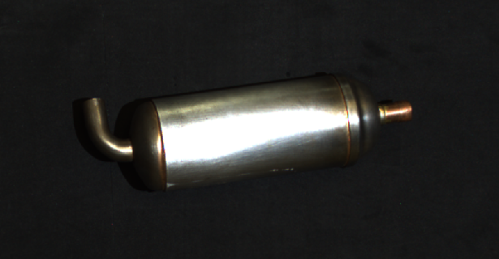

|

Use Contrast Distortion filter
~~~~~~~~~~~~~~~~~~~~~~~~~~~~~~~~~~

The filter corrects and/or removes these surface elevation artifacts caused by Contrast Distortion - 
defocusing and blur in high contrast regions. This results in a more realistic geometry of objects, 
specifically observable on planes and cylinders. 

If you want to learn more about this filer and tune its parameters, check out the :ref:`Contrast Distortion Filter`.

