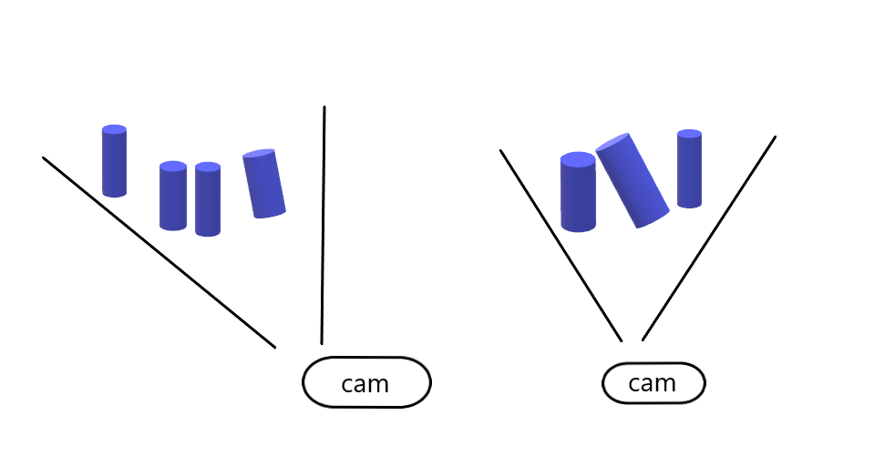

Working Distance and Camera Positioning
================================================

.. contents:: 
   :local:

Introduction
-----------------------------------

In this tutorial, we will learn how to go about positioning the camera correctly for a given application. We will cover different considerations such as Field-of-View (FOV), working distance, and image blooming.

Find the right working distance
-----------------------------------

In many applications the camera will be stationary mounted to capture point clouds with a constant FOV. In other applications the camera may be mounted on the robot arm. Robot mounted camera gives a lot more freedom as to how the camera can be positioned to capture good point clouds. In both alternatives, the camera still needs to be positioned such that it is optically optimized for the given scene.

When finding the correct working distance, there are a few things to take into consideration:

    1.What is the area or volume that the camera needs to see?

    2.What is the required spatial resolution and precision in the working area or volume?

    3.Is the given field of view within the working range of the DaoAI camera?

Once we know what region we want to image, we can check if it satisfies the recommended working distance of the camera and the requirements for our algorithm by:

- Using our :ref:`Calculator`. 
- Check the pages :ref:`Working Distance and Field-of-View`. The page will estimate the relationship between camera distance to the scene, FOV, spatial resolution and precision.
- Using the datasheets.
- Manual validation by capturing and inspecting a point cloud using e.g. DaoAI Camera Studio.

.. note::
    In the datasheet and the FOV pages we can find information about DaoAI camera point precision and spatial resolution as functions of the working distance.

.. warning::
    Be aware that the noise is proportional to the working distance, and that the spatial resolution is inversely proportional to the working distance.

We may proceed if all requirements for working distance, FOV, resolution and precision can be satisfied with a single camera position. If not, we need to consider using robot mounting, multiple cameras and so on. In that case we recommend that you contact support@daoai.com and we will help you find a solution.

Angle the camera
-------------------------------
The imaging sensor inside DaoAI cameras is offset at a slight pan angle in the azimuth direction (y-axis). This should be considered if it is desired to have the camera perpendicular to the scene.

.. tabs::

   .. group-tab:: BP SAMLL

    .. image:: images/small.png
        :align: center

   .. group-tab:: BP MEDIUM

    .. image:: images/medium.png
        :align: center

   .. group-tab:: BP LARGE

    .. image:: images/large.png
        :align: center

   
   .. group-tab:: BP AMR

    .. image:: images/amr.png
        :align: center
   

   .. group-tab:: BP AMR-GPU

    .. image:: images/amr.png
        :align: center
   

Although it is perhaps most intuitive to mount the camera perpendicular to a scene, this is not the best way. If possible, mount the camera at a slight tilt angle to avoid reflections from the background, as explained in Blooming - Bright Spots in the Point Cloud. This also frees up space above the scene for easier access for tools and robots. Check out available DaoAI :ref:`Mounting`.

.. tabs::

   .. group-tab:: BP SAMLL

    .. image:: images/large_1.png
        :align: center

   .. group-tab:: BP MEDIUM

    .. image:: images/amr_1.png
        :align: center

   .. group-tab:: BP LARGE

    .. image:: images/large_1.png
        :align: center
   
   .. group-tab:: BP AMR

    .. image:: images/amr_1.png
        :align: center
      
   .. group-tab:: BP AMR-GPU

    .. image:: images/amr_1.png
        :align: center

.. note::
    Camera tilting is more important if the scene contains specular surfaces.

In bin-picking applications
^^^^^^^^^^^^^^^^^^^^^^^^^^^^^

For bin-picking applications, place the DaoAI BP camera projector above the back edge or above the rear corner of the bin (see images below). Pan and tilt it so that the 2D camera is looking at the center of the bin. The projector rays should not fall on the inner surfaces of the two walls closest to the projector; they should almost be parallel to those two walls. Mounting the camera this way minimizes inter reflections from the bin walls.

Find the required depth of focus
-----------------------------------
DaoAI cameras are very robust against defocus, but to maximize the precision of the point cloud, the depth of focus should be taken into consideration. This step is only required if the algorithm that will work on the point cloud requires it in order to be successful.

Alternatively use the Depth of Focus :ref:`Calculator` by selecting the camera model and inputting the closest and farthest working distance. 