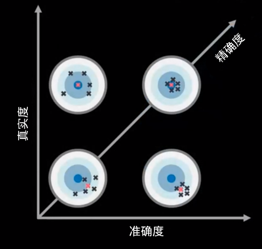
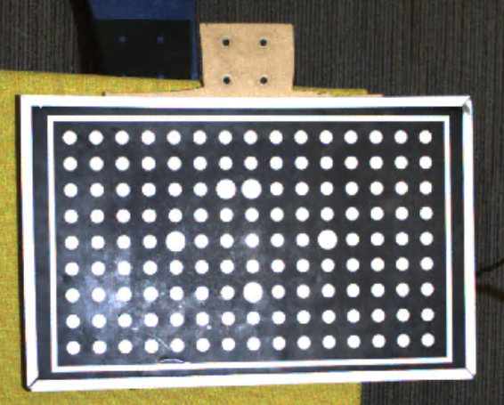
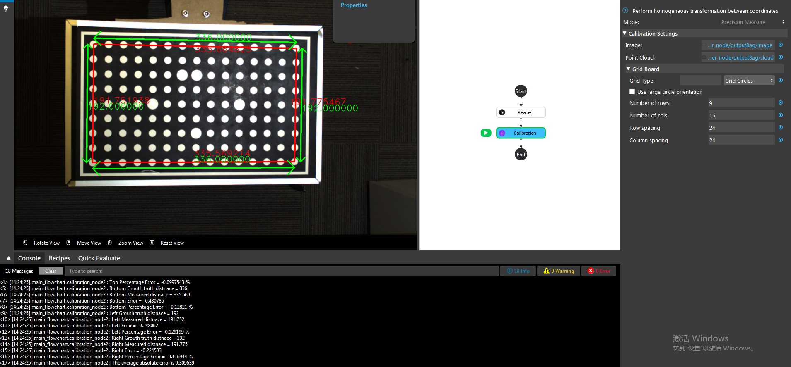

评估准确度
=====================

.. contents:: 
   :local:

相机精度
-------------------

摄像机 **精度** 是对摄像机 **真实性** 和摄像机 **预视性** 的综合衡量。

高的相机精度代表相机的真实性和相机的预知性都很高：捕获的图像/点云是高质量的，低噪音的，反映在相机中的物体位置与物体在空间的实际位置相同。

在口头交流中，摄像机的 **准确度** 通常指的是摄像机的 **真实性**。

相机的真实性
--------------------

.. image:: ./images/trueness_2.png
    :scale: 45%
.. image:: ./images/trueness_1.png
    :scale: 45%

摄像机真实性反映了物体在空间的位置和摄像机捕捉到的位置之间的误差。
摄像机真实性决定了拣选过程是否能在视场内的所有位置和时间成功地拣选物体。

摄像机的真实性在摄像机的对焦点处最高，随着物体远离对焦点而逐渐降低。
物体在摄像机视场边缘的位置的误差高于摄像机焦点的误差。

这种误差的增加适用于所有的轴：X、Y和Z轴，而X、Y轴的影响略小于Z轴（X和Y轴的误差<0.1%），而Z轴的影响略大（Z轴的误差<0.2%）。
相对于z轴的影响稍小（x和y轴误差<0.1%），而z轴的影响稍大（z轴误差<0.2%）。

相机的精度受以下因素影响：

    - 三维相机的硬件和光学质量
    - 相机校准的质量
    - 校准视场中物体的位置
    - 相机温度
    - 相机老化
    - 物理冲击、振动和压力

摄像机预热
--------------------

准确度反映了捕获的图像或点云的质量。
如果捕获的数据中存在噪音，点云是否因高反射面而损失。

高精度的点云通常具有以下特点。

    - 密集的点云，可以捕捉到细节：
        - 高分辨率
        - 低噪音
        - 耐环境光照
        - 低遮挡性
        - 高动态范围
    - 低的点云误差，通常由以下因素引起：
        - 物体之间的反射
        - 物体的表面高光
        - 高对比度区域
        - 物体的边缘

DaoAI相机的精确度
----------------------

DaoAI相机提供0.2%的精度。
其中X、Y轴精度<0.1%，Z轴偏移精度误差<0.2%。
这意味着，在不考虑其他因素的情况下，在100毫米的捕捉距离，相机的精度误差最多为0.2毫米。
同样地，在1000毫米的拍摄距离上，相机的精度误差将最多为2毫米。

如何验证相机的真实性
---------------------------------

摄像机的真实性可能会受到物理冲击、温度和使用时间的影响。
因此，验证你的相机的真实性对于获得成功的采摘是很重要的。
当相机的真实性大于可接受的范围（< 0.2%），那么相机将需要再次校准。

回顾一下，相机的真实性是指捕获的物体位置和实际物体位置的误差。

为了验证这个误差，我们可以使用一个已知大小的物体，例如校准板：两个圆圈之间的距离是已知的。
我们可以将摄像机拍摄的距离与我们知道的实际距离进行比较。

例如，校准板上有15个圆圈，每一个圆圈与另一个圆圈的距离是24毫米，也就是说，这一行的距离应该是336。
假设这个距离在相机中测量为335，那么相机的真实性可以计算为（336.5-335）/336 * 100% = 0.15%。

如果你安装了 DaoAI Vision Studio，你可以使用校准节点的预视测量模式来验证摄像机的真实性。

