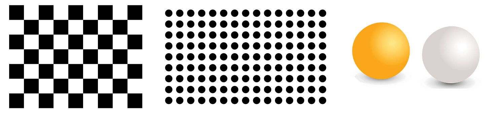
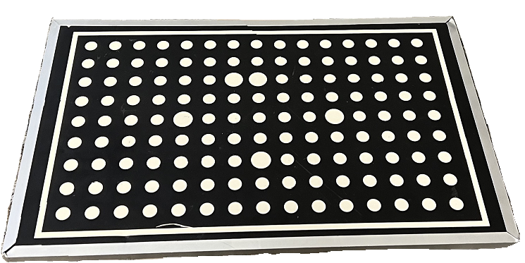
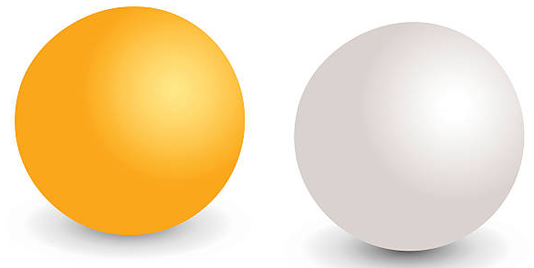

Calibration Object
============================
The hand-eye calibration process requires using an object of known geometry that can be detected and localized from the camera image. 2D patterns are most commonly used as calibration objects. OpenCV libraries use a checkerboard, while HALCON software uses a dot pattern. Having a 3D camera enables using a 3D calibration object; an example is spheres.

DaoAI uses a circleboard for the hand-eye calibration. The main DaoAI calibration objects can be found on DaoAI product box . These boards are also used for camera maintenance with infield correction. Each of these circleboards has a 9x15 checkerboard made of 24 mm checkers and a fiducial marker in the center. For these boards to be used in hand-eye calibration, both the circleboard and fiducial marker need to be detectable in each capture.

If the DaoAI calibration object is unavailable, DaoAI hand-eye calibration will also function, it is possible to buy some spherical objects, such as ping pong balls, by the way , the mesh model of the spheres need to be prepared, and the size of the mesh object must be the same as the purchased object. 

Continue reading about :ref:`How To Get Good Quality Data On DaoAI Calibration Board` .