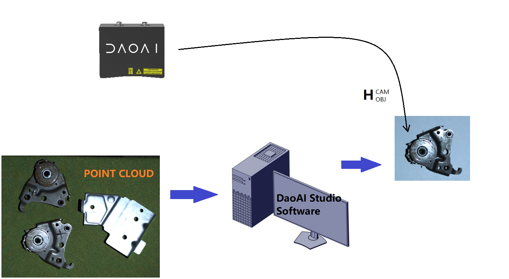

Hand-Eye Calibration Problem
===============================
This tutorial aims to describe the problem that the hand-eye calibration solves as well as to introduce robot poses and coordinate systems that are required for the hand-eye calibration. The problem is the same for eye-to-hand systems and eye-in-hand systems. Therefore, we first provide a detailed description for the eye-to-hand configuration. Then, we point out the differences for the eye-in-hand configuration. 

Eye-to-hand
-----------------------------
How can a robot pick an object?

.. list-table:: 
   :widths: 20 20

   * - Let’s start with a robot that doesn’t involve a camera. 
   
       Its two main coordinate systems are:

       1. The robot base coordinate system

       2. The end-effector coordinate system

     - .. image:: images/tohand.png
          :scale: 40%

   * - To be able to pick an object, the robot controller needs to 
   
       know the object’s pose (position and orientation) relative 
       
       to the robot base frame. It also requires knowledge about 
       
       the robot’s geometry. This combined information is 
       
       sufficient to compute the joint angles that will move the 
       
       end-effector/gripper towards the object.
     
     - .. image:: images/tohand1.png
          :scale: 40%

   * - Now, let’s assume that the pose of the object relative to 
   
       the robot is unknown. That’s where DaoAI 3D vision comes 
       
       into play.

     - .. image:: images/tohand2.png
          :scale: 40%

DaoAI point clouds are given relative to the DaoAI camera’s coordinate system. The origin in this coordinate system is fixed at the middle of the DaoAI imager lens (internal 2D camera). A machine vision software can run detection and localization algorithms on this collection of data points. It can determine the pose of the object in DaoAI camera’s coordinate system (|1|).
 

.. list-table:: 
   :widths: 20 20

   * - DaoAI camera can now see the object in its field of view, 
   
       but relative to its own coordinate system. To enable the 
       
       robot to pick the object it is necessary to transform the 
       
       object’s coordinates from the camera coordinate system 
       
       to the robot base coordinate system.

     - .. image:: images/tohand3.png
          :scale: 40%

   * - The coordinate transformation that enables this is the 
   
       result of hand-eye calibration. For eye-to-hand systems, it 
       
       is the pose of the camera relative to the robot’s base ( |2|

       ) that is estimated with the hand-eye calibration.
       
       Once the pose circle is closed, it is possible to calculate 
       
       one pose from the other poses in the circle. In this case, 
       
       the pose of the object relative to the robot. This is found 
       
       by post-multiplying the pose of the camera relative to the 
       
       robot, with the pose of the object relative to the camera: 
      
       |3|

     - .. image:: images/tohand4.png
          :scale: 40%
    
Eye-in-hand
--------------------------
How can a robot pick an object?

.. list-table:: 
   :widths: 20 20

    
   * - DaoAI camera can now see the object in its field of view, 
   
       but relative to its own coordinate system. To enable the 
       
       robot to pick the object it is necessary to transform the 
       
       object’s coordinates from the camera coordinate system 
       
       to the robot base coordinate system.

    
     - .. image:: images/inhand.png
          :scale: 40%

   * - In this case, the transformation is done indirectly: |4|

       The pose of the end-effector relative to the base of the 
       
       robot (|5|) is known, and is provided by the robot 
       
       controller. The pose of the camera relative to the end-
       
       effector (|6|), which is in this case constant, is 
       
       estimated from the hand-eye calibration.

     - .. image:: images/inhand1.png
          :scale: 40%

Now that we’ve defined the hand-eye calibration problem, let’s see :ref:`Hand-Eye Calibration Solution`.

.. |1| raw:: html

    <math xmlns="http://www.w3.org/1998/Math/MathML">
      <msubsup>
        <mi><b>H</b></mi>
        <mrow data-mjx-texclass="ORD">
          <mi><b>O</b></mi>
          <mi><b>B</b></mi>
          <mi><b>J</b></mi>
        </mrow>
        <mrow data-mjx-texclass="ORD">
          <mi><b>C</b></mi>
          <mi><b>A</b></mi>
          <mi><b>M</b></mi>
        </mrow>
      </msubsup>
    </math>

.. |2| raw:: html

    <math xmlns="http://www.w3.org/1998/Math/MathML">
      <msubsup>
        <mi><b>H</b></mi>
        <mrow data-mjx-texclass="ORD">
          <mi><b>C</b></mi>
          <mi><b>A</b></mi>
          <mi><b>M</b></mi>
        </mrow>
        <mrow data-mjx-texclass="ORD">
          <mi><b>R</b></mi>
          <mi><b>O</b></mi>
          <mi><b>B</b></mi>
        </mrow>
      </msubsup>
    </math>

.. |3| raw:: html

    <math xmlns="http://www.w3.org/1998/Math/MathML" display="block">
      <msubsup>
        <mi><b>H</b></mi>
        <mrow data-mjx-texclass="ORD">
          <mi><b>O</b></mi>
          <mi><b>B</b></mi>
          <mi><b>J</b></mi>
        </mrow>
        <mrow data-mjx-texclass="ORD">
          <mi><b>R</b></mi>
          <mi><b>O</b></mi>
          <mi><b>B</b></mi>
        </mrow>
      </msubsup>
      <mo>=</mo>
      <msubsup>
        <mi><b>H</b></mi>
        <mrow data-mjx-texclass="ORD">
          <mi><b>C</b></mi>
          <mi><b>A</b></mi>
          <mi><b>M</b></mi>
        </mrow>
        <mrow data-mjx-texclass="ORD">
          <mi><b>R</b></mi>
          <mi><b>O</b></mi>
          <mi><b>B</b></mi>
        </mrow>
      </msubsup>
      <mo>&#x22C5;</mo>
      <msubsup>
        <mi><b>H</b></mi>
        <mrow data-mjx-texclass="ORD">
          <mi><b>O</b></mi>
          <mi><b>B</b></mi>
          <mi><b>J</b></mi>
        </mrow>
        <mrow data-mjx-texclass="ORD">
          <mi><b>C</b></mi>
          <mi><b>A</b></mi>
          <mi><b>M</b></mi>
        </mrow>
      </msubsup>
    </math>

.. |4| raw:: html

    <math xmlns="http://www.w3.org/1998/Math/MathML" display="block">
      <msubsup>
        <mi><b>H</b></mi>
        <mrow data-mjx-texclass="ORD">
          <mi><b>O</b></mi>
          <mi><b>B</b></mi>
          <mi><b>J</b></mi>
        </mrow>
        <mrow data-mjx-texclass="ORD">
          <mi><b>R</b></mi>
          <mi><b>O</b></mi>
          <mi><b>B</b></mi>
        </mrow>
      </msubsup>
      <mo>=</mo>
      <msubsup>
        <mi><b>H</b></mi>
        <mrow data-mjx-texclass="ORD">
          <mi><b>E</b></mi>
          <mi><b>E</b></mi>
        </mrow>
        <mrow data-mjx-texclass="ORD">
          <mi><b>R</b></mi>
          <mi><b>O</b></mi>
          <mi><b>B</b></mi>
        </mrow>
      </msubsup>
      <mo>&#x22C5;</mo>
      <msubsup>
        <mi><b>H</b></mi>
        <mrow data-mjx-texclass="ORD">
          <mi><b>C</b></mi>
          <mi><b>A</b></mi>
          <mi><b>M</b></mi>
        </mrow>
        <mrow data-mjx-texclass="ORD">
          <mi><b>E</b></mi>
          <mi><b>E</b></mi>
        </mrow>
      </msubsup>
      <mo>&#x22C5;</mo>
      <msubsup>
        <mi><b>H</b></mi>
        <mrow data-mjx-texclass="ORD">
          <mi><b>O</b></mi>
          <mi><b>B</b></mi>
          <mi><b>J</b></mi>
        </mrow>
        <mrow data-mjx-texclass="ORD">
          <mi><b>C</b></mi>
          <mi><b>A</b></mi>
          <mi><b>M</b></mi>
        </mrow>
      </msubsup>
    </math>

.. |6| raw:: html

    <math xmlns="http://www.w3.org/1998/Math/MathML">
      <msubsup>
        <mi><b>H</b></mi>
        <mrow data-mjx-texclass="ORD">
          <mi><b>C</b></mi>
          <mi><b>A</b></mi>
          <mi><b>M</b></mi>
        </mrow>
        <mrow data-mjx-texclass="ORD">
          <mi><b>E</b></mi>
          <mi><b>E</b></mi>
        
        </mrow>
      </msubsup>
    </math>

.. |5| raw:: html

    <math xmlns="http://www.w3.org/1998/Math/MathML">
      <msubsup>
        <mi><b>H</b></mi>
        <mrow data-mjx-texclass="ORD">
          <mi><b>E</b></mi>
          <mi><b>E</b></mi>
        </mrow>
        <mrow data-mjx-texclass="ORD">
          <mi><b>R</b></mi>
          <mi><b>O</b></mi>
          <mi><b>B</b></mi>
        </mrow>
      </msubsup>
    </math>