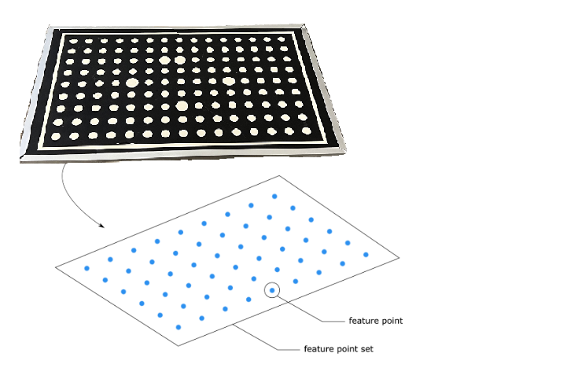
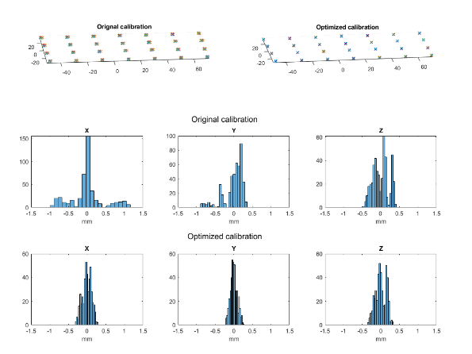

手眼标定的残差
===================================
为了评估手眼校准的性能，我们需要一种方法来检查残差。下面我们解释手眼校准残差代表什么以及如何计算它们。

对于数据集中的每个棋盘点云，DaoAI软件会提取一定数量的特征点。我们将这些特征点的集合称为特征点集。

使用手眼校准的结果，可以计算坐标转换。该坐标转换可以将特征点集从摄像机坐标系转换为机器人基坐标系。假设机器人系统的每个元素，即相机、机器人和手眼校准算法都是完美的。那么从一个转换后的集合中提取的特征点将具有与数据集中其他集合中相应特征点相同的坐标。从可视化上来看，这意味着3D空间中的所有特征点集都会完全重叠。然而，在现实中，这从未发生过，总会存在一些残差。从视觉上看，这意味着来自不同集合的相同特征点不会完全重叠。这可以从下面的图像中看出，这是一项内部手眼校准实验的可视化结果。

.. image:: images/2.png
    :scale: 80%

我们将解释DaoAI软件如何计算残差。

使用数据集中的所有特征点集，找到一组参考特征点，它表示所有其他特征点集的算术平均值。这意味着参考集的每个特征点都具有坐标，使得与其他集中相应特征点的欧氏距离之和最小化。这由放大的黑色球表示在放大的视图中。然后，DaoAI软件估计每个特征点集的姿势，包括参考集。最后，通过参考特征点集与所有其他特征点集之间的相对位置和方向来计算平移和旋转残差。平移残差表示为表示两个特征点集的参考框之间的欧氏距离。旋转残差表示为两个参考框之间的角度-轴表示。

继续阅读 :ref:`如何使用手眼标定的结果`. 