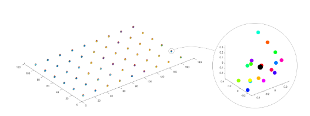

Hand-Eye Calibration Residuals
===================================
In order to evaluate the performance of the hand-eye calibration, we need a method to check the residuals. Here we explain what hand-eye calibration residuals represent and how they are calculated.

For each checkerboard point cloud in the dataset, DaoAI software extracts a certain number of feature points. We shall refer to this collection of feature points as a feature point set.

.. image:: images/1.png
    :scale: 80%

With the result of hand-eye calibration, it is possible to compute a coordinate transformation. This coordinate transformation can convert the feature point sets from the camera coordinate frame to the robot base frame. Assume that each element of the robotic system, i.e. camera, robot, and hand-eye calibration algorithm was perfect. Then feature points from one transformed set would have the same coordinates as their counterparts from the other sets in the dataset. Visually, this means that all the feature point sets in 3D space would overlap. This is never the case in reality and there are always some residuals. Visually, this means that the same feature points from different sets don’t fully overlap. This can be seen from the image below, which is the visualization of one of the in-house hand-eye calibration experiments.

We will now explain how DaoAI software calculates the residuals.

With all feature point sets from the dataset, a set of reference feature points is found that represents the arithmetic mean of all other feature point sets. This means that each feature point of the reference set has coordinates so that the sum of Euclidean distances from its counterpart feature point, from the other sets, is minimized. This is represented by the black enlarged sphere in the zoomed in view. DaoAI software then estimates the pose of each feature point set, including the reference set. Finally, translational and rotational residuals are calculated as the relative position and orientation between the reference feature point set and all other feature point sets. The translational residual is given as the Euclidean distance between the reference frames that represent the two feature point sets. The rotational residual is given as the angle of the angle-axis representation between the two reference frames.

Continue reading on :ref:`How To Use The Result Of Hand-Eye Calibration`. 