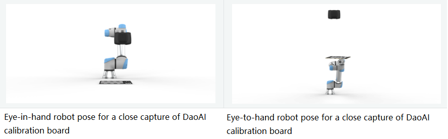
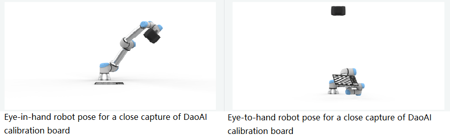
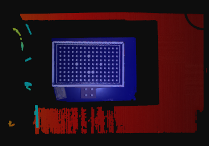

如何获得DaoAI标定板的高质量数据
========================================================

这个教程旨在介绍如何获取DaoAI棋盘格的高质量点云，以进行手眼校准。这是让手眼校准算法正常工作和达到所需精度的关键步骤。目标是配置DaoAI HDR设置，以获得高质量的点云，无论DaoAI棋盘格在工作空间的哪个位置可见。

假设您已经指定了要拍摄DaoAI棋盘格图像的机器人姿势。查看如何选择适合手眼校准的合适姿势的方法。

.. Note::
    使用DaoAI校准板时，每个姿势必须能够看到整个校准板，包括基准标记。这是为了确保手眼校准的准确性和可靠性，因为校准需要准确测量校准板和基准标记的位置。如果在某些姿势下无法完整看到校准板，可能会导致校准错误。因此，在选择拍摄姿势时，请确保整个校准板都可见

我们将讨论两个特定的姿势，即“近”姿势和“远”姿势。 "近" 姿势是机器人的姿势，其中相机和棋盘格之间的成像距离最小。对于eye-in-hand系统，这是机器人安装的相机最靠近棋盘格的姿势。对于eye-to-hand系统，这是机器人将棋盘格最靠近静止相机的姿势。在进行手眼校准时，通常需要捕获这两个特定的姿势，以确保校准的准确性和稳定性。

“远” 姿势是机器人的姿势，其中相机和棋盘格之间的成像距离最大。对于眼在手系统，这是机器人安装的相机远离棋盘格的姿势。对于眼到手系统，这是机器人将棋盘格放置在远离静止相机的位置。在进行手眼校准时，通常也需要捕获这两个特定的姿势，以覆盖不同成像距离下的情况，从而确保校准的全面性和准确性。

您提到的预期结果可能包括一系列不同位置和角度下的点云数据，这些数据用于执行手眼校准。这些数据可以用于计算相机相对于机器人的姿势，从而支持视觉引导机器人的操作。根据这些点云数据，可以生成类似于点云或三维模型的视觉信息，以便机器人能够感知周围环境并执行相应的任务。这个预期结果可以用于调整和验证手眼校准的准确性。

请参阅 :ref:`相机设置` ，以了解不同DaoAI相机的默认设置。

让我们看看如何实现 :ref:`手眼标定的流程` .