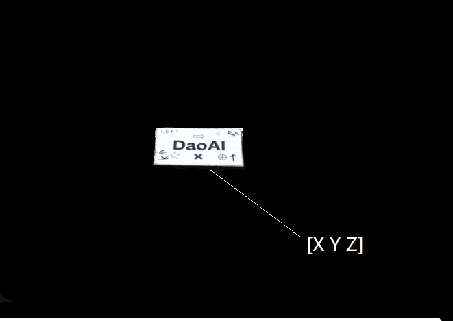
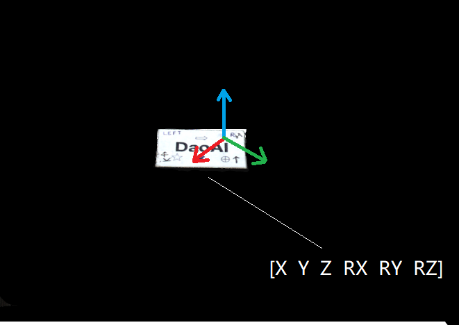

How To Use The Result Of Hand-Eye Calibration
===============================================
We have analyzed the requirements for a robot that is accompanied by a DaoAI camera and a machine vision software to pick an object. This led to the description of the Hand-Eye Calibration Problem. If you are unsure how to utilize the result of the hand-eye calibration, you are on the right page. This is where we describe how to transform the object’s coordinates from the DaoAI camera coordinate system to the robot base coordinate system.

Let’s suppose you run machine vision software on a DaoAI point cloud. It detects the object of interest, such as this DaoAI gem, and estimates its position. The x, y, z values describing the picking point are given relative to the DaoAI camera’s coordinate system.

.. Tip::
    Before running your application it is recommended to Warm-up the camera using the same capture cycle as for hand-eye calibration. To further reduce the impact of temperature dependent performance factors, enable Thermal Stabilization.

In some cases, your algorithm will also output the object’s orientation, e.g. the roll, pitch, and yaw angles. These parameters are also given relative to the DaoAI camera’s coordinate system.

The pose (position and orientation) of your object can be described with a homogeneous transformation matrix. If you are not familiar with (robot) poses and coordinate systems.

Below you will see the mathematical theory of transform a single point or an entire point cloud from the camera coordinates to the robot base coordinates. In practice, the easiest way of doing this is to use the DaoAI SDK supported transformation. This transforms the data before it is copied on the CPU and is therefore very fast.

.. tabs::

   .. tab:: Eye-to-hand

      .. image:: images/tohand4.png
          :scale: 50%

      If you are dealing with an eye-to-hand system, this is how a single 3D point can be transformed from the DaoAI camera to the robot base coordinate system: 

      |1|

      |2|

      To convert the whole DaoAI point cloud, from the camera coordinate system to the robot base coordinate system, apply the equation above to each point in the point cloud.

      On the other hand, to transform the pose of the object relative to the DaoAI camera, apply the following equation:

      |3|

      |4|

      We assume that your pose is described with a homogeneous transformation matrix.

      The resulting pose is the one that the robot Tool Center Point (TCP) should attain for picking. The offset between the TCP and the robot’s flange should be accounted for on the robot side.

   

   .. tab:: Eye-in-hand

      .. image:: images/inhand1.png
          :scale: 50%

      The approach for eye-in-hand systems is similar. The difference is that the current pose of the robot has to be included in the equations. As with the other poses, we assume that the robot pose is represented with a homogeneous transformation matrix.

      The following equation describes how to transform a single 3D point from the DaoAI camera to the robot base coordinate system:

      |5|

      |6|

      To convert the whole DaoAI point cloud from the camera coordinate system to the robot base coordinate system, apply the equation above to each point in the point cloud.

      To transform the pose of the object relative to the DaoAI camera use the following equation:

      |7|

      |8|

      The resulting pose is the one that the robot Tool Center Point (TCP) should attain for picking. The offset between the TCP and the robot’s flange should be accounted for on the robot side.

.. |1| raw:: html

    <math xmlns="http://www.w3.org/1998/Math/MathML" display="block">
    <msup>
        <mi><b>p</b></mi>
        <mrow data-mjx-texclass="ORD">
        <mi><b>R</b></mi>
        <mi><b>O</b></mi>
        <mi><b>B</b></mi>
        </mrow>
    </msup>
    <mo>=</mo>
    <msubsup>
        <mi><b>H</b></mi>
        <mrow data-mjx-texclass="ORD">
        <mi><b>C</b></mi>
        <mi><b>A</b></mi>
        <mi><b>M</b></mi>
        </mrow>
        <mrow data-mjx-texclass="ORD">
        <mi><b>R</b></mi>
        <mi><b>O</b></mi>
        <mi><b>B</b></mi>
        </mrow>
    </msubsup>
    <mo>&#x22C5;</mo>
    <msup>
        <mi><b>p</b></mi>
        <mrow data-mjx-texclass="ORD">
        <mi><b>C</b></mi>
        <mi><b>A</b></mi>
        <mi><b>M</b></mi>
        </mrow>
    </msup>
    </math>

.. |2| raw:: html

    <math xmlns="http://www.w3.org/1998/Math/MathML" display="block">
    <mtable displaystyle="true" columnalign="right" columnspacing="0em" rowspacing="3pt">
        <mtr>
        <mtd>
            <mrow data-mjx-texclass="INNER">
            <mo data-mjx-texclass="OPEN">[</mo>
            <mtable columnalign="center" columnspacing="1em" rowspacing="4pt">
                <mtr>
                <mtd>
                    <msup>
                    <mi><b>x</b></mi>
                    <mrow data-mjx-texclass="ORD">
                        <mi><b>r</b></mi>
                    </mrow>
                    </msup>
                </mtd>
                </mtr>
                <mtr>
                <mtd>
                    <msup>
                    <mi><b>y</b></mi>
                    <mrow data-mjx-texclass="ORD">
                        <mi><b>r</b></mi>
                    </mrow>
                    </msup>
                </mtd>
                </mtr>
                <mtr>
                <mtd>
                    <msup>
                    <mi><b>z</b></mi>
                    <mrow data-mjx-texclass="ORD">
                        <mi><b>r</b></mi>
                    </mrow>
                    </msup>
                </mtd>
                </mtr>
                <mtr>
                <mtd>
                    <mn><b>1</b></mn>
                </mtd>
                </mtr>
            </mtable>
            <mo data-mjx-texclass="CLOSE">]</mo>
            </mrow>
            <mo>=</mo>
            <mrow data-mjx-texclass="INNER">
            <mo data-mjx-texclass="OPEN">[</mo>
            <mtable columnalign="center" columnspacing="1em" rowspacing="4pt">
                <mtr>
                <mtd>
                    <msubsup>
                    <mi mathvariant="bold-italic"><b>R</b></mi>
                    <mrow data-mjx-texclass="ORD">
                        <mi><b>c</b></mi>
                    </mrow>
                    <mrow data-mjx-texclass="ORD">
                        <mi><b>r</b></mi>
                    </mrow>
                    </msubsup>
                </mtd>
                <mtd>
                    <msubsup>
                    <mi mathvariant="bold-italic"><b>t</b></mi>
                    <mrow data-mjx-texclass="ORD">
                        <mi><b>c</b></mi>
                    </mrow>
                    <mrow data-mjx-texclass="ORD">
                        <mi><b>r</b></mi>
                    </mrow>
                    </msubsup>
                </mtd>
                </mtr>
                <mtr>
                <mtd>
                    <mn><b>0</b></mn>
                </mtd>
                <mtd>
                    <mn><b>1</b></mn>
                </mtd>
                </mtr>
            </mtable>
            <mo data-mjx-texclass="CLOSE">]</mo>
            </mrow>
            <mo>&#x22C5;</mo>
            <mrow data-mjx-texclass="INNER">
            <mo data-mjx-texclass="OPEN">[</mo>
            <mtable columnalign="center" columnspacing="1em" rowspacing="4pt">
                <mtr>
                <mtd>
                    <msup>
                    <mi><b>x</b></mi>
                    <mrow data-mjx-texclass="ORD">
                        <mi><b>c</b></mi>
                    </mrow>
                    </msup>
                </mtd>
                </mtr>
                <mtr>
                <mtd>
                    <msup>
                    <mi><b>y</b></mi>
                    <mrow data-mjx-texclass="ORD">
                        <mi><b>c</b></mi>
                    </mrow>
                    </msup>
                </mtd>
                </mtr>
                <mtr>
                <mtd>
                    <msup>
                    <mi><b>z</b></mi>
                    <mrow data-mjx-texclass="ORD">
                        <mi><b>c</b></mi>
                    </mrow>
                    </msup>
                </mtd>
                </mtr>
                <mtr>
                <mtd>
                    <mn><b>1</b></mn>
                </mtd>
                </mtr>
            </mtable>
            <mo data-mjx-texclass="CLOSE">]</mo>
            </mrow>
        </mtd>
        </mtr>
    </mtable>
    </math>      

.. |3| raw:: html

    <math xmlns="http://www.w3.org/1998/Math/MathML" display="block">
    <msubsup>
        <mi><b>H</b></mi>
        <mrow data-mjx-texclass="ORD">
        <mi><b>O</b></mi>
        <mi><b>B</b></mi>
        <mi><b>J</b></mi>
        </mrow>
        <mrow data-mjx-texclass="ORD">
        <mi><b>R</b></mi>
        <mi><b>O</b></mi>
        <mi><b>B</b></mi>
        </mrow>
    </msubsup>
    <mo>=</mo>
    <msubsup>
        <mi><b>H</b></mi>
        <mrow data-mjx-texclass="ORD">
        <mi><b>C</b></mi>
        <mi><b>A</b></mi>
        <mi><b>M</b></mi>
        </mrow>
        <mrow data-mjx-texclass="ORD">
        <mi><b>R</b></mi>
        <mi><b>O</b></mi>
        <mi><b>B</b></mi>
        </mrow>
    </msubsup>
    <mo>&#x22C5;</mo>
    <msubsup>
        <mi><b>H</b></mi>
        <mrow data-mjx-texclass="ORD">
        <mi><b>O</b></mi>
        <mi><b>B</b></mi>
        <mi><b>J</b></mi>
        </mrow>
        <mrow data-mjx-texclass="ORD">
        <mi><b>C</b></mi>
        <mi><b>A</b></mi>
        <mi><b>M</b></mi>
        </mrow>
    </msubsup>
    </math>

.. |4| raw:: html

    <math xmlns="http://www.w3.org/1998/Math/MathML" display="block">
    <mtable displaystyle="true" columnalign="right" columnspacing="0em" rowspacing="3pt">
        <mtr>
        <mtd>
            <mrow data-mjx-texclass="INNER">
            <mo data-mjx-texclass="OPEN">[</mo>
            <mtable columnalign="center" columnspacing="1em" rowspacing="4pt">
                <mtr>
                <mtd>
                    <msubsup>
                    <mi mathvariant="bold-italic"><b>R</b></mi>
                    <mrow data-mjx-texclass="ORD">
                        <mi><b>o</b></mi>
                    </mrow>
                    <mrow data-mjx-texclass="ORD">
                        <mi><b>r</b></mi>
                    </mrow>
                    </msubsup>
                </mtd>
                <mtd>
                    <msubsup>
                    <mi mathvariant="bold-italic"><b>t</b></mi>
                    <mrow data-mjx-texclass="ORD">
                        <mi>o</mi>
                    </mrow>
                    <mrow data-mjx-texclass="ORD">
                        <mi><b>r</b></mi>
                    </mrow>
                    </msubsup>
                </mtd>
                </mtr>
                <mtr>
                <mtd>
                    <mn><b>0</b></mn>
                </mtd>
                <mtd>
                    <mn><b>1</b></mn>
                </mtd>
                </mtr>
            </mtable>
            <mo data-mjx-texclass="CLOSE">]</mo>
            </mrow>
            <mo>=</mo>
            <mrow data-mjx-texclass="INNER">
            <mo data-mjx-texclass="OPEN">[</mo>
            <mtable columnalign="center" columnspacing="1em" rowspacing="4pt">
                <mtr>
                <mtd>
                    <msubsup>
                    <mi mathvariant="bold-italic"><b>R</b></mi>
                    <mrow data-mjx-texclass="ORD">
                        <mi><b>c</b></mi>
                    </mrow>
                    <mrow data-mjx-texclass="ORD">
                        <mi><b>r</b></mi>
                    </mrow>
                    </msubsup>
                </mtd>
                <mtd>
                    <msubsup>
                    <mi mathvariant="bold-italic"><b>t</b></mi>
                    <mrow data-mjx-texclass="ORD">
                        <mi><b>c</b></mi>
                    </mrow>
                    <mrow data-mjx-texclass="ORD">
                        <mi><b>r</b></mi>
                    </mrow>
                    </msubsup>
                </mtd>
                </mtr>
                <mtr>
                <mtd>
                    <mn><b>0</b></mn>
                </mtd>
                <mtd>
                    <mn><b>1</b></mn>
                </mtd>
                </mtr>
            </mtable>
            <mo data-mjx-texclass="CLOSE">]</mo>
            </mrow>
            <mo>&#x22C5;</mo>
            <mrow data-mjx-texclass="INNER">
            <mo data-mjx-texclass="OPEN">[</mo>
            <mtable columnalign="center" columnspacing="1em" rowspacing="4pt">
                <mtr>
                <mtd>
                    <msubsup>
                    <mi mathvariant="bold-italic"><b>R</b></mi>
                    <mrow data-mjx-texclass="ORD">
                        <mi><b>o</b></mi>
                    </mrow>
                    <mrow data-mjx-texclass="ORD">
                        <mi><b>c</b></mi>
                    </mrow>
                    </msubsup>
                </mtd>
                <mtd>
                    <msubsup>
                    <mi mathvariant="bold-italic"><b>t</b></mi>
                    <mrow data-mjx-texclass="ORD">
                        <mi><b>o</b></mi>
                    </mrow>
                    <mrow data-mjx-texclass="ORD">
                        <mi><b>c</b></mi>
                    </mrow>
                    </msubsup>
                </mtd>
                </mtr>
                <mtr>
                <mtd>
                    <mn><b>0</b></mn>
                </mtd>
                <mtd>
                    <mn><b>1</b></mn>
                </mtd>
                </mtr>
            </mtable>
            <mo data-mjx-texclass="CLOSE">]</mo>
            </mrow>
        </mtd>
        </mtr>
    </mtable>
    </math>

.. |5| raw:: html

    <math xmlns="http://www.w3.org/1998/Math/MathML" display="block">
    <msup>
        <mi><b>p</b></mi>
        <mrow data-mjx-texclass="ORD">
        <mi><b>R</b></mi>
        <mi><b>O</b></mi>
        <mi><b>B</b></mi>
        </mrow>
    </msup>
    <mo>=</mo>
    <msubsup>
        <mi><b>H</b></mi>
        <mrow data-mjx-texclass="ORD">
        <mi><b>E</b></mi>
        <mi><b>E</b></mi>
        </mrow>
        <mrow data-mjx-texclass="ORD">
        <mi><b>R</b></mi>
        <mi><b>O</b></mi>
        <mi><b>B</b></mi>
        </mrow>
    </msubsup>
    <mo>&#x22C5;</mo>
    <msubsup>
        <mi><b>H</b></mi>
        <mrow data-mjx-texclass="ORD">
        <mi><b>C</b></mi>
        <mi><b>A</b></mi>
        <mi><b>M</b></mi>
        </mrow>
        <mrow data-mjx-texclass="ORD">
        <mi><b>E</b></mi>
        <mi><b>E</b></mi>
        </mrow>
    </msubsup>
    <mo>&#x22C5;</mo>
    <msup>
        <mi><b>p</b></mi>
        <mrow data-mjx-texclass="ORD">
        <mi><b>C</b></mi>
        <mi><b>A</b></mi>
        <mi><b>M</b></mi>
        </mrow>
    </msup>
    </math>

.. |6| raw:: html

    <math xmlns="http://www.w3.org/1998/Math/MathML" display="block">
    <mtable displaystyle="true" columnalign="right" columnspacing="0em" rowspacing="3pt">
        <mtr>
        <mtd>
            <mrow data-mjx-texclass="INNER">
            <mo data-mjx-texclass="OPEN">[</mo>
            <mtable columnalign="center" columnspacing="1em" rowspacing="4pt">
                <mtr>
                <mtd>
                    <msup>
                    <mi><b>x</b></mi>
                    <mrow data-mjx-texclass="ORD">
                        <mi><b>r</b></mi>
                    </mrow>
                    </msup>
                </mtd>
                </mtr>
                <mtr>
                <mtd>
                    <msup>
                    <mi><b>y</b></mi>
                    <mrow data-mjx-texclass="ORD">
                        <mi><b>r</b></mi>
                    </mrow>
                    </msup>
                </mtd>
                </mtr>
                <mtr>
                <mtd>
                    <msup>
                    <mi><b>z</b></mi>
                    <mrow data-mjx-texclass="ORD">
                        <mi><b>r</b></mi>
                    </mrow>
                    </msup>
                </mtd>
                </mtr>
                <mtr>
                <mtd>
                    <mn><b>1</b></mn>
                </mtd>
                </mtr>
            </mtable>
            <mo data-mjx-texclass="CLOSE">]</mo>
            </mrow>
            <mo>=</mo>
            <mrow data-mjx-texclass="INNER">
            <mo data-mjx-texclass="OPEN">[</mo>
            <mtable columnalign="center" columnspacing="1em" rowspacing="4pt">
                <mtr>
                <mtd>
                    <msubsup>
                    <mi mathvariant="bold-italic"><b>R</b></mi>
                    <mrow data-mjx-texclass="ORD">
                        <mi><b>e</b></mi>
                    </mrow>
                    <mrow data-mjx-texclass="ORD">
                        <mi><b>r</b></mi>
                    </mrow>
                    </msubsup>
                </mtd>
                <mtd>
                    <msubsup>
                    <mi mathvariant="bold-italic"><b>t</b></mi>
                    <mrow data-mjx-texclass="ORD">
                        <mi><b>e</b></mi>
                    </mrow>
                    <mrow data-mjx-texclass="ORD">
                        <mi><b>r</b></mi>
                    </mrow>
                    </msubsup>
                </mtd>
                </mtr>
                <mtr>
                <mtd>
                    <mn><b>0</b></mn>
                </mtd>
                <mtd>
                    <mn><b>1</b></mn>
                </mtd>
                </mtr>
            </mtable>
            <mo data-mjx-texclass="CLOSE">]</mo>
            </mrow>
            <mo>&#x22C5;</mo>
            <mrow data-mjx-texclass="INNER">
            <mo data-mjx-texclass="OPEN">[</mo>
            <mtable columnalign="center" columnspacing="1em" rowspacing="4pt">
                <mtr>
                <mtd>
                    <msubsup>
                    <mi mathvariant="bold-italic"><b>R</b></mi>
                    <mrow data-mjx-texclass="ORD">
                        <mi><b>c</b></mi>
                    </mrow>
                    <mrow data-mjx-texclass="ORD">
                        <mi><b>e</b></mi>
                    </mrow>
                    </msubsup>
                </mtd>
                <mtd>
                    <msubsup>
                    <mi mathvariant="bold-italic"><b>t</b></mi>
                    <mrow data-mjx-texclass="ORD">
                        <mi><b>c</b></mi>
                    </mrow>
                    <mrow data-mjx-texclass="ORD">
                        <mi><b>e</b></mi>
                    </mrow>
                    </msubsup>
                </mtd>
                </mtr>
                <mtr>
                <mtd>
                    <mn><b>0</b></mn>
                </mtd>
                <mtd>
                    <mn><b>1</b></mn>
                </mtd>
                </mtr>
            </mtable>
            <mo data-mjx-texclass="CLOSE">]</mo>
            </mrow>
            <mo>&#x22C5;</mo>
            <mrow data-mjx-texclass="INNER">
            <mo data-mjx-texclass="OPEN">[</mo>
            <mtable columnalign="center" columnspacing="1em" rowspacing="4pt">
                <mtr>
                <mtd>
                    <msup>
                    <mi><b>x</b></mi>
                    <mrow data-mjx-texclass="ORD">
                        <mi><b>c</b></mi>
                    </mrow>
                    </msup>
                </mtd>
                </mtr>
                <mtr>
                <mtd>
                    <msup>
                    <mi><b>y</b></mi>
                    <mrow data-mjx-texclass="ORD">
                        <mi><b>c</b></mi>
                    </mrow>
                    </msup>
                </mtd>
                </mtr>
                <mtr>
                <mtd>
                    <msup>
                    <mi><b>z</b></mi>
                    <mrow data-mjx-texclass="ORD">
                        <mi><b>c</b></mi>
                    </mrow>
                    </msup>
                </mtd>
                </mtr>
                <mtr>
                <mtd>
                    <mn><b>1</b></mn>
                </mtd>
                </mtr>
            </mtable>
            <mo data-mjx-texclass="CLOSE">]</mo>
            </mrow>
        </mtd>
        </mtr>
    </mtable>
    </math>

.. |7| raw:: html

    <math xmlns="http://www.w3.org/1998/Math/MathML" display="block">
    <msubsup>
        <mi><b>H</b></mi>
        <mrow data-mjx-texclass="ORD">
        <mi><b>O</b></mi>
        <mi><b>B</b></mi>
        <mi><b>J</b></mi>
        </mrow>
        <mrow data-mjx-texclass="ORD">
        <mi><b>R</b></mi>
        <mi><b>O</b></mi>
        <mi><b>B</b></mi>
        </mrow>
    </msubsup>
    <mo>=</mo>
    <msubsup>
        <mi><b>H</b></mi>
        <mrow data-mjx-texclass="ORD">
        <mi><b>E</b></mi>
        <mi><b>E</b></mi>
        </mrow>
        <mrow data-mjx-texclass="ORD">
        <mi><b>R</b></mi>
        <mi><b>O</b></mi>
        <mi><b>B</b></mi>
        </mrow>
    </msubsup>
    <mo>&#x22C5;</mo>
    <msubsup>
        <mi><b>H</b></mi>
        <mrow data-mjx-texclass="ORD">
        <mi><b>C</b></mi>
        <mi><b>A</b></mi>
        <mi><b>M</b></mi>
        </mrow>
        <mrow data-mjx-texclass="ORD">
        <mi><b>E</b></mi>
        <mi><b>E</b></mi>
        </mrow>
    </msubsup>
    <mo>&#x22C5;</mo>
    <msubsup>
        <mi><b>H</b></mi>
        <mrow data-mjx-texclass="ORD">
        <mi><b>O</b></mi>
        <mi><b>B</b></mi>
        <mi><b>J</b></mi>
        </mrow>
        <mrow data-mjx-texclass="ORD">
        <mi><b>C</b></mi>
        <mi><b>A</b></mi>
        <mi><b>M</b></mi>
        </mrow>
    </msubsup>
    </math>

.. |8| raw:: html

    <math xmlns="http://www.w3.org/1998/Math/MathML" display="block">
    <mtable displaystyle="true" columnalign="right" columnspacing="0em" rowspacing="3pt">
        <mtr>
        <mtd>
            <mrow data-mjx-texclass="INNER">
            <mo data-mjx-texclass="OPEN">[</mo>
            <mtable columnalign="center" columnspacing="1em" rowspacing="4pt">
                <mtr>
                <mtd>
                    <msubsup>
                    <mi mathvariant="bold-italic"><b>R</b></mi>
                    <mrow data-mjx-texclass="ORD">
                        <mi><b>o</b></mi>
                    </mrow>
                    <mrow data-mjx-texclass="ORD">
                        <mi><b>r</b></mi>
                    </mrow>
                    </msubsup>
                </mtd>
                <mtd>
                    <msubsup>
                    <mi mathvariant="bold-italic"><b>t</b></mi>
                    <mrow data-mjx-texclass="ORD">
                        <mi><b>o</b></mi>
                    </mrow>
                    <mrow data-mjx-texclass="ORD">
                        <mi><b>r</b></mi>
                    </mrow>
                    </msubsup>
                </mtd>
                </mtr>
                <mtr>
                <mtd>
                    <mn><b>0</b></mn>
                </mtd>
                <mtd>
                    <mn><b>1</b></mn>
                </mtd>
                </mtr>
            </mtable>
            <mo data-mjx-texclass="CLOSE">]</mo>
            </mrow>
            <mo>=</mo>
            <mrow data-mjx-texclass="INNER">
            <mo data-mjx-texclass="OPEN">[</mo>
            <mtable columnalign="center" columnspacing="1em" rowspacing="4pt">
                <mtr>
                <mtd>
                    <msubsup>
                    <mi mathvariant="bold-italic"><b>R</b></mi>
                    <mrow data-mjx-texclass="ORD">
                        <mi><b>e</b></mi>
                    </mrow>
                    <mrow data-mjx-texclass="ORD">
                        <mi><b>r</b></mi>
                    </mrow>
                    </msubsup>
                </mtd>
                <mtd>
                    <msubsup>
                    <mi mathvariant="bold-italic">t</mi>
                    <mrow data-mjx-texclass="ORD">
                        <mi><b>e</b></mi>
                    </mrow>
                    <mrow data-mjx-texclass="ORD">
                        <mi><b>r</b></mi>
                    </mrow>
                    </msubsup>
                </mtd>
                </mtr>
                <mtr>
                <mtd>
                    <mn><b>0</b></mn>
                </mtd>
                <mtd>
                    <mn><b>1</b></mn>
                </mtd>
                </mtr>
            </mtable>
            <mo data-mjx-texclass="CLOSE">]</mo>
            </mrow>
            <mo>&#x22C5;</mo>
            <mrow data-mjx-texclass="INNER">
            <mo data-mjx-texclass="OPEN">[</mo>
            <mtable columnalign="center" columnspacing="1em" rowspacing="4pt">
                <mtr>
                <mtd>
                    <msubsup>
                    <mi mathvariant="bold-italic"><b>R</b></mi>
                    <mrow data-mjx-texclass="ORD">
                        <mi><b>c</b></mi>
                    </mrow>
                    <mrow data-mjx-texclass="ORD">
                        <mi><b>e</b></mi>
                    </mrow>
                    </msubsup>
                </mtd>
                <mtd>
                    <msubsup>
                    <mi mathvariant="bold-italic"><b>t</b></mi>
                    <mrow data-mjx-texclass="ORD">
                        <mi><b>c</b></mi>
                    </mrow>
                    <mrow data-mjx-texclass="ORD">
                        <mi><b>e</b></mi>
                    </mrow>
                    </msubsup>
                </mtd>
                </mtr>
                <mtr>
                <mtd>
                    <mn><b>0</b></mn>
                </mtd>
                <mtd>
                    <mn><b>1</b></mn>
                </mtd>
                </mtr>
            </mtable>
            <mo data-mjx-texclass="CLOSE">]</mo>
            </mrow>
            <mo>&#x22C5;</mo>
            <mrow data-mjx-texclass="INNER">
            <mo data-mjx-texclass="OPEN">[</mo>
            <mtable columnalign="center" columnspacing="1em" rowspacing="4pt">
                <mtr>
                <mtd>
                    <msubsup>
                    <mi mathvariant="bold-italic"><b>R</b></mi>
                    <mrow data-mjx-texclass="ORD">
                        <mi><b>o</b></mi>
                    </mrow>
                    <mrow data-mjx-texclass="ORD">
                        <mi><b>c</b></mi>
                    </mrow>
                    </msubsup>
                </mtd>
                <mtd>
                    <msubsup>
                    <mi mathvariant="bold-italic">t</mi>
                    <mrow data-mjx-texclass="ORD">
                        <mi><b>o</b></mi>
                    </mrow>
                    <mrow data-mjx-texclass="ORD">
                        <mi><b>c</b></mi>
                    </mrow>
                    </msubsup>
                </mtd>
                </mtr>
                <mtr>
                <mtd>
                    <mn><b>0</b></mn>
                </mtd>
                <mtd>
                    <mn><b>1</b></mn>
                </mtd>
                </mtr>
            </mtable>
            <mo data-mjx-texclass="CLOSE">]</mo>
            </mrow>
        </mtd>
        </mtr>
    </mtable>
    </math>