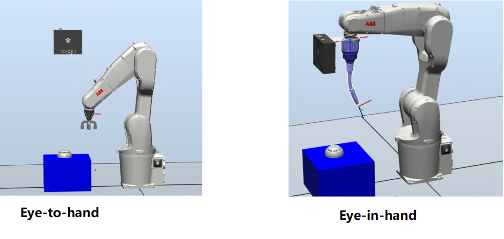

系统配置
================================
在视觉引导的机器人系统中，关于相机位置有两种不同的标准配置，分别是“eye-to-hand” 和 “eye-in-hand”。

    

Eye-to-hand
------------------------
这种配置的系统具有一个位于机器人环境中的静止相机，其定位是为了观察机器人臂的工作空间。

这种系统的优点是相机相对远离机器人的拾取工作区域，因此机器人不太可能与相机碰撞。另一个好处是，这种系统配置允许在机器人移动的同时进行图像采集，这意味着潜在的循环时间可能较短。

缺点是机器人手臂可能会通过在目标物体和相机之间移动而遮挡视野，这可能会对循环时间产生负面影响。为了防止这种情况发生，需要使用智能运动规划并同步机器人运动和图像采集，这并不是一件简单的事情。此系统也较不灵活，因为相机是静态的，具有固定的视点。这意味着视场不能改变，当需要增加图像测量的精度时也无法实现。最后，从机器人单元的建设角度来看，需要额外的工作，因为它需要一个机械结构来安装相机。

Eye-in-hand
-----------------------
这种配置假定相机被刚性地安装在机器人的末端执行器上，并随机器人一起移动。通常情况下，它会被机械固定在法兰或工具上。

这种系统的优点在于其灵活性。如果需要更大的视场（FOV），机器人可以后退，从远处进行成像。从多个视点成像对象可以生成更完整的3D模型（可能是完整的360度模型）。它还可以改变相机的视点，从不同角度观察。这还可以有助于减轻镜面反射问题，因为在改变视点时，这些问题通常会出现在不同的区域。此系统配置的另一个优点是消除了机器人引起的潜在物体遮挡问题。

这种配置的一个缺点是必须通过谨慎控制机器人的加速度来实施碰撞避免，以避免损坏工作环境、相机和机器人。机器人安装的另一个缺点是当机器人不处于正确位置时，相机可能无法用于图像采集，例如在机器人正在交付已拾取的零件时。此外，机器人在抓取3D图像之前必须停止移动。最后，相机的重量会减少可用于夹持器和机器人拾取的有效载荷。

现在我们已经介绍了系统配置，接下来我们将介绍 :ref:`手眼标定的问题`.
