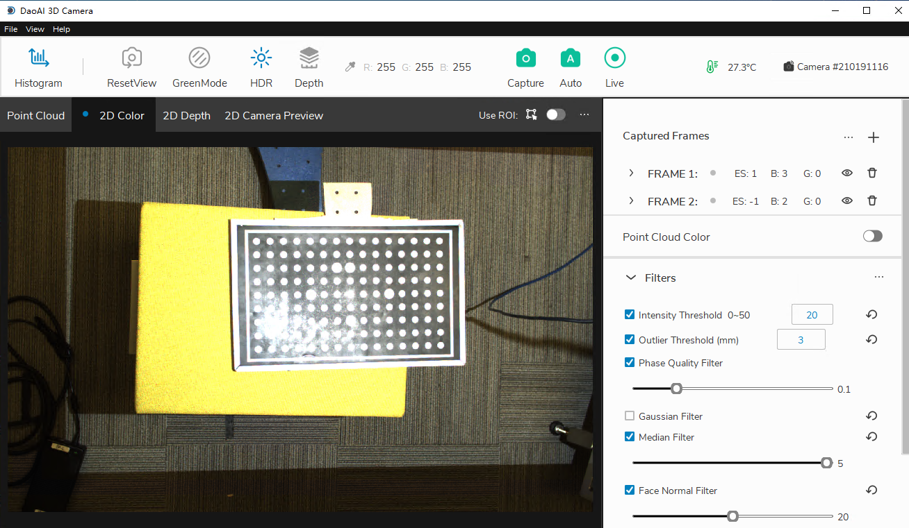
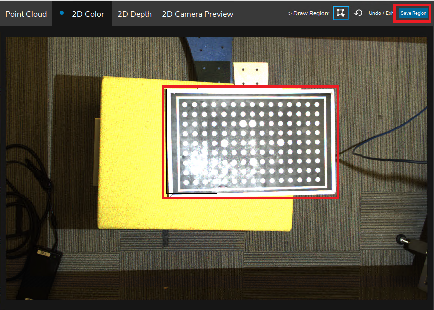
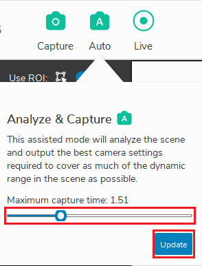
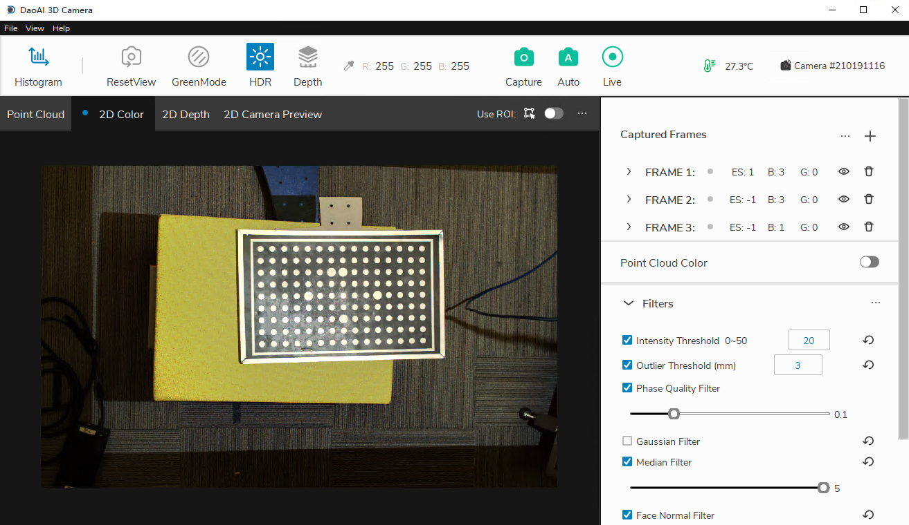
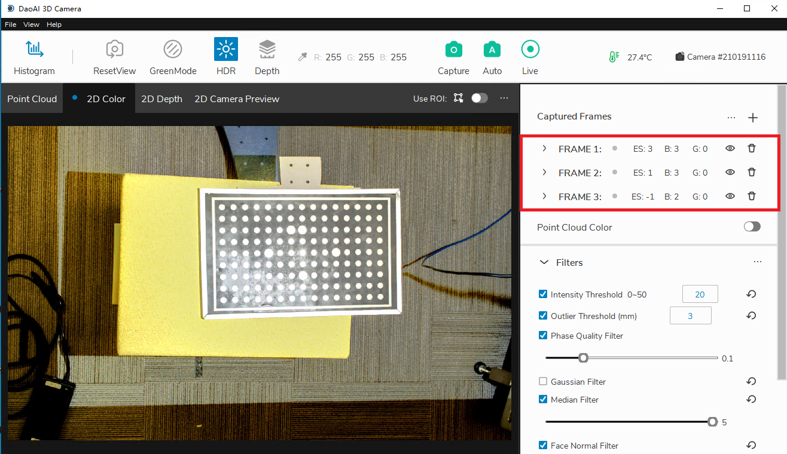
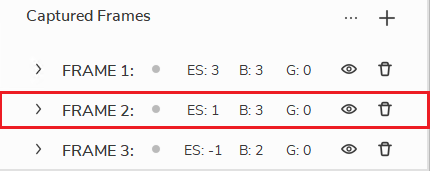
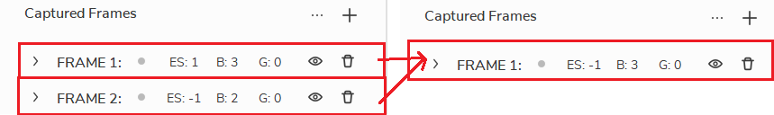

Case Studies
==============

.. contents:: 
   :local:
   

Using ROI to Allow Auto Capture Better Generate Frame Parameters 
--------------------------------------------------------------------

"Why is the image so bright when I use Auto Capture? "

|

This is because Auto Capture by defualt takes account of the entire image, trying to have all part visible.
The background is darker than the foreground, and Auto Capture tries to make the background visible so the entire image becomes too bright.

Hence, we need to contrain an Region of Interest so that Auto Capture will only consider this area when generating frame parameters.

1. Enable ROI and drag to select a region then click save.

|

2. Hover mouse over Auto and allocate capture time, then click auto to generate frame parameters.

|

3. You may disable the ROI later as the frame parameters is already generated.

|

Delete a Frame in the Least Impactful Way
-------------------------------------------

"When using multiple frames and the image acquisition time is too long, which frame should I delete?""

|

1. If you have More than 3 frames, delete the frame which its brightness is the median of the frames. This way the brightness is least affected after deletion.

|

2. If you have 2 frames, combine the two frames by taking the average of their frame settings and replace the first frame, then delete the second frame. This way the brightness is least affected after deletion.

|