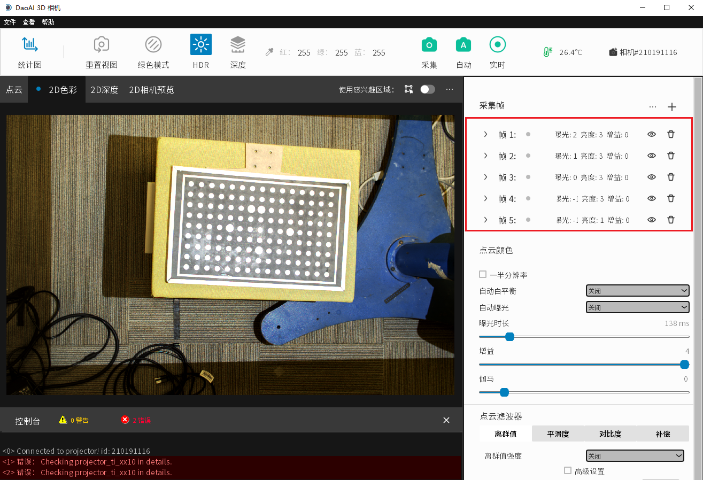

<<<<<<< HEAD
实例
=====

如何使用ROI来更好的自动计算帧值参数
------------------------------------

"为什么我用了Auto自动生成帧值参数, 结果图片特别亮？"

|

这是因为Auto默认使用图片的全部区域来计算, 目的是尽可能让区域中的细节都可以分辨。
可以看到图中的背景相较于前景是很暗的, 那么Auto为了使背景同样清晰可见, 就会调整亮度, 导致前景过亮。

因此, 我们在使用Auto时应当留意我们想要拍摄的区域, 将它用ROI框选出来后, 再用Auto来自动计算参数。
这样最终得到的亮度参数就是理想的。

1. 首先启用ROI, 框选出感兴趣的区域然后保存。

.. figure:: images/roi_auto_2.png
    :align: center 

|

2. 鼠标悬停在Auto上, 分配拍摄时间, 然后点击Auto自动生成参数并拍摄。 

.. figure:: images/roi_auto_3.png
    :align: center 

|

3. 如果之后不需要可以取消ROI设置, 然后也可以再进一步手动微调。

|

如何正确的缩减帧数
-------------------

"当用多帧拍摄时, 需要压缩拍摄时间, 该删除哪一帧？"

|

1. 如果有三帧以上, 可以删除亮度为中值的一帧, 这样在删除一帧的同时对最终图像的亮度影响最低。

.. figure:: images/del_frame_2.png
    :align: center 

|

2. 如果只有两帧, 可以将两帧合并成一帧: 删除第二帧，第一帧的帧值参数取两帧的平均值 然后删除第二帧。这样同样在减少一帧的前提下, 对最终图像的亮度影响最低。

.. figure:: images/del_frame_3.png
    :align: center 
=======
Case Studies
==============

.. contents:: 
   :local:
   

Using ROI to Allow Auto Capture Better Generate Frame Parameters 
--------------------------------------------------------------------

"Why is the image so bright when I use Auto Capture? "

.. figure:: images/auto_roi_1.png
    :align: center

|

This is because Auto Capture by defualt takes account of the entire image, trying to have all part visible.
The background is darker than the foreground, and Auto Capture tries to make the background visible so the entire image becomes too bright.

Hence, we need to contrain an Region of Interest so that Auto Capture will only consider this area when generating frame parameters.

1. Enable ROI and drag to select a region then click save.

|

2. Hover mouse over Auto and allocate capture time, then click auto to generate frame parameters.

|

3. You may disable the ROI later as the frame parameters is already generated.

|

Delete a Frame in a Least Impactful Way
----------------------------------------

"When using multiple frames, which frame should I delete?"

|

1. If you have More than 3 frames, delete the frame which its brightness is the median of the frames. This way the brightness is least affected after deletion.

.. figure:: images/del_frame_2.png
    :align: center

|

2. If you have 2 frames, combine the two frames by taking the average of their frame settings and replace the first frame, then delete the second frame. This way the brightness is least affected after deletion.

.. figure:: images/del_frame_3.png
    :align: center
>>>>>>> english_review_version_02

|