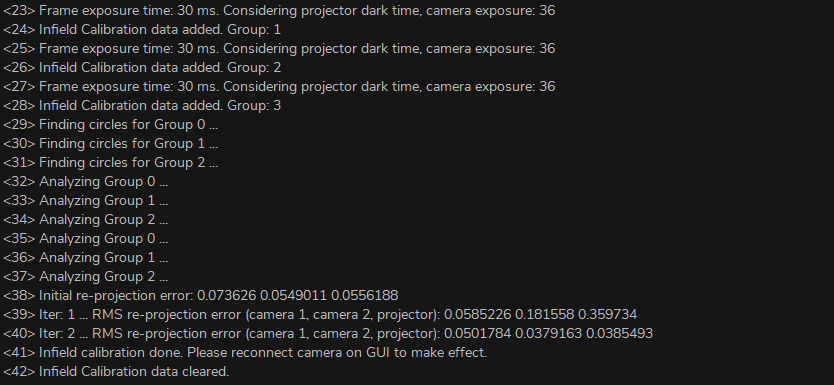

现场校准
===============================

现场校准是一种维护工具，旨在验证和纠正DaoAI相机的尺寸真实性。
用户可以在视场（FOV）的不同点上检查点云的尺寸真实性，并确定其是否能满足其应用的需要。
如果检查结果显示相机对应用来说不够精确，那么可以进行修正以提高点云的尺寸真实性。
多次测量的平均尺寸真实性误差预计为<0.1%。

**为什么需要现场校准**

我们的相机的设计能够承受工业工作环境，并持续捕获高质量的点云。
然而，像大多数高精度的电子仪器一样，有时它们可能需要一点调整，以确保它们保持最佳性能。
当相机经历了环境的重大变化或重度处理时，它可能需要进行校正，以便在新的环境中发挥最佳作用。

**现场校准功能**

.. note::
    需要 DaoAI相机工作室 2.22.10.1 版本或之后的版本。

在使用过程中，如果发现三维摄像机的精度低于0.2%的误差标准，可以使用现场校准来优化摄像机的参数，使摄像机的精度达到标准。
现场标定通常只需要拍摄3-5组不同位置、不同深度、不同偏差的标定板照片。

进入校准模式。确保3D相机已连接，点击左上角的文件→现场校准.在主窗口的右部应该出现"校准"组框。

评估
----------------

在评估里，主要分为三个类别：

1. 配置校准板的基本信息。 
2. 点击设置来更改相机的配置设置，点击预览可以预览拍照效果，点击save保存相机的采集配置。 
3. 点击采集和评估，可以得到当前相机的校准精度。

.. list-table:: 面板介绍

   * - 行数
     - 输入校准板圈的行数
   * - 列数
     - 输入校准板圆圈的列数
   * - 中心到中心的距离
     - 输入校准板的中心到相邻圆的中心的距离 
       相邻圆的中心的距离
   * - 修改相机配置
     - 更改相机采集配置
   * - 预览
     - 预览更改后的相机采集效果
   * - 保存 
     - 保存相机采集配置
   * - 采集&评估 
     - 采集之后评估相机当前的精度
     

校准
----------------

点击 **现场校准**，进入相机现场校准模式，现场校准主要分为五个项目：

1. 配置校准板的基本信息。
2. 点击设置来更改相机的配置设置，点击预览可以预览拍照效果，点击save保存相机的采集配置。
3. 添加新的采集，用于添加校准的数据。显示采集的数量，点击清除，清除原有数据。
4. 重新标定相机的精度。
5. 保存全新的校准信息到相机里。

.. list-table:: 面板介绍

   * - 行数
     - 输入校准板圈的行数
   * - 列数
     - 输入校准板圆圈的列数
   * - 中心到中心的距离
     - 输入校准板的中心到相邻圆的中心的距离 
       相邻圆的中心的距离
   * - 添加
     - 添加一组现场校准的图片
   * - 清除
     - 清除所有为现场校准采集的图像
   * - 分析
     - 用已经采集的用于现场校准的图片进行分析
   * - 保存到相机
     - 保存全新的相机精度信息到相机中。

1. 用当前的相机参数，参考 :ref:`评估精度` 实验，分析相机的精度，记录当前的相机精度，用它与后面的对比来判断现场标定的效果。
2. 在整个目标测量范围内，将校准板放置在不同的位置、深度和偏移量，共3-5个位置。每个位置需要遵循与实验室校准相同的要求（请参考 :ref:`手眼标定` ），调整曝光和亮度，使校准板预览照片明亮但不过度曝光（没有大的红色区域）。点击"添加"按钮，捕捉一组校准照片，完成后照片组数将显示+1。
3. 采集3-5组照片后，点击"分析"按钮。等待数据处理完成的时候，相机工作室可能会卡住10秒左右。
4. 检查控制台信息。如果场标数据处理成功，控制台将显示信息"现场标定完成"。如果没有这条信息或报告错误，说明分析失败。您需要点击"清除"按钮，然后从第二步重新开始。

5. 现场校准分析完成后，点击保存数据到相机中，在Camera Studio中断开并重新连接摄像机。
6. 与第1步类似，请参考DaoAI 3D相机空间距离精度实验，并分析相机的精度，记录现场校准相机的精度。如果精度优于0.2%的误差标准，则说明现场校准成功。
