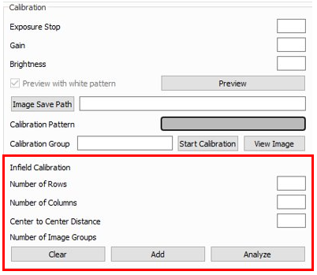
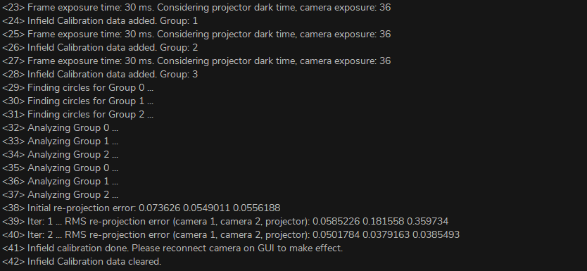

Infiled Calibration
===============================

Infield calibration is a maintenance tool designed to verify and correct for the dimension trueness of DaoAI cameras. The user can check the dimension trueness of the point cloud at different points in the field of view (FOV) and determine if it is acceptable for their application. If the verification shows the camera is not sufficiently accurate for the application, then a correction can be performed to increase the dimension trueness of the point cloud. The average dimension trueness error from multiple measurements is expected to be close to zero (<0.1%).

**why is the necessary**

Our cameras are made to withstand industrial working environments and continue to return quality point clouds. However, like most high precision electronic instruments, sometimes they might need a little adjustment to make sure they stay at their best performance. When a camera experiences substantial changes in its environment or heavy handling it could require a correction to work optimally in its new setting.

**Field calibration function**

.. note::
    Requires DaoAI camera studio version 2.22.10.1

If the accuracy of 3D camera is found to be lower than 0.2% error standard during field use, you can use field calibration to optimize the camera parameters and make the camera accuracy meet the standard. Field calibration usually requires only a total of 3-5 sets of photos of calibration plates with different positions, depths and deflections.

Enter the calibration mode: Make sure the 3D camera is connected, click Help → System in the upper left corner, enter the password Robotics_2018 in the new pop-up authentication window and click OK, check the checkbox "Calibrating Mode" (Calibrating Mode) and close the System window. The "Calibration" subgroup box should appear at the bottom of the main window. The lower red section is the Infield Calibration panel.

.. list-table:: Panel Introduction

   * - Number of Rows
     - Enter the number of rows of calibrated board circles
   * - Number of Columns
     - Enter the number of columns of calibrated board circles
   * - Center to Center Distance
     - Enter the distance from the center of the calibration board to 
     
       the center of the adjacent circle
   * - Clear
     - Clear all images that have been captured for field calibration
   * - Add
     - Add a set of pictures of field calibration
   * - Analyze
     - Analysis with images that have been collected for field calibration

1. With the current camera parameters, refer to the :ref:`Evaluate Accuracy` experiment , analyze the accuracy of the camera, record the current camera accuracy, and use it for comparison with later to judge the effect of field calibration.
2. The calibration board is placed in different positions, depths, and deflections, 3-5 positions in total, throughout the target measurement range. In each position, you need to follow the same requirements as the lab calibration :ref:`Hand Eye Calibration` , adjust the exposure and brightness so that the calibration plate preview photo is bright but not overexposed (no large red areas). Click "Add" button to capture a set of calibration photos, and the number of photo groups will show +1 when finished. 3.
3. After acquiring 3-5 groups of photos, click the "Analyze" button. Camera Studio may be stuck for about 10s, waiting for the data processing to finish. 
4. Check the console information. If the field calibration data is processed successfully, the following message will be displayed "Infield calibration done. If this message is not present or error is reported, the analysis failed. You need to click on the "Clear" button and start again from step 2.

5. After the field calibration analysis is complete, disconnect and reconnect the camera in Camera Studio.
6. Similar to step 1, refer to the DaoAI 3D camera spatial distance accuracy experiment to analyze the accuracy of the camera and record the field calibration camera accuracy. If the accuracy is higher than 0.2% error standard, the field calibration is successful.