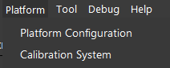
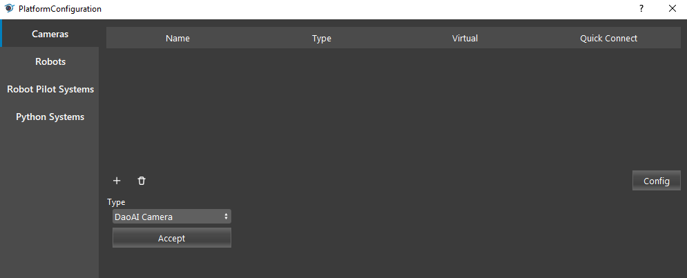
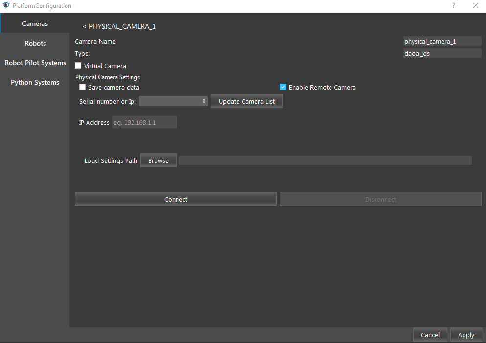

Using Multiple DaoAI Cameras
=============================

**DaoAI Vision** allows you to operate multiple DaoAI Cameras of the BP series simultaneously (e.g. connecting both BP-S and BP-L).

However, it comes with some limitations: 

    - Each of the DaoAI Cameras must have a unique IP address.
    - Each of the DaoAI Cameras have to be connected using separate ethernet ports.
    - You must not call DaoAI::Application::cameras() simultaneously from multiple threads or processes; they may collide when trying to connect to the cameras to get the serial number, firmware version, etc.
    - The same holds for any combination of these API calls (connect, update firmware, list cameras) at the same time from multiple threads or processes.

.. warning:: 
    Cameras can capture images simultaneously, but they must be connected to the computer in sequence.

To connect multiple cameras in Vision: 

Select **Platform** → **Platform Configuration** in the tool bar.

In the **Camera** tab, click **+** to start adding a new camera, select the appropriate camera model from the dropdown list, then click **Accept** to add the camera.

If it is a remote camera, select the **Enable Remote Camera** checkbox and enter its IP address. Click **Update Camera List**, then select the Camera from the list. Click Connect to connect the camera.

.. note:: 
    For multiple Remote Cameras, make sure you have configured your cameras' IP addresses (see :ref:`Network Configuration`), otherwise you may have issue finding or connecting the cameras.

