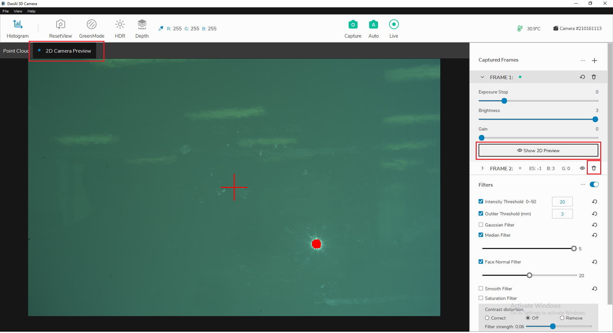
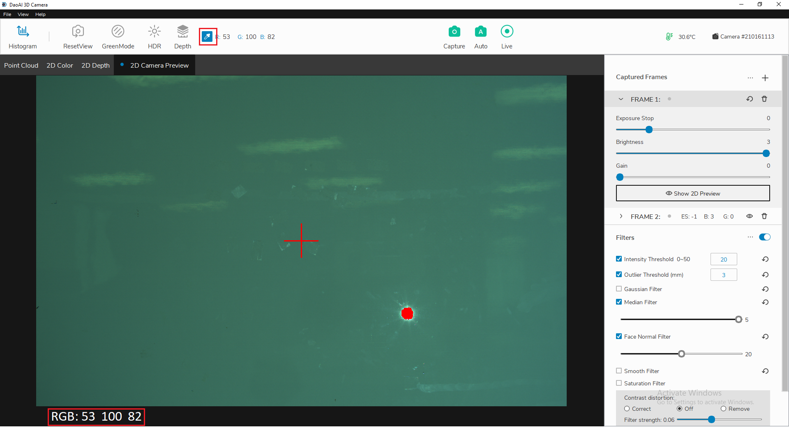

2D 相机预览
===========

2D预览功能用于在执行捕获之前检索场景的预览图像。

|

要执行2D预览，请在与您要预览的帧数对应的框架下拉菜单中单击“显示2D预览”。预览将自动出现在“2D相机”的可视预览中。如果帧数设置有问题的话，可以单击“眼睛”图标以预览该框架。在“2D相机预览”选项卡中，如果图像有红色斑点，这意味着这些像素在当前帧设置下过度曝光。

如果存在2D相机预览，您可以单击主窗口顶部栏中的颜色选择器图标，以查找光标所在位置的像素的RGB值。图像预览中的位置。这些值将在顶部栏上更新，并显示在左下角。

|