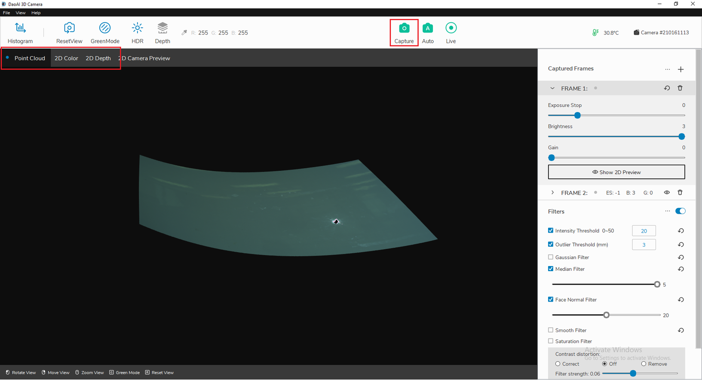
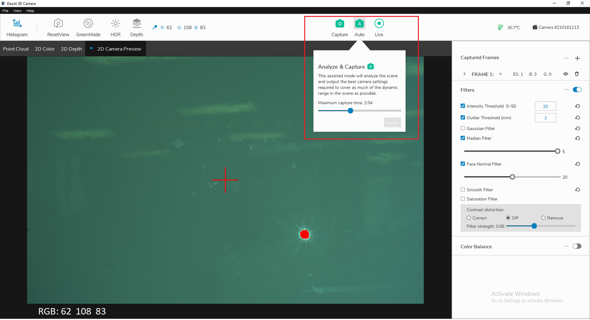
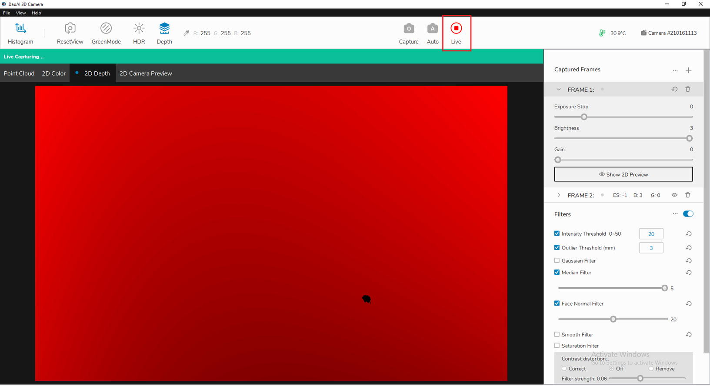

采集
=========

执行采集是三位感知视觉软件的主要功能之一。三维感知视觉有3种拍摄模式可供选择。

|

单张采集
---------------

当您点击顶部栏上的“采集”时，相机将使用的所有帧及其相应的设置来采集图像。对于所有采集模式，您都可以查看深度图、颜色图和点云图之间切换。

|

自动采集
---------

当你点击“自动”时，将对图像环境进行分析，并自动生成帧，来最大化最终的动态范围图片。然后，将使用新的帧设置进行单次采集。在此模式下，您还可以指定最大采集时间。此设置将更改帧数的最大的曝光时间

|

实时采集
-------------

点击 “实时”，三维感知视觉系统将连续进行单次拍摄。要停止执行采集，只需再次单击该按钮(当实时模式正在运行时)。
 

    
|

保存和加载数据
----------------

用户可以保存采集生成的图像集，然后在以后加载这些图像以生成点云。

如果您需要保存捕获的2D图像，请点击左上角“帮助”→“系统”→“高级”→“保存单次捕获图像”，选择保存图像的路径。（软件将生成子文件夹以存储捕获的图像)。

如果您需要使用加载的2D图像来生成点云，请单击左上角的“帮助”→“高级”→“高级”→“加载单张采集图片”，选择加载图像的路径文件夹。为了确保当前帧的数量与图像文件夹中的帧的数量相同(以及各自的设置)，
点击采集，即可生成对应的点云图像。

.. note:: 需要密码才可访问系统面板。

.. image:: images/advanced_system_settings.png
    :align: center

|
