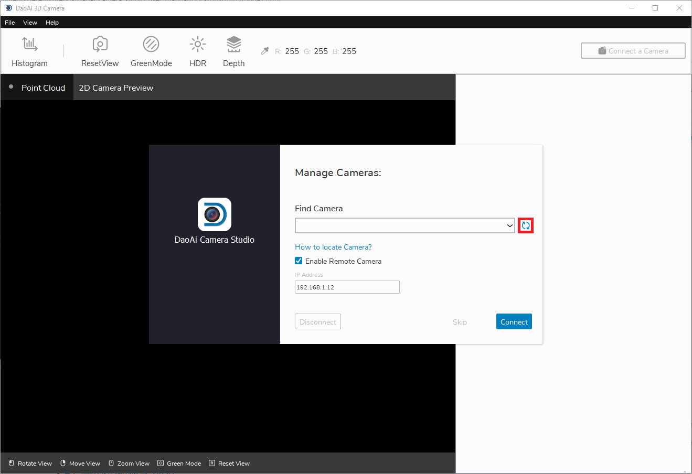
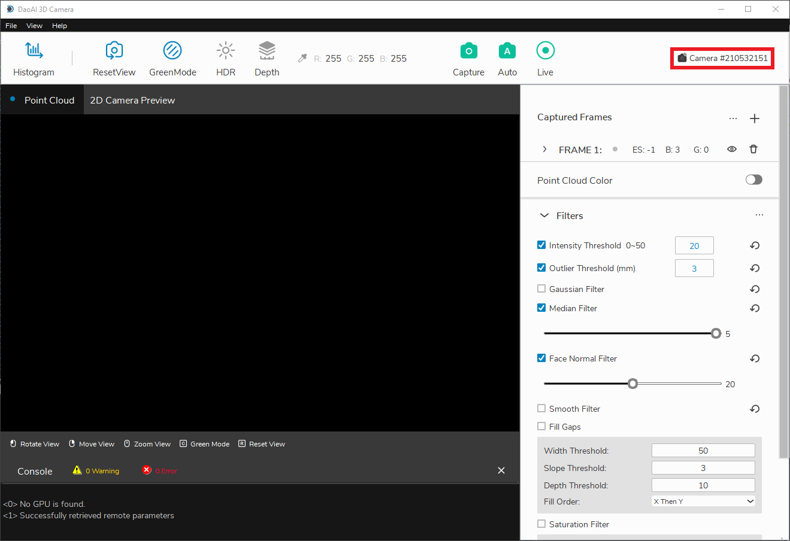
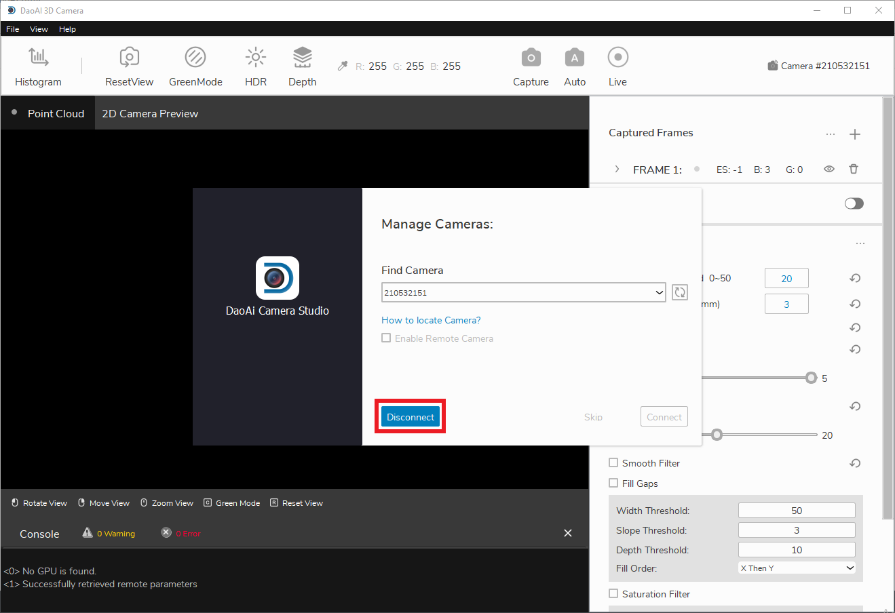

Connecting
===========

Connecting your camera in our Camera Studio software is simple. Refer to the *Connecting the Camera* article in the **Quickstart** section.

|

Connecting
-----------

When starting Camera Studio, at first you will see the *Manage Cameras* window.

|

The refresh button updates the list of connected cameras. If you are using a remote controlled camera, you will have check the *Enable Remote Cameras* checkbox and specify the 
camera's IP address first before clicking refresh.

|

Once you detect the camera you wish to connect to, click the connect button. If there are multiple cameras connected, you can choose which camera to connect to from the dropdown 
list.

.. image:: images/manage_cameras_connect.png
    :align: center

|

After connected, you should see the main window.

|

Disconnecting
--------------

To disconnect your camera, first click the camera ID in the top right area of the main window.

|

From there, you should see the **Manage Cameras** window, where you can click disconnect.

|
