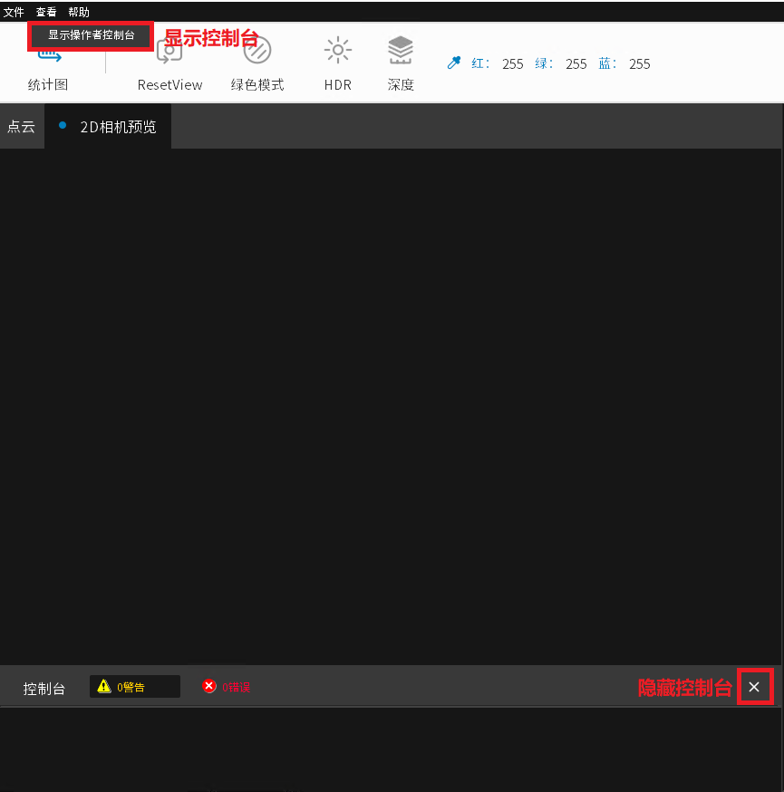

控制台
======

.. image:: images/console.png
    :align: center
|

系统信息, 运行结果, Debug信息, 警告和错误信息会在控制台显示。 

信息过滤
-------

点击控制台栏上的黄色警告或者红色错误可以选择过滤掉其他信息, 只显示选择的的信息, 警告或者错误。

.. warning::
    在导出log文件时, 请不要选中控制台过滤器, 否则导出的log文件会只包含过滤后的内容。Log文件的写入要在关闭程序后完成, 在导出log文件时, 应当保持控制台过滤器是未选中状态直到程序关闭。
    

如何隐藏、显示控制台
------------------

可以点击控制台栏中的"X"图标来隐藏控制台。

显示控制点可以点击软件上方菜单栏, 查看 -> 显示操作者控制台。

|

