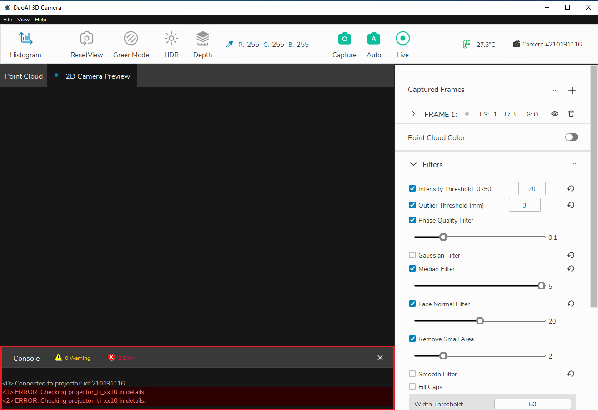
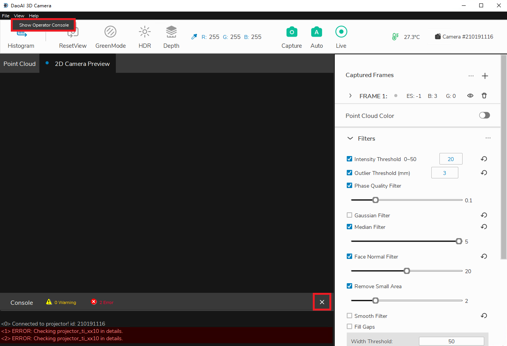

Console
========

|

System information, results, detailed informations, warnings and errors are displayed in the Console.

Message Filtering
-------------------

Click on the yellow warning icon or the red error icon can filter out message other than warning or error. 

.. warning::
    Do not filter console when exporting log files. Log files contain messages from the console and will complete writing to disk upon program exits.  

Hide and Show the Console
---------------------------

Click on the 'X' icon on the top-right corner of the console to hide it.

And from menu bar, click "View -> Show Console" to bring it back.

|