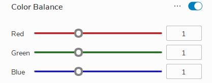

Filters
========

Filters
This section describes the filters used for pre and post processing images in order to optimize the point cloud quality.

|

**Intensity Threshold**

Our intensity metric is based off of the average pixel intensity value from the four fringe projections from capture. The threshold helps filter out outliers that are caused by 
low quality pixels within dark areas in an image. Generally we see that for objects with low reflectivity, the algorithm is not able conduct 3D reconstruction and thus computes 
incorrect points there. The value of the intensity threshold corresponds to the averaged RGB value we want to filter at.

E.G. When the intensity threshold is 20, all the pixels in the final image with values <= 20 will be filtered out.

|

**Outlier Threshold**

Used to filter out points that are more than a certain distance from their nearest neighboring point. For example, if set to 3mm, it is determined whether the straight-line 
distance between two adjacent point is greater than 3mm. If it is greater than 3mm, the point is filtered out. However, if there are multiple outliers close to each other, this 
filter will not be able to filter out those points.

|

**Gaussian Filter**

This filter applies a moving average window to each pixel of the captured image. The gaussian kernel size can be set to be 3x3 , 5x5, 7x7, 9x9, 11x11, and 13x13. This applies a 
smoothing effect on the point cloud and also helps to remove outlier points.

|

**Median Filter**

This filter finds the median value of a sliding window to update the current pixel as. The kernel size can be 3x3 or 5x5. This applies a smoothing effect on the point and helps 
remove outlier points.

|

**Face Normal Filter**

This filter analyzes a point cloud polygon mesh to find the surface normal vector of any polygon. If the surface normal vector is at an angle larger than the face normal value 
with respect to the line of sight, then the points are filtered out. On objects with sharp corners and large areas where the surface normal is perpendicular to the line of sight, 
many outliers occur. An example is a box: the walls sometimes create outlier points in the point cloud due to noise, low contrast or over-saturated images. 

Without this filter, the incorrect points show up on the edges of holes, sharp drop offs, vertical faces, and more.

|

**Smooth Filter**

This filter is a post-processing filter which rounds the depth value of an organized point cloud to the nearest mm. For example, if the smooth value is 0.5, each of the depth 
values will be rounded to the nearest 0.5mm. This filter is useful in scenarios where images with noise errors causes small oscillations on the point cloud. If you know the model 
is flat and you see small oscillations in the point cloud, you can use this filter to round the data to create a flat model.

|

**Saturation Filter**

This filter removes areas that are overexposed. When one of the three RGB channels exceeds 255, it deletes the pixel. Usually G (green) is the first overexposed channel. When 
using the filter, HDR mode is automatically selected and can be manually cancelled if it is not necessary. One of the drawbacks of the filter is that some smooth edges may be 
distorted.

|

**Contrast Distortion Filter**

Contrast distortion occurs due to imperfections in the lens and optical phenomena like diffraction and chromatic aberration. It appears when there is an abrupt contrast change 
from a highly absorptive to a reflective surface (e.g. in a black to white transition on a checkerboard), which leads to measurement errors in the 3D point cloud.

* If “Remove“ is selected, regions of high contrast distortion will be removed from the 3D point cloud.
* If “Correct“ is selected, measurement errors caused by contrast distortion will be compensated based on a “Strength“ value user set on the GUI. The higher “Strength“ value user 
use, the more measurement error will be compensated. Note that, it's possible to over-compensate the measurement error which looks like “opposite“ contrast distortion.

|

**Color Balance**

By increasing the corresponding value of R/G/B, you can make the image closer to that color. The default value is 1, the minimum is 0.5, and the maximum is 2.

Used when the color of the background environment is slightly inclined to a certain hue. Adjust the balance of other colors. Usually, it does not need to be set up.

Preview options are not available, a single capture is required to see the image effect.

|

**Fill Gaps**

Interpolation can be used to caltulate the coordinates of points in areas where points are missing from the point cloud. There will be scenarios where your point cloud is missing 
points in areas due things like reflection, poor lighting, etc. Thresholds can be set for maximum gap area width, depth, and slope, to describe the areas of the point cloud where 
interpolation will occur to calculate and fill in these missing points.