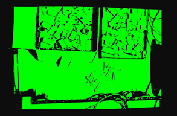
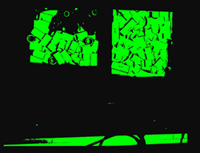
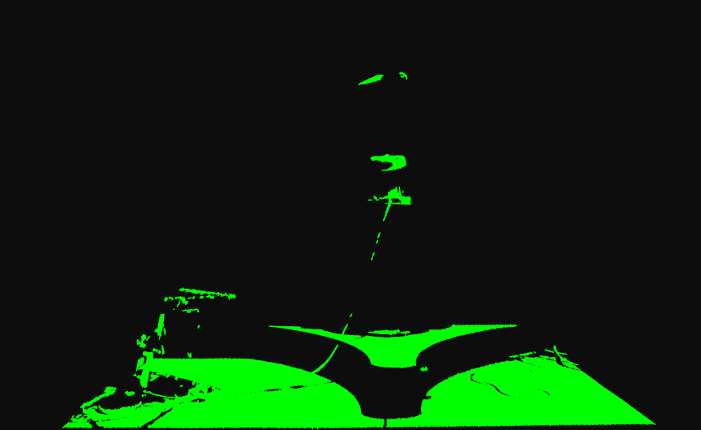
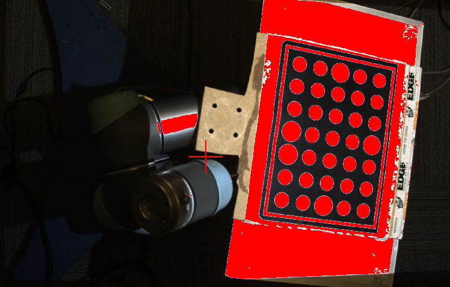
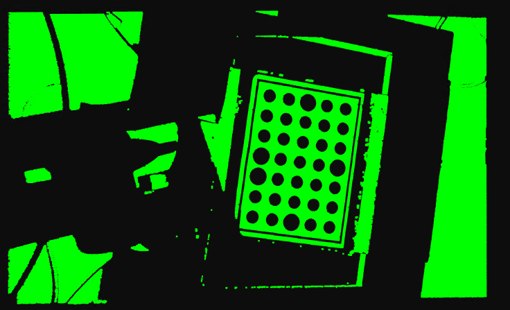
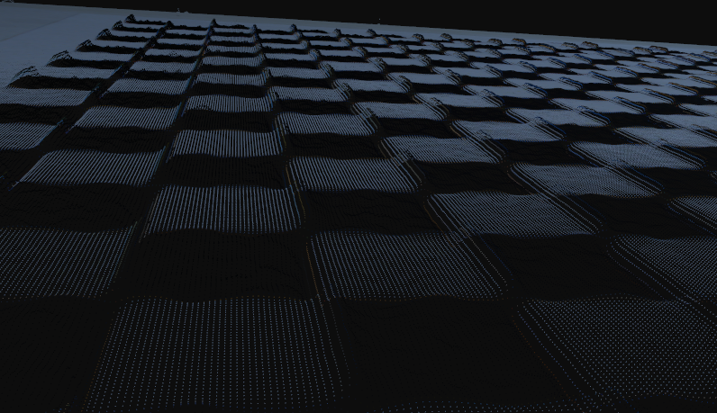
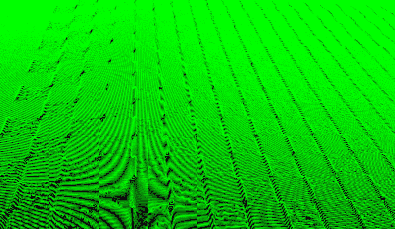
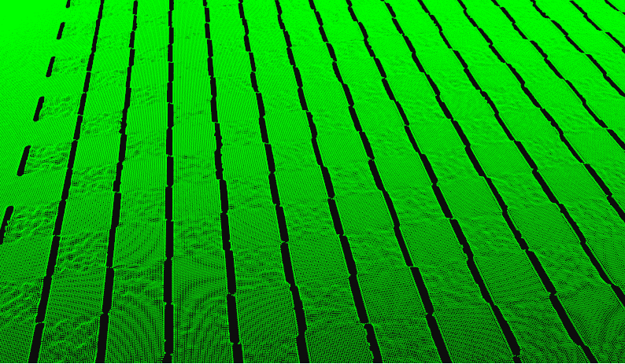
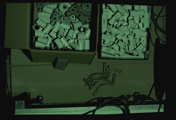

滤镜
=====

本节介绍用于预处理和后处理图像的过滤功能，以提高点云质量。

|

强度阈值
--------------------

我们的强度度量基于来自捕获的四个边缘投影的平均像素强度值。 阈值有助于过滤由图像暗区中的低质量像素引起的异常值。 通常，我们看到对于反射率低的物体，该算法无法进行 3D 重建，因此在那里计算出不正确的点。 强度阈值对应着我们要过滤的平均RGB值。

例如. 当强度阈值为 20 时，最终图像中所有值 <= 20 的像素都将被过滤掉。

    Point cloud without intensity threshold set

    
    强度阈值设置为 20 的点云

|

异常值阈值
---------

用于过滤离最近邻点超过一定距离的点。 例如，如果设置为3mm，则判断相邻两点的直线距离是否大于3mm。 如果大于 3mm，则该点被过滤掉。 但是，如果有多个离群值彼此靠近，则此过滤器将无法过滤掉这些点。

.. figure:: images/outlier_before.png
    :align: center

    未设置异常值阈值的点云
    

    异常值阈值设置为 3 毫米的点云

|

高斯滤波器
----------------

此过滤器将移动平均窗口应用于捕获图像的每个像素。 高斯核大小可以设置为 3x3、5x5、7x7、9x9、11x11 和 13x13。 这对点云应用了平滑效果，还有助于去除异常点。
|

中值滤波器
--------------

这个过滤器找到一个滑动窗口的中值来更新当前像素。 内核大小可以是 3x3 或 5x5。 这会在点上应用平滑效果并帮助去除异常点。

|

法线面过滤
---------

此过滤器分析点云多边形网格以找到任何多边形的表面法线向量。 如果表面法线向量相对于视线的角度大于面法线值，则过滤掉这些点。 在具有尖角和表面法线垂直于视线的大面积物体上，会出现许多异常值。 一个例子是一个盒子：由于噪声、低对比度或过度饱和的图像，墙壁有时会在点云中创建异常点。

如果没有这个过滤器，错误的点会出现在孔的边缘、锐化下降、垂直面等。

|

平滑过滤
---------

此过滤器是一种后处理过滤器，可将有组织的点云的深度值四舍五入到最接近的 mm。 例如，如果平滑值为 0.5，则每个深度值将四舍五入到最接近的 0.5 毫米。 此过滤器在具有噪声错误的图像导致点云上的小振荡的情况下很有用。 如果您知道模型是扁平的，并且在点云中看到了小的振荡，则可以使用此过滤器对数据进行四舍五入以创建扁平模型。

|

饱和过滤
---------

此滤镜可去除曝光过度的区域。 当三个 RGB 通道之一超过 255 时，它会删除该像素。 通常，G（绿色）是第一个曝光过度的通道。 使用滤镜时，会自动选择 HDR 模式，如果不需要，可以手动取消。 过滤器的缺点之一是一些平滑的边缘可能会失真。

    没有饱和过滤器的点云

    带饱和过滤器的点云

|

对比度失真滤镜
--------------

对比度失真的发生是由于镜头中的缺陷以及衍射和色差等光学现象。 当从高吸收性表面到反射性表面（例如棋盘上的黑色到白色过渡）发生突然的对比度变化时，就会出现这种情况，这会导致 3D 点云中的测量误差。

* 如果选择“移除”，高对比度失真区域将从 3D 点云中移除。
* 如果选择“Correct”，则由对比度失真引起的测量误差将根据用户在 GUI 上设置的“Strength”值进行补偿。 用户使用的“强度”值越高，补偿的测量误差就越多。 请注意，可能会过度补偿看起来像“相反”对比度失真的测量误差。

    点云彩色图像（对比度失真可见）

    点云绿色图像（对比度失真可见）

    对比度失真使用“移除”

.. figure:: images/cd_correct.png
    :align: center
    :scale: 60%	

    使用“正确”来进行对比度失真

|

色彩均衡
--------

通过增加R/G/B的对应值，可以使图像更接近那个颜色。 默认值为 1，最小值为 0.5，最大值为 2。

当背景环境的颜色略微倾向于某种色调时使用。 调整其他颜色的平衡。 通常，它不需要设置。

预览选项不可用，需要单次捕获才能看到图像效果。

.. figure:: images/color_balance.png
    :align: center

    色彩平衡控制

.. figure:: images/color_balance_r.png
    :align: center

    R 偏色平衡

    G 偏色平衡

.. figure:: images/color_balance_b.png
    :align: center

    B 偏色平衡
|

填补空白
----------

插值可用于计算点云中缺少点的区域中点的坐标。 在某些情况下，由于反射、光照不足等原因，您的点云会在区域中丢失点。可以为最大间隙区域宽度、深度和坡度设置阈值，以描述点云的插值区域进行计算并填补这些缺失的点。