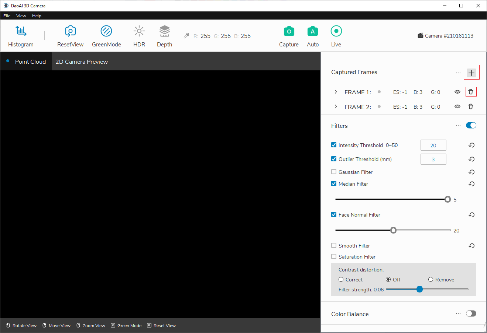
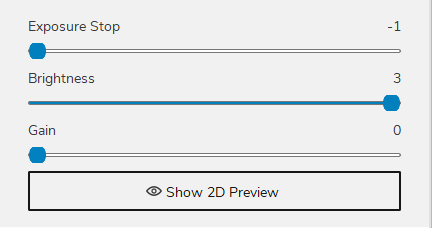

帧数
=======

帧用于调整在捕捉时应用的曝光停止、亮度和增益级别。 三维感知识别系统允许您添加具有不同设置的多个帧以捕获多个图像组并微调生成图像的质量。

|

添加帧数
--------------

当图像不符合预期要求时，您可以通过添加更多帧并使用不同的曝光文件设置来实现更精确的逐帧曝光级别。 例如，两帧设置2个不同的曝光值分别为-1和0，以弥补单帧-1太暗或单帧0太亮的情况。

单击右侧帧设置菜单上的“+”按钮以添加更多帧。同样，您可以单击垃圾桶图标删除相应的帧。最小帧数为 1。

    添加和删除按钮

.. figure:: images/frames_dropdown.png
    :align: center
    
    下拉菜单显示参数

|

帧值参数
--------

三个参数的功能均为调整画面亮度。其中任意一个参数增加1都会使图像的亮度乘以2。

增加亮度时应当优先增加亮度，再增加曝光帧，最后增加增益。

|

**曝光帧**

    调整曝光时间。曝光帧的级别为 -1、0、1、2、3、4。增加曝光时间会增加拍照时间, 因此增加亮度时应在亮度已经最高后再增加曝光。最常用的曝光级别是 -1、0 和 1。

**亮度**

    调整投影仪的亮度。值域为 1、2、3。增加亮度不会影响拍摄时间, 因此调整亮度时应优先调整亮度。

**增益**

    调整相机的ISO值或感光度。 跨度范围为 0、1、2、3、4, 其中 0 是基点 0dB, 4 对应于最大值 24dB（每个滑块增量会导致 6dB 变化）。 当增益增加或减少6dB时，增益效果是前一次的两倍。 转换公式为：20 x log（增益倍数）= + /-增益 dB 值。
增加增益会降低信噪比，因此在增加亮度时，应最后增加增益。

点云颜色
--------

独立采集点云的颜色。

.. figure:: images/point_cloud_color.png
    :align: center

|

启用后, 会展开帧值参数(如上图所示), 并在拍摄时，额外投射一次全白光以采集点云图的颜色。

此外，曝光时间的单位为毫秒, 可以进行更细致的调整。其他参数设置与帧值参数一样。

