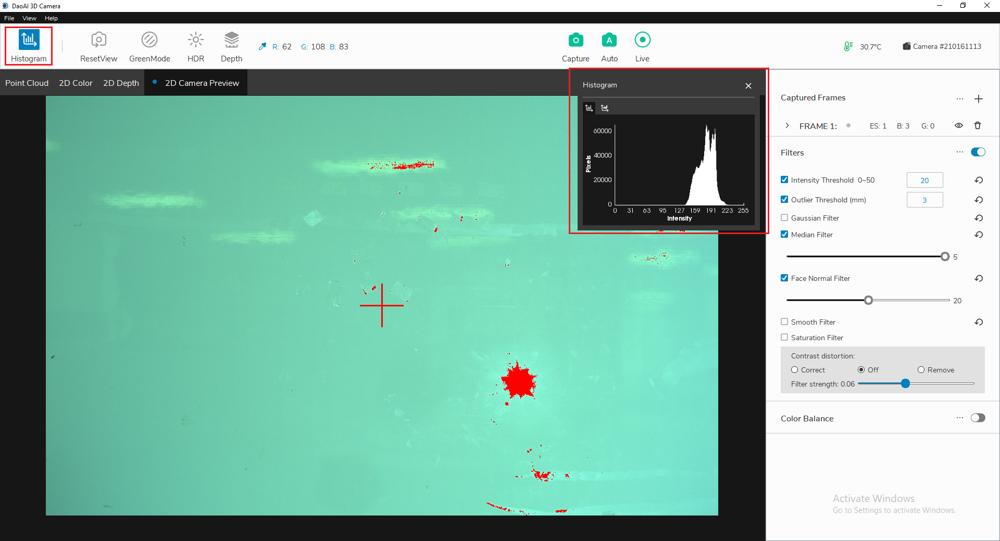

Histograms
===========

The histogram window provides a visualization of the distribution of pixels' colors 

**Goal:** The highest column in the logarithmic histogram to around 128 to avoid 255 overexposures. This can be achieved by adding frames and adjusting exposure levels. 

Click “Histogram” in the upper left corner to toggle the histogram window. The histogram plot will pop up on the screen automatically. Inside this window, there are two different 
tabs for switching between linear distribution and logarithimic distribution.

