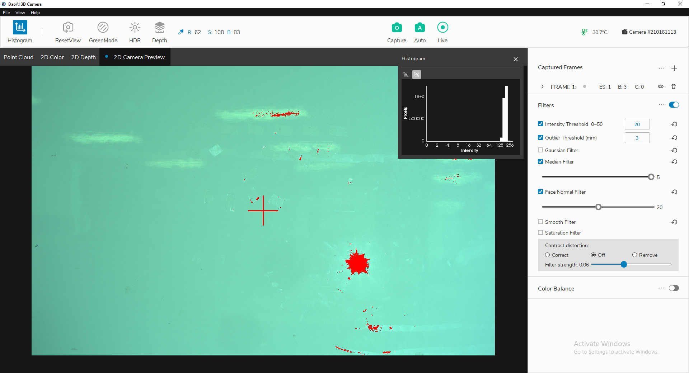

直方图
===========

直方图窗口提供图像中所有可视化像素的 RGB 值 (0-255)。

|

**目的:** 将对数直方图中的最高列设置为 128 左右，以避免 255 次过度曝光。 这可以通过添加帧和调整曝光级别来实现。

单击左上角的“直方图”以切换直方图窗口。 直方图将自动在屏幕上弹出。 在此窗口内，有两个不同的选项卡用于在线性分布图和对数分布图之间切换。 曝光过度的像素被标记为红色，因此您可以轻松看到它们。 如果 255 范围内有大量像素，则图像曝光过度。 应选择较短的曝光时间或较低的亮度来限制过度曝光。

.. figure:: images/histogram_linear.png
    :align: center
    
    线性分布

    
    对数分布