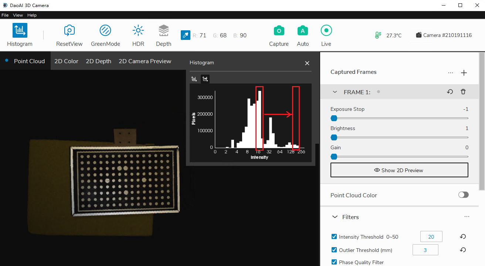
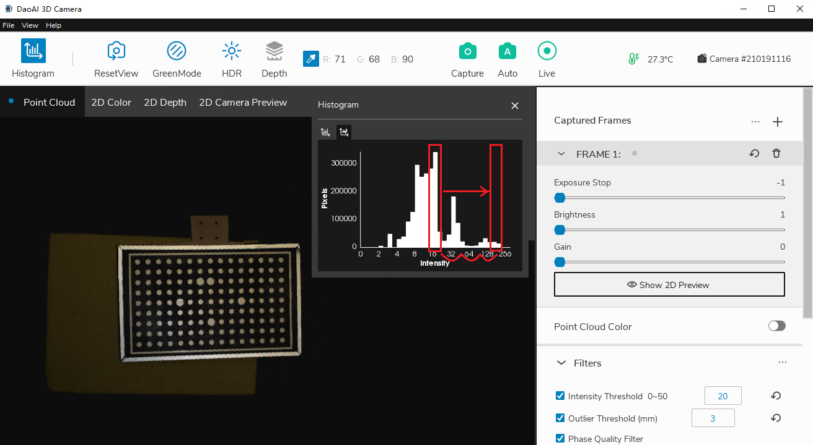
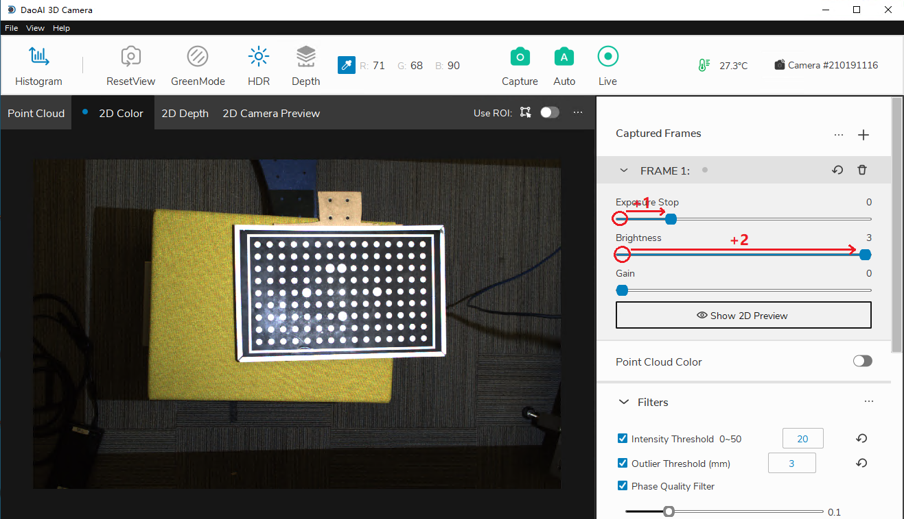

Histograms
===========

The histogram window provides a visualization of the distribution of the RGB values (0-255) of all the pixels in the image.

|

**Goal:** To have the highest column in the logarithmic histogram to around 128 to avoid 255 overexposures. This can be achieved by adding frames and adjusting exposure levels. 

Click “Histogram” in the upper left corner to toggle the histogram window. The histogram plot will pop up on the screen automatically. Inside this window, there are two different 
tabs for switching between graphs of a linear distribution and logarithmic distribution. Overexposed pixels are marked a red color so you can easily see them. If there are a large 
number of pixels in 255 range, the image is overexposed. Shorter exposure time or lower brightness should be chosen to limit the overexposure.

.. figure:: images/histogram_linear.png
    :align: center
    
    Linear distribution

.. figure:: images/histogram_logarithmic.png
    :align: center
    
    Logarithmic distribution

|

**Logarithmic distribution can help adjusting the brightness to desired range.**

For example, as the image below, we want to adjust the peak brightness from "16-32" to "128-256".

|

Recall that for frame parameters, an increase of one in any field will double the brightness of the final image, and the ranges in logarithmic distribution also doubles.

|

Obeserve that there are 3 intervals from range "16-32" to "128-255". Then adding 3 to frame parameters can move the peak brightness to our desired range.

|
