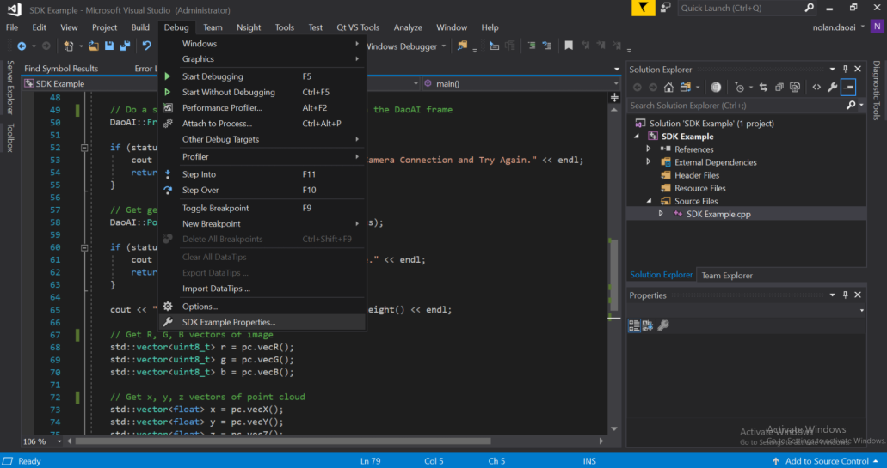
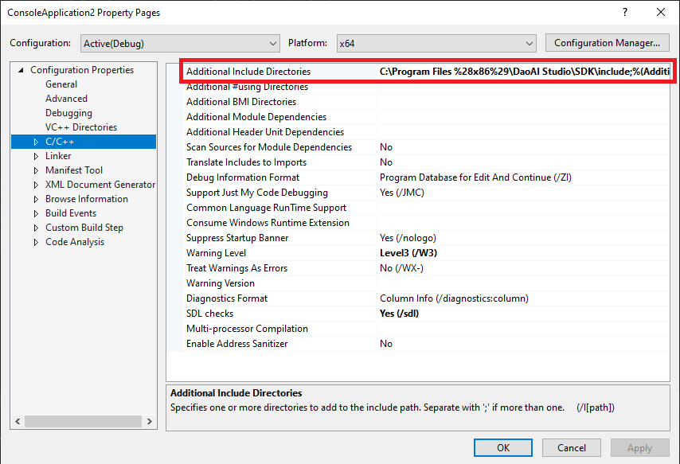
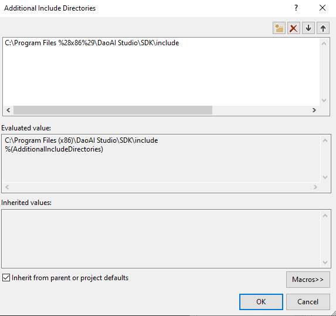
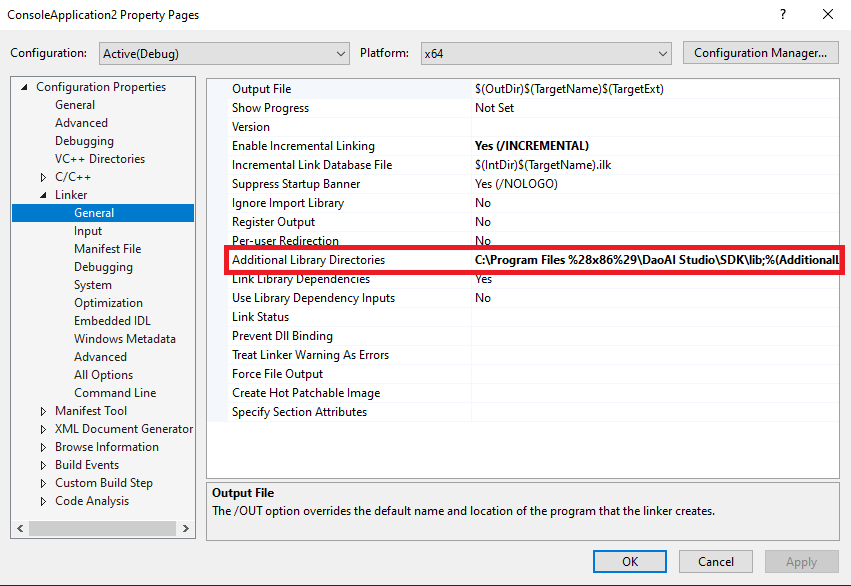
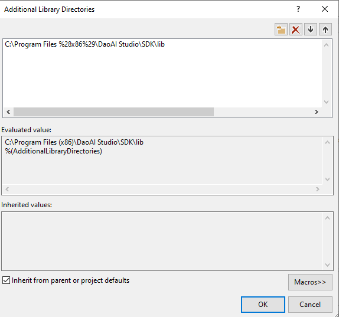
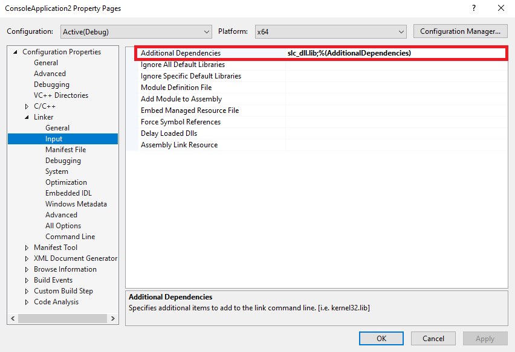
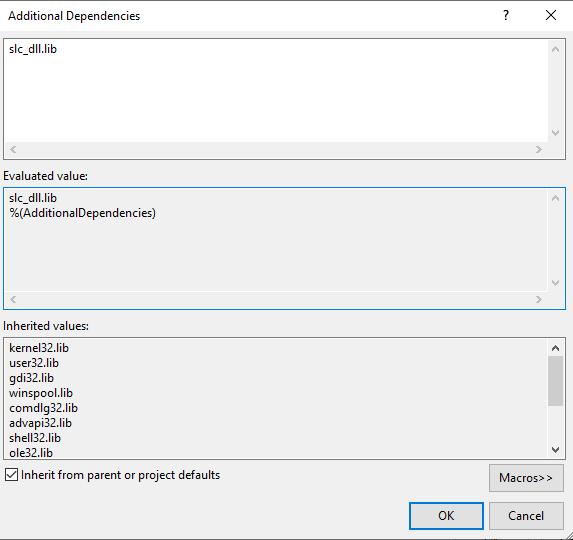

Develop - Create a New Project
==================================

This page will walk you through how to set up a project using our SDK.

**Step 1. Add the path to slc_dll.dll to the Path system variable**

In Windows, navigate to Edit the system environment variables → Environment Variables. The new entry to the path system variable should be the <path to DaoAI Studio>\\SDK\\bin.

**Step 2. Update include directories in Visual Studio**

In Visual Studio, navigate to Debug → SDK Example Properties. You'll need to stay in the Properties menu for the remaining steps as well.

|

When making changes to the project properties, make sure the Configuration and Platform are set correctly (Release, x64). To update the include directories, first navigate to 
Additional Include Directories under C/C++ → General, click on the field's dropdown arrow and click Edit, and add the path to the SDK include directory, which contains the 
library header files.

|

**3. Update linker settings in Visual Studio**

Navigate to Linker → General, click on the field's dropdown arrow and click Edit, and add the path to the SDK lib directory, which contains the .lib library object files that 
need to be linked.

|

Finally, navigate to Linker → Input, click on the field's dropdown arrow and click Edit, and add slc_dll.lib as an entry.

|

When you are finished these steps, apply the changes and click OK.