*********
DaoAI SLC Camera 连接 Matrox Design系统
*********

.. contents:: 
   :local:

本文档将指导您来如何安装和配置 Matrox Design 系统， 将DaoAI SLC 相机中的真实图像、深度图图像和点云成像捕获到Matrox Design 系统里。

安装 DaoAI SLC 相机软件
~~~~~~~~~~~~~~~~~~~
下载最新的SLC full installer 安装包进行安装。

安装完SLC 软件后， 打开根目录，打开DA3rdPartyCamera文件夹。

安装Matrox Design Assistant 2109（8.0）
~~~~~~~~~~~~~~~~~~~
`下载Matrox Design Assistant 的安装程序 <https://daoairoboticsinc-my.sharepoint.com/:u:/g/personal/xchen_daoai_com/EbI7wC2QgclJnE8FRvu48aEBBnd_Gqp5UpK-IYNSxHbDcg?e=74p9LT>`_。这个软件需要我们的密钥，因此您同时要准备好一个密钥。

.. Note::
    如果此电脑之前安装过我们的Vison软件， 请先进入“控制面板”并卸载我们的Vison软件，并同时卸载“Matrox Imaging”软件。

安装Matrox Design Assistant 2109（8.0）步骤如下：

1. 当您运行上面的 exe 时，请使用默认设置。它将解压缩一个名为“DAXV2109_8_0_291”的文件夹。

.. image:: images/slc-to-matrox1.png
    :align: center
|

2. 打开文件夹，并运行“DesignAssistantSetup.exe”

|

3. 单击第一个按钮“Install .NET5.0 Desktop Runtime”

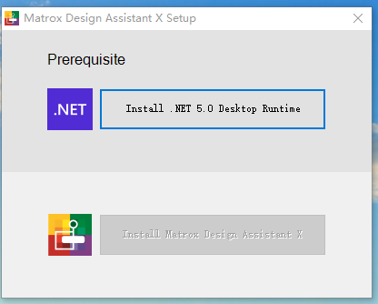
|

.. WARNING::
    如果这个时候没有”Install .NET5.0 Desktop Runtime” 的选项的话就请先手动安装 Windows desktop .NET 5.0。
    `安装包 <https://daoairoboticsinc-my.sharepoint.com/:u:/g/personal/xchen_daoai_com/EdBqQO_AdjJCndlh-J9JN6EBbsKfGKz6QJKtHZktdPmW0g?e=E6c2qb>`_

4. 安装完runtime后，安装 Install Matrox Design Assistant。

|

5. 接下来你会看到组件选择，勾选IDE和RTE

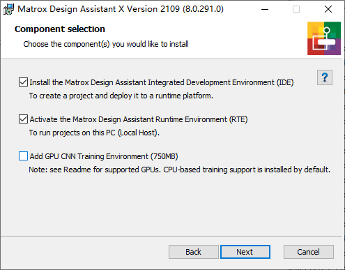

    勾选前两个选项。
|

6. 在安装结束时，禁用“配置自动更新”

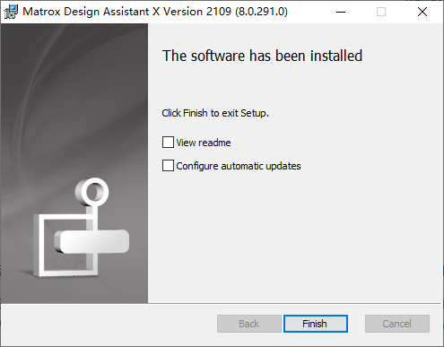
|

7. 重启电脑。

.. Note::
    如果您看到这个错误，您需要进入控制面板并确保您在安装程序启动之前卸载了 Matrox Imaging。

    .. image:: images/slc-to-matrox5.png
        :align: center
    |

    如果您看到此错误框，则表示您的 PC 上没有正确安装 .NET Runtime 5.0。

    .. image:: images/slc-to-matrox6.png
        :align: center
    |

配置 Matrox Design Assistant 2109（8.0）
~~~~~~~~~~~~~~~~~~~

完成上述安装过程后，我们接下来需要执行的操作是将我们的 DaoAI SLC Camera 加载到 DA的系统中。

1. 打开文件夹 C:\ProgramData\Matrox Design Assistant\8.0\ThirdPartyCameras

|

2. 将（SLC 安装文件夹） /DA3rdPartyCamera/DaoAI_Camera 文件夹复制到步骤 1 中打开的 ThirdPartyCameras 文件夹中。

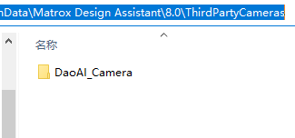
|

3. 在电脑右下角的显示隐藏图标中，通过右键单击 DA 图标->”Stop the runtime enviroment”。

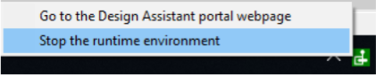

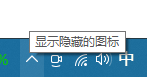
|

4. 单击”Start the runtime enviroment”以加载新的第三方相机。

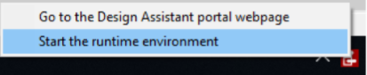
|

.. Note::
    DA 运行环境是开机自启动的，因此我们要暂停后再重新开始才可以保证我们的相机被成功加载进去。

创建设计助手项目
~~~~~~~~~~~~~~~~~~~

1. 从开始菜单打开 Matrox DA X Version 2109

|

2. 创建一个新项目，选择第一项“连接本地”

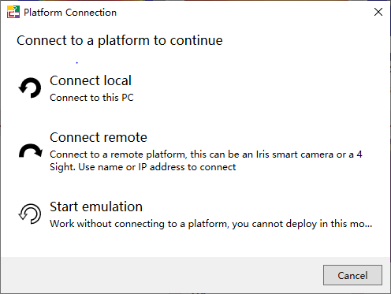
|

3. 并从 3D 相机列表中指定 DaoAI SLC_Camera 类型。配置如下图片一样：

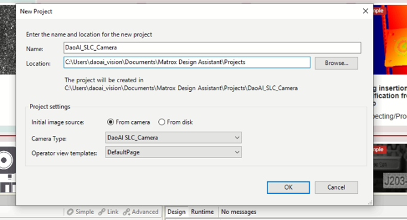
|

4. 在出现的提示中点击连接到本地。

连接 DaoAI SLC 相机
~~~~~~~~~~~~~~~~~~~

.. WARNING::
    DaoAI Studio和MIL Design Assistant不能同时连接一台相机。
|

在 Matrox Design Assistant 中，您可以在 “Platform Configuration” 对话框中选择、连接和断开相机。 

1. 要打开平台配置，请右键单击相机节点，然后单击“Configure Camera Source Setting...”

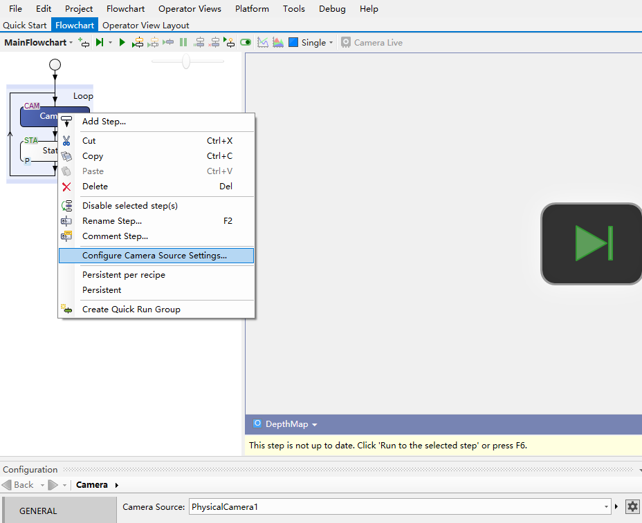
|

2. 有Allocate和Free按钮，分别对应连接和断开。您可以实现三种功能：

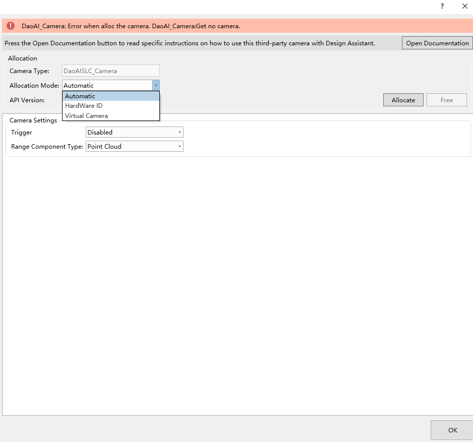
|

a. 自动：
MIL 设计助手分配 API 检测到的第一个 DaoAI SLC 相机。

b. 硬件 ID：
硬件ID的值是您要连接的摄像机的序列号。序列号可以在 DaoAI Studio 中找到。

c. 虚拟相机：
它将分配一个虚拟相机而不是物理相机。您输入的值可以是：
    \i. Empty，表示虚拟相机将加载默认文件夹（DaoAI 3D 相机安装文件夹） \data\d3Data\中的数据。

    \i\i. 文件夹路径应该是一个文件夹，其中包含您希望虚拟相机加载并显示在 MIL 设计助手上的 .daf 和/或 .dcf 数据文件。
    
    .. image:: images/slc-to-matrox15.png
        :align: center
    |

3. 单击“分配”以连接您的相机。

|

4. 对于硬件相机，您需要准备相机的配置文件。
使用 DaoAI 3D 相机软件中的“保存相机设置”功能保存“.cfg”文件。您需要将文件重命名为您的相机序列号（错误会提示您序列号）并将cfg文件放在（DaoAI 3D相机安装文件夹） \data\config\下。

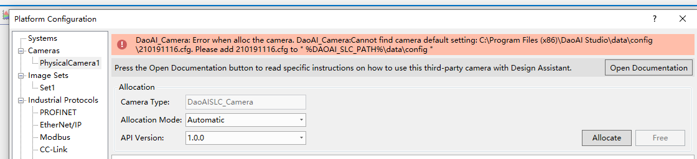
|

5. 对于成功的连接，您应该会看到 Free 按钮已启用，并且没有错误提示。

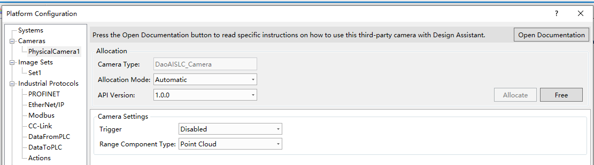
|

.. danger::
    您必须取消选中此“点云投影深度图”才能获得正确的 2D 图像。

    .. image:: images/slc-to-matrox18.png
        :align: center
    |

更多信息
~~~~~~~~~~~~~~~~~~~

配置相机步骤
------------

在 Camera 步骤中，验证 Camera Source 输入是否为 PhysicalCamera1，
选择相机节点，点击“运行选择步骤”，相机进行抓拍。

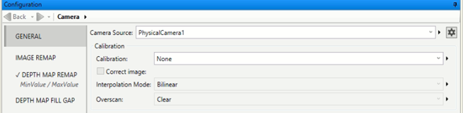
|

这是捕获的示例结果：

.. list-table:: 
    :header-rows: 0

    * - 相机图像
      - .. image:: images/slc-to-matrox20.png

    * - 深度图像
      - .. image:: images/slc-to-matrox20.png
    
    * - 点云
      - .. image:: images/slc-to-matrox21.png
|

更改相机设置
------------

使用物理相机时，有不同的相机设置，如下所示：

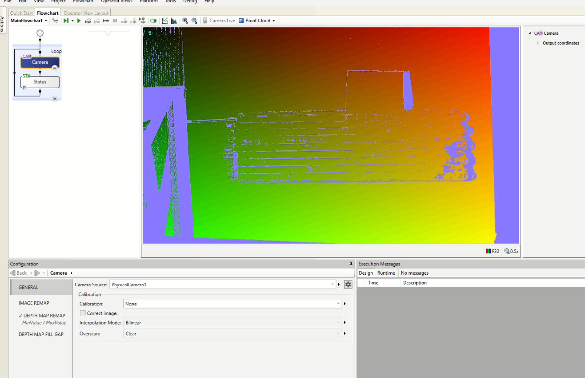
|

在 DaoAI Studio 中，您可以直接更改这些设置，但在 MIL 设计助手中，它将加载您正在连接的相机的默认设置。

设置文件名为“ serial_number.ws”，   “serial_number”应该是您要连接的摄像机的确切序列号。例如，序列号为“202001002”的相机将加载设置“202001002.ws”

设置文件“ serial_number.ws”应放在路径：   %DAOAI_SLC_PATH%\data\workspace\

如果要更改设置文件，需要在 DaoAI Studio 中设置所需的值，并使用“另存为...”以相应的名称和路径保存设置。然后，当您在 MIL 设计助手的平台配置对话框中单击“分配”时，它将加载您想要的相机设置。