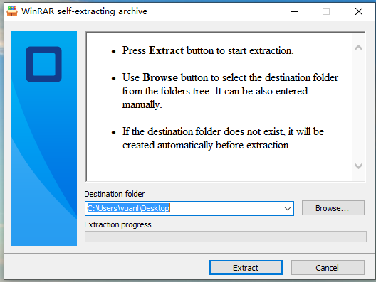

*********
DaoAI SLC Camera with Matrox Design Assistant
*********

.. contents:: 
   :local:

This document will guide you through setting up to capture real image, depth map images and point cloud from your DaoAI SLC Camera into Matrox Design Assistant.

Install the DaoAI SLC Camera Software
~~~~~~~~~~~~~~~~~~~
Install the latest DaoAI SLC Camera software.

After installation, go to the Application folder, and open DA3rdPartyCamera folder.

Install the Matrox Design Assistant 2109(8.0)
~~~~~~~~~~~~~~~~~~~
`Download the installer of Matrox Design Assistant <https://daoairoboticsinc-my.sharepoint.com/:u:/g/personal/xchen_daoai_com/EbI7wC2QgclJnE8FRvu48aEBBnd_Gqp5UpK-IYNSxHbDcg?e=74p9LT>`_ . You will need a key for it.

.. Note::
    Before you start, go to Control Panel and uninstall “Matrox Imaging” and DaoAI's Vision software first if you already have it installed.

|

1. When you run the exe above, go with default settings. It will unzip a fodler called “DAXV2109_8_0_291“.

|

2. Open this folder and run “DesignAssistantSetup.exe“

|

3. Click the first button “Install .NET5.0 Desktop Runtime”

|

.. WARNING::
    If there is no ”Install .NET5.0 Desktop Runtime” avaliable, you need to first install Windows Desktop .NET 5.0。
    `installation <https://daoairoboticsinc-my.sharepoint.com/:u:/g/personal/xchen_daoai_com/EdBqQO_AdjJCndlh-J9JN6EBbsKfGKz6QJKtHZktdPmW0g?e=E6c2qb>`_

4. After installing Runtime, Install Matrox Design Assistant。

|

5. Next you will see the component selection, check IDE and RTE

.. figure:: images/slc-to-matrox3.png
    :align: center

    Check first two options。
|

6. At the end of installation, disable “Confiture automatic updates“

.. image:: images/slc-to-matrox4.png
    :align: center

|

7. Restart PC.

.. Note::
    If you see this error, you need to go to Control Panel and make sure you uninstalled Matrox Imaging before the installer started.

    .. image:: images/slc-to-matrox5.png
        :align: center
    
    |

    If you see this error box, it means you don’t have .NET runtime 5.0 installed correctly on your PC.

    .. image:: images/slc-to-matrox6.png
        :align: center
    
    |

Configure the Matrox Design Assistant 2109(8.0)
~~~~~~~~~~~~~~~~~~~

After installing DA from installer above, do the following to load DaoAI SLC Camera into DA system.

1. Open folder C:\ProgramData\Matrox Design Assistant\8.0\ThirdPartyCameras

|

2. Copy the (SLC Installation folder)/DA3rdPartyCamera/DaoAI_Camera folder into ThirdPartyCameras folder opened in step 2.

.. image:: images/slc-to-matrox7.png
    :align: center
|

3. Stop DA runtime environment by right clicking the DA icon.

.. image:: images/slc-to-matrox8.png
    :align: center

.. image:: images/slc-to-matrox9.png
    :align: center
|

4. Start the DA runtime environment to load new thrid party camera.

|

Creating the Design Assistant Project
~~~~~~~~~~~~~~~~~~~

1. Open Matrox DA X Version 2109 from start menu

|

2. Create a new project, choose “Connect Local”

|

3. Specify the DaoAI SLC_Camera type from 3D camera list as the example image.

.. image:: images/slc-to-matrox12.png
    :align: center
|

4. Click connect to local in the new pop up.

Connect to the DaoAI SLC Camera
~~~~~~~~~~~~~~~~~~~

.. WARNING::
    DaoAI Studio and MIL Design Assistant cannot be connected to the same camera at the same time.

|

In Matrox Design Assistant, you can choose, connect and disconnect cameras on Platform Configuration dialog.

1. To open Platform Configuration, right click the Camera node, and click “Configure Camera Source Settings…”

|

2. There are Allocate and Free buttons, which correspond to connection and disconnection. There are three kind of features that you can implement:

|

a. Automatic : 
MIL Design Assistant allocates the first DaoAI SLC Camera detected by the API.

b. Hardware ID: 
The value of the Hardware is the serial number of the camera that you want to connect. The serial number can be found in DaoAI Studio.

c. Virtual Camera: 
It will allocate a virtual camera instead of a physical camera. The value you input can be :
    \i. Empty, which means the virtual camera will load the data in default folder (DaoAI 3D Camera Installation folder)\data\d3Data\.

    \i\i. A folder path, which should be a folder contains the .daf and/or .dcf data files that you want the virtual camera to load and display on MIL Design Assistant.
    
    .. image:: images/slc-to-matrox15.png
        :align: center
    |

3. Click “Allocate” to connect your camera.

|

4. For Hardware cameras, you need to prepare a configuration file of the camera.
Use “Save Camera Settings” function in DaoAI 3D Camera to save a “.cfg” file. You need to rename the file to the serial number of your camera(The error will prompt you the serial number) and place the cfg file under (DaoAI 3D Camera Installation folder)\data\config\.

.. image:: images/slc-to-matrox16.png
    :align: center
|

5. For a successful connection, you should see the Free button enabled, and no error prompts.

.. image:: images/slc-to-matrox17.png
    :align: center

|

.. danger::
    You must uncheck this “Project Depth Map from Point Cloud” to get a correct 2D Image.

    .. image:: images/slc-to-matrox18.png
        :align: center
    |

Further Information
~~~~~~~~~~~~~~~~~~~

Configuring the Camera step
------------

In the Camera step, verify that the Camera Source input is PhysicalCamera1.

Select camera node and click “Run to Select Step”, then the camera will do the capture.

.. image:: images/slc-to-matrox19.png
    :align: center
|

This is the sample result from the capture:

.. list-table:: 
    :header-rows: 0

    * - Camera Image
      - .. image:: images/slc-to-matrox20.png

    * - Depth Image
      - .. image:: images/slc-to-matrox20.png
    
    * - Point Cloud
      - .. image:: images/slc-to-matrox21.png
|

Change Camera Settings
------------

While using  physical camera, there are different camera settings like below:

.. image:: images/slc-to-matrox22.png
    :align: center
|

In DaoAI Studio, you can just change these settings directly, but in MIL Design Assistant, it will load the default settings for the camera you are connecting.

The settings file is named “serial_number.ws”,  the “serial_number” should be the exact serial number of the camera you want to connect. For example, camera with serial number “202001002” will load settings “202001002.ws”

The setting file “serial_number.ws” shoule be placed in path:   %DAOAI_SLC_PATH%\data\workspace\

If you want to change the settings file, you need to set the value you want in DaoAI Studio and use “Save As …” to save the settings with corresponding name and path. Then when you click “Allocate” on Platform Configuration dialog in MIL Design Assistant, it will load the settings you want for the camera.