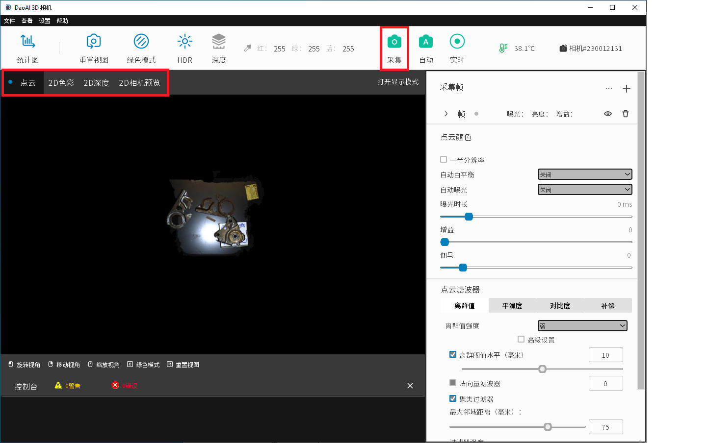

Captures
=========

Performing captures is one of the main features of our Camera Studio software. Camera Studio has 3 capture modes to choose from.

|

Single Capture
---------------
When you click “Capture” on the top bar, the camera will capture images using all the frames and their corresponding settings. For all capture modes, you can view the depth map 
(Depth), color map (Color), and the point cloud map (Point Cloud) by switching between these tabs.

|

Auto Capture
-----
When you click “Auto”, an analysis of the image environment will be conducted and frames will be automatically generated in order to maximize the dynamic range of the final 
image. Then, a single capture will follow using the new frame settings. In this mode, you can also specific the Maximum capture time. This setting will change the maximum 
cumulative exposure time for the frames it can generate based off of the initial analysis.

.. image:: images/auto_capture.png
    :align: center
|

Live Capture
-------------
When you click “Live”, Camera Studio will continuously perform single captures. To stop performing captures, simply click the button again (while Live mode is running).
 

|

Saving and Loading Data
----------------

Users are able to save sets of images generated by captures and then at a later time, load these images to generate point clouds.

If you need to save the captured 2D image, click on the upper left corner "Help" →  System" → Advanced" →  “Save Single Capture Image”, choose the path to save the image (The 
software will generate a subfolder to store the capture image). 

If you need to use saved 2D images to generate point clouds, click on the upper left corner of "Help" →  "System" →  "Advanced" →  "Load Image for Single Capture”, select the 
path folder where the images are loaded. To make sure that the current number of frames is the same as the number of frames in the images folder (and there respective settings), 
click “Capture” to generate the corresponding point cloud image.

.. note:: Note that a password is required in order to access the System panel.

|
