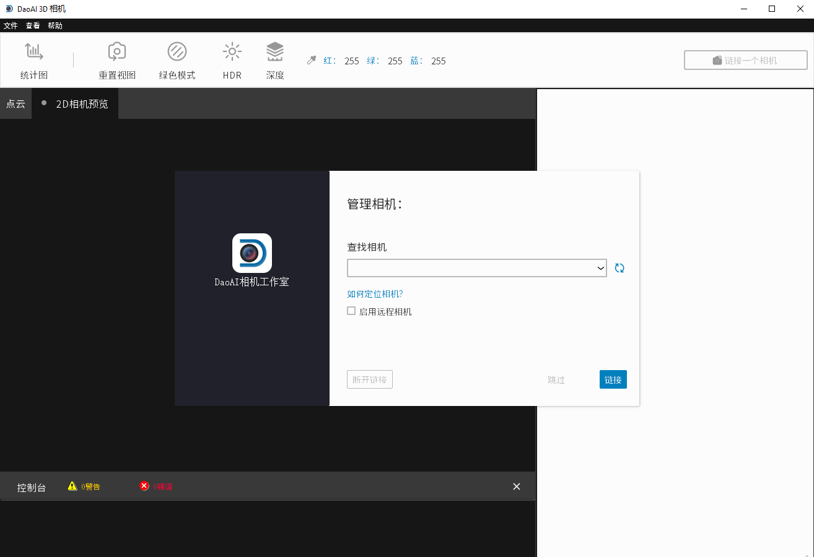
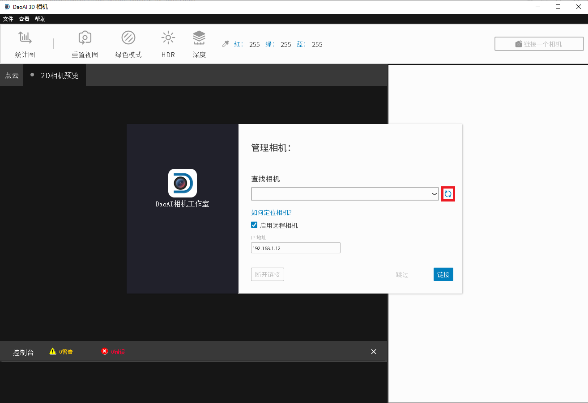
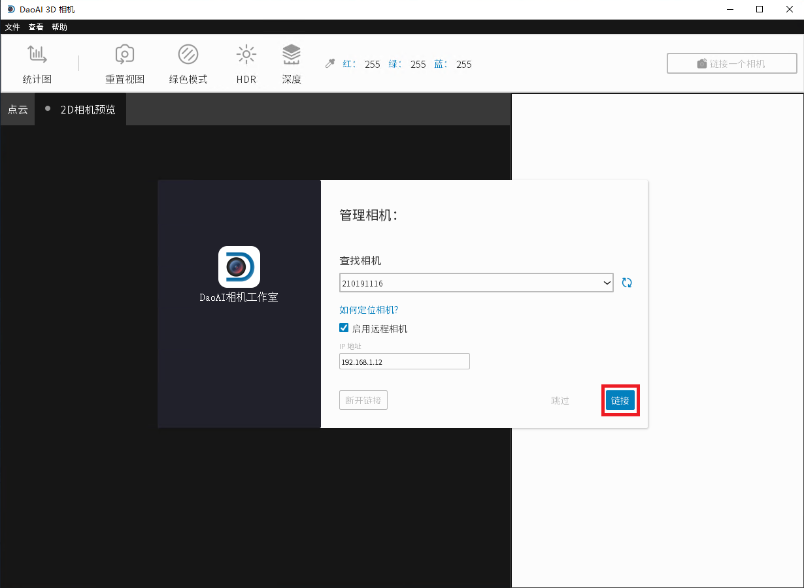
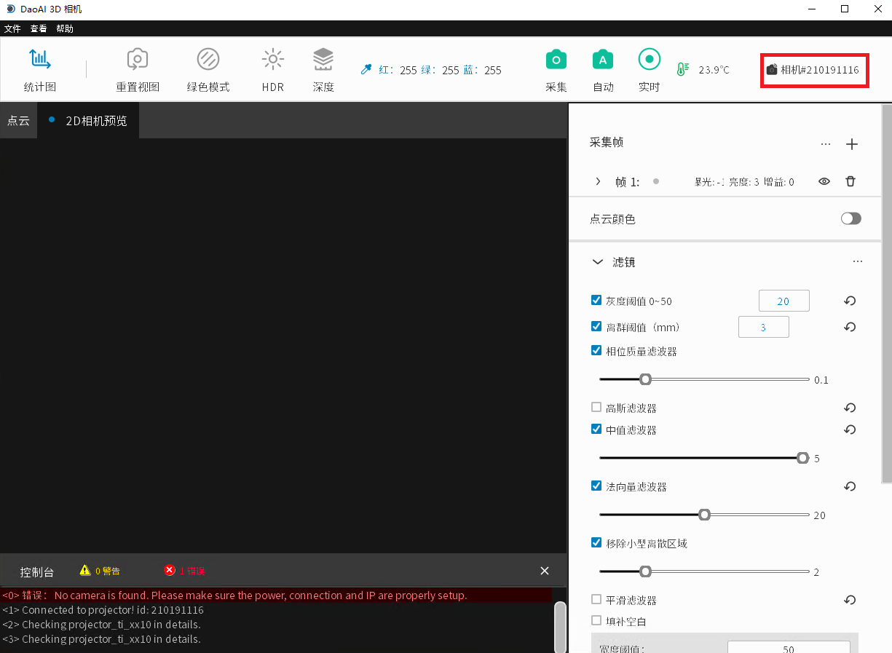
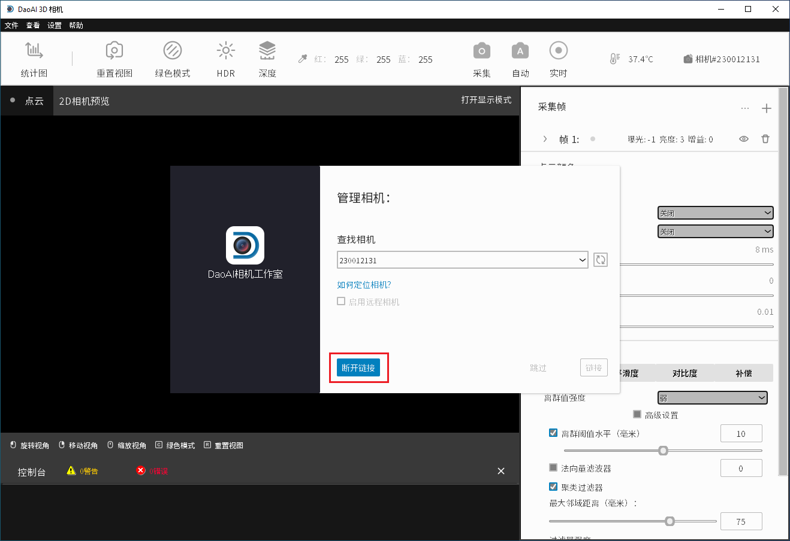

Connecting & Disconnecting Camera
-------------------------------------

The first step of using the DaoAI Camera Studio is to connect your cameras. 

Connecting
~~~~~~~~~~~~~~~~~~~

When starting up the Camera Studio, at first you will see the **Manage Cameras** window.

|

The refresh button updates the list of connected cameras. 

|

If you are using a remote controlled camera, you will have check the *Enable Remote Cameras* checkbox and specify the 
camera's IP address first before clicking refresh.

**Default IP for Remote Camera**
 - **192.168.1.2**: BP-L camera, BP-M camera, BP-S camera, BP-AMR-GPU camera, and IN cameras
 - **192.168.1.12**: BP-AMR camera

Once you detect the camera you wish to connect to, click the **Connect** button. 
If there are multiple cameras connected, you can choose which camera to connect to from the dropdown list.

|

After connecting, you should see the main window.

|

.. Note::
    Normally, if multiple cameras are physically connected, they will all appear in the camera selection list. 
    However, DaoAI Camera Studio only supports establishing a connection with a single camera at a time.
    To capture with multiple cameras using DaoAI Camera Studio, please start another instance of DaoAI Camera Studio and connect the other camera.

Disconnecting
~~~~~~~~~~~~~~~~~~~

To disconnect your camera, first click the camera ID in the top right area of the main window.

|

From there, you should see the **Manage Cameras** window, where you can click disconnect.

|

