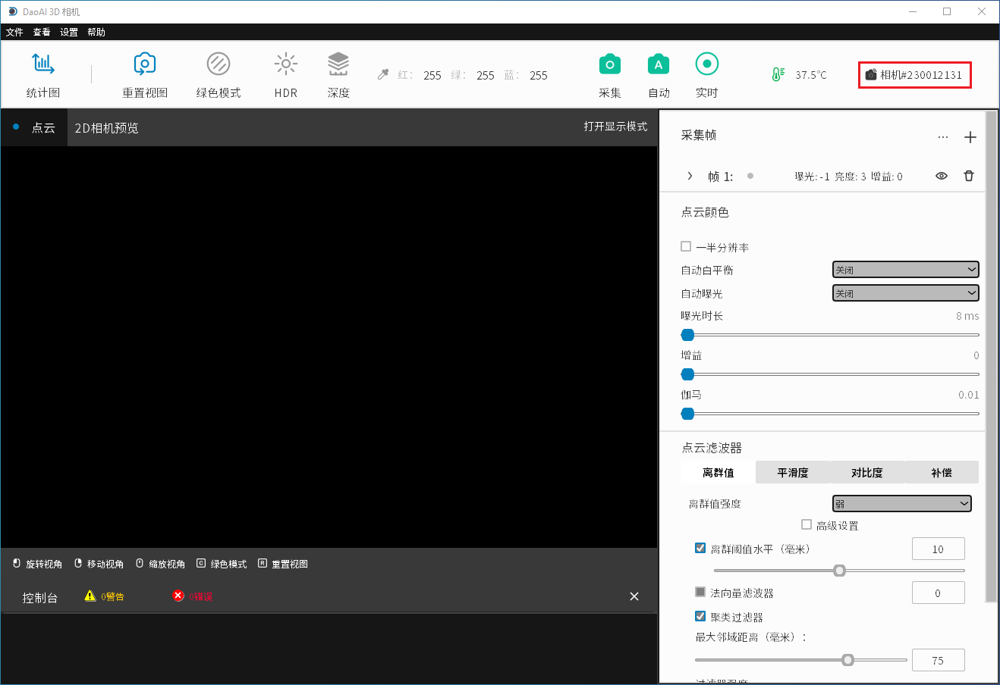

连接和断开摄像机的连接
-------------------------------------

使用DaoAI相机工作室的第一步是连接你的相机。

连接
~~~~~~~~~~~~~~~~~~~

当启动相机工作室时，首先你会看到 **管理相机** 窗口。

.. image:: images/manage_cameras.png
    :align: center

|

刷新按钮会更新所连接的摄像机列表。

|

如果你使用的是远程控制的摄像机，你必须勾选*启用远程摄像机*复选框，并在点击刷新前指定摄像机的IP地址。
摄像机的IP地址，然后再点击刷新。

**远程摄像机的默认IP**。
 - **192.168.1.12**: BP-L camera, BP-M camera, BP-S camera, BP-AMR-GPU camera, and IN cameras
 - **192.168.1.2**: BP-AMR camera

一旦检测到您要连接的摄像机，请单击**连接**按钮。
如果有多台摄像机被连接，你可以从下拉列表中选择要连接的摄像机。

|

连接后，你应该看到主窗口。

|

.. Note::
    通常情况下，如果物理连接了多台摄像机，它们都会出现在摄像机选择列表中。
    然而，DaoAI Camera Studio一次只支持与一台摄像机建立连接。
    要使用DaoAI Camera Studio拍摄多个摄像机，请启动另一个DaoAI Camera Studio实例并连接其他摄像机。

断开连接
~~~~~~~~~~~~~~~~~~~

要断开摄像机的连接，首先点击主窗口右上方的摄像机ID。

|

从那里，你应该看到**管理相机**窗口，在那里你可以点击断开连接。

|

