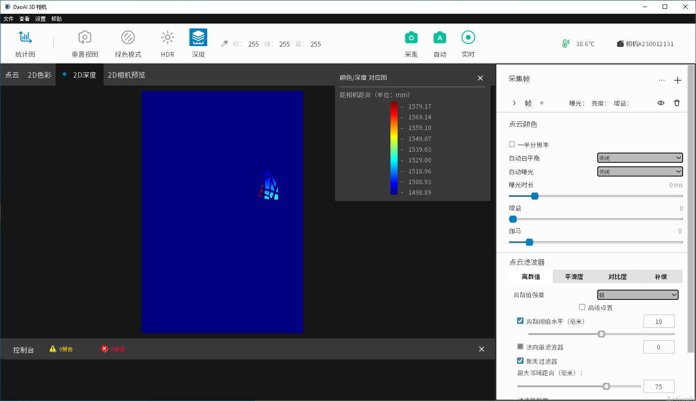

Depth
-------

| The 2D depth display tab encodes the depth values of each valid pixel as its color. 
| Blue represents short distance, red represents long distance from the camera, in unit millimeter. 
| To analyze the specific values, you can toggle the “Depth” button and the depth chart legend will pop up.

