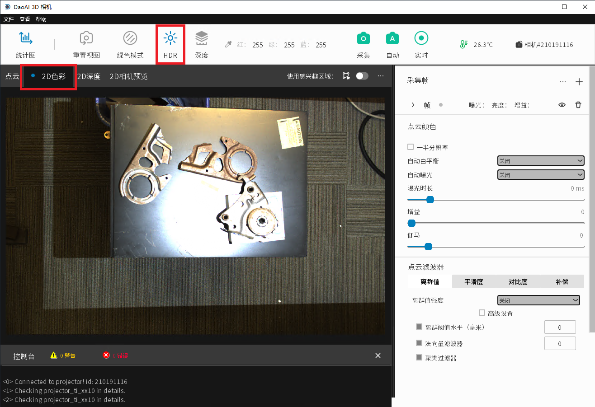
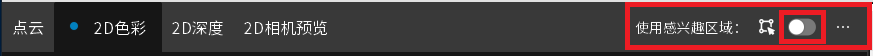
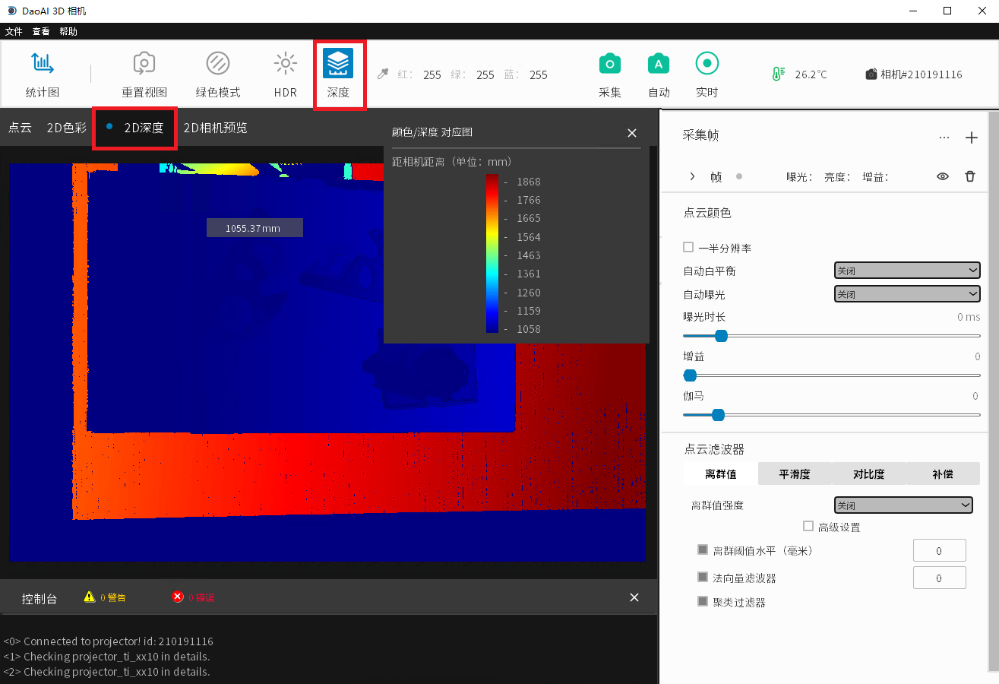

选项显示
=============

可通过多种不同的方式来进行采集数据的可视化。

|

2D 颜色
---------

采集图像可在2D 颜色选项里进行显示，可以选择HDR模式。HDR将更改图像的颜色以最大化其动态范围。HDR在有多帧设定下采集动态范围时十分有用。
我们有多个帧的设置，以捕捉最动态的范围。

|

**感兴趣的区域**

|

感兴趣的区域可以在2D颜色选项中剪裁并显示出来。 您可以单击选项卡右上角的按钮并在图中框选出一个感兴趣的区域。

|

当裁剪了显示区域后，您必须单击“保存区域”来保存它。 现在，只要打开 ROI, 所有未来的捕获都会记住这个保存的区域, 并且只会在“点云”和“2D 颜色”选项卡中显示该区域。 

|

当您决定不再需要此 ROI 时，您可以通过单击切换开关旁边的三个点并单击“删除 ROI”来清除保存的区域。

|

2D 深度选项
-------------

2D 深度显示选项卡将每个有效像素的深度值编码为其颜色。
蓝色代表短距离, 红色代表远距离(以毫米为单位)。
如果要分析具体值, 您可以切换“深度”按钮, 将弹出深度图图例。

您也可以将鼠标移到图片中以显示该点的深度值。

|
.. Display Tabs
.. =============

We provide a variety of different display options to visualize the captured data:

    - Point Cloud 
    - 2D Color
    - 2D Depth
    - 2D Preview
    - Region of Interest

点云
-----

点云选项卡显示来自采集图像的 3D 点云模型。 可以使用鼠标旋转和移动点云视图。

.. image:: images/tab_point_cloud.png
    :align: center
<<<<<<< HEAD:docs/source/detailed-introduction/Display Tabs.rst
=======

|

* The left mouse button rotates the point cloud.
* Right mouse button drags point cloud.
* Mouse wheel zooms in and out of point cloud.
* Keyboard button "c" toggles RGB point cloud and pure green point cloud.
* Keyboard button "r" restores the camera view to its original state. 

The point cloud can also be saved as a .daf, .ply, or .pcd file. This is done under “File” →  “Save 3D Data”. Saving the whiteboard object into ply format can be used to detect 
the accuracy of 3D camera depth measurement. Similarly, a point cloud can be loaded via “File” → “Load 3D Data” - once loaded, the point cloud will be displayed in this tab.

The point cloud's color can be switched between 5 different modes: default color, green mode, HDR, pseudocolor, and mixed color (a combination of the default and pseudocolor 
modes). To change the mode, click the display mode dropdown menu in the Point Cloud tab and select the color type.
>>>>>>> english_review_version_02:docs/source/getting-started/camera-studio-guide/Display Tabs.rst

|

2D Color
----------

The 2D Color tab shows the captured image and in this tab, the HDR mode can be selected. HDR will change the color of the image to maximize its dynamic range. HDR is useful when 
we have multiple frames of with settings to capture the most dynamic range. 

|

2D Depth
---------

The 2D Depth display tab encodes the depth values of each valid pixel as its color. Blue represents a short distance, red represents a long distance (in millimeters) from the 
camera. To analyze the specific values, you can toggle the “Depth” button and the depth chart legend will pop up.

|

You can also hover your mouse over the image to see depth value.

.. image:: images/tab_2d_depth_hover.png
    :align: center

|

<<<<<<< HEAD:docs/source/detailed-introduction/Display Tabs.rst
* 鼠标左键旋转点云。
* 鼠标右键拖动点云。
* 鼠标滚轮放大和缩小点云。
* 键盘按钮“c”切换RGB点云和纯绿色点云。
* 键盘按钮“r”将相机视图恢复到原始状态。 

点云也可以保存为 .daf、.ply 或 .pcd 文件。 这是在“文件”→“保存 3D 数据”下完成的。 将白板对象保存为ply格式可用于检测3D相机深度测量的准确性。 同样，可以通过“文件”→“加载 3D 数据”加载点云——加载后，点云将显示在此选项卡中。 

点云的颜色可以在 5 种不同模式之间切换: 默认颜色、绿色模式、HDR、伪彩、和混合色(默认颜色加伪彩的融合)。 要更改模式，请单击点云选项卡中的显示模式下拉菜单并选择颜色类型。

|

2D 预览
--------

2D相机预览用于提前确认被拍摄物体的位置和图像的RGB值。（例如图片是双目相机视图的预览，您可以将光标悬停在图片中的不同位置查看本地RGB值。）
=======
2D Preview 
-----------
The 2D camera preview is used to confirm the position of the photographed object and the RGB value of the image in advance. 
(For example, the picture is a preview of a binocular 
camera view, you can hover the cursor over to different locations in the picture to view the local RGB values.)
>>>>>>> english_review_version_02:docs/source/getting-started/camera-studio-guide/Display Tabs.rst

.. image:: images/tab_2d_preview.png
    :align: center

|

The 2D Preview feature is used to retrive a preview image of the scene before you perform a capture.

To perform a 2D Preview, click "Show 2D Preview" in the frame drop down menu corresponding to the one you want previewed. The preview will automatically appear in the “2D Camera 
Preview” visual tab. If the frame settings is collapsed, you can click the “eye” icon in order to preview that frame. In the “2D Camera Preview” tab, if the image has red spots, 
that means those pixels are overexposed under the current frame settings.

.. image:: images/2d_preview.png
    :align: center

If there exists a 2D Camera Preview, you can click on the color picker icon in the top bar of the main window in order to find the RGB values of the pixel at your cursor's 
position in the image preview. The values will be updated on the top bar as well as displayed on the bottom left corner.

.. image:: images/2d_preview_rgb.png
    :align: center

|

Regions of Interest
----------------------

|

Regions of interest can be set within the 2D Color tab to select a cropped region of the image to be displayed. You can click the button on the top right of the tab and draw a 
region on the image itself.

.. image:: images/roi_2.png
    :align: center

|

Once you've highlighted a region, you must click “Save Region” to save it. Now whenever ROI is toggled on, all future captures will remember this saved region and will only 
display that region in the “Point Cloud” and “2D Color” tab.

|

When you decide you no longer need this ROI, you can clear the saved region by clicking the three dots beside the toggle switch and clicking “Remove ROI”.

.. image:: images/roi_4.png
    :align: center

|