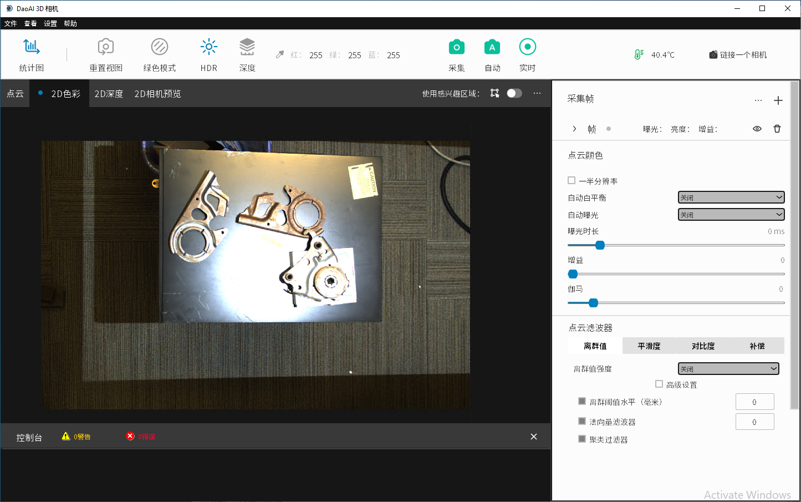

HDR
-----

| The HDR (High Dynamic Range) mode recreates an image by increasing the difference between the darkest and the lightest parts in an image.
| When HDR mode is turned on, the dynamic range of exposure is increased to larger than that of ordinary digital image technology, so that the details of the previous dark parts can be highlighted. 
| On the other hand, if the original image is overexposed, the HDR mode will utilize lower exposure images to recreate the final image.

Below are the same colour image with HDR off and HDR on respectively:

    Colour map with HDR off

    Colour map with HDR on

