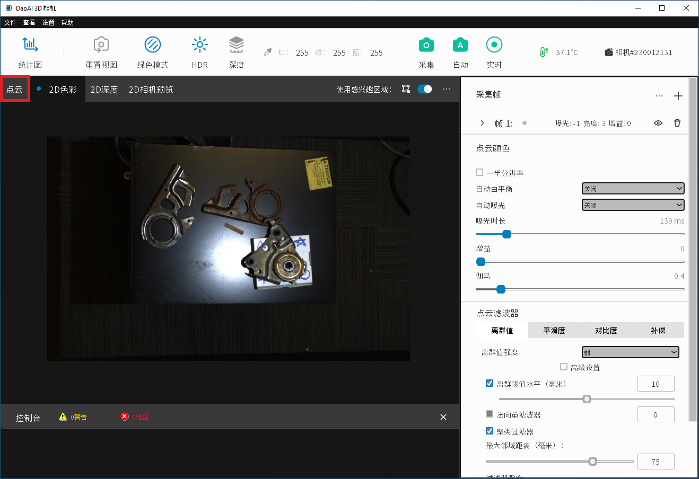

Saving Point Clouds
======================================

This page will provide simple instructions for saving point clouds in DaoAI Camera Studio.

1. Capture an image (see :ref:`Capturing Images`).

2. Select the "Point Cloud" tab to view the captured point clouds (under the "Histogram" button).

3. Select "Files" (the first button in the upper-left corner).

4. Select "Save 3D data" from the File dropdown menu to save the point clouds.
