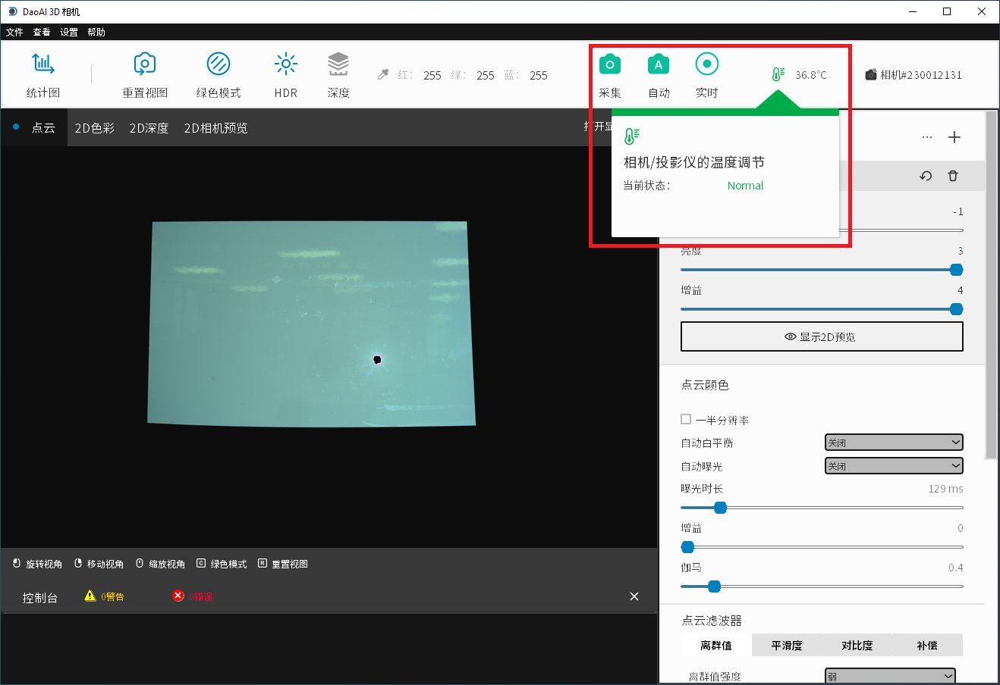
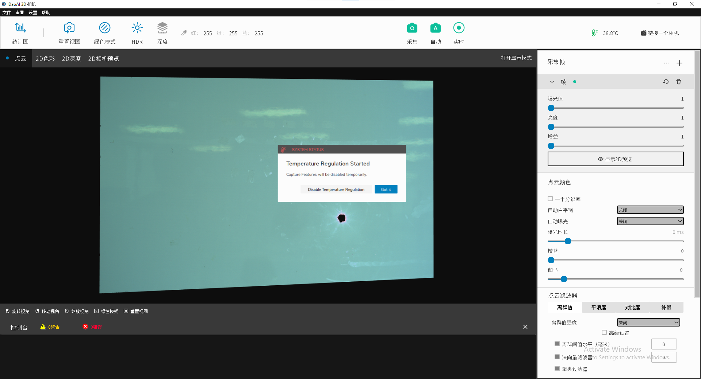
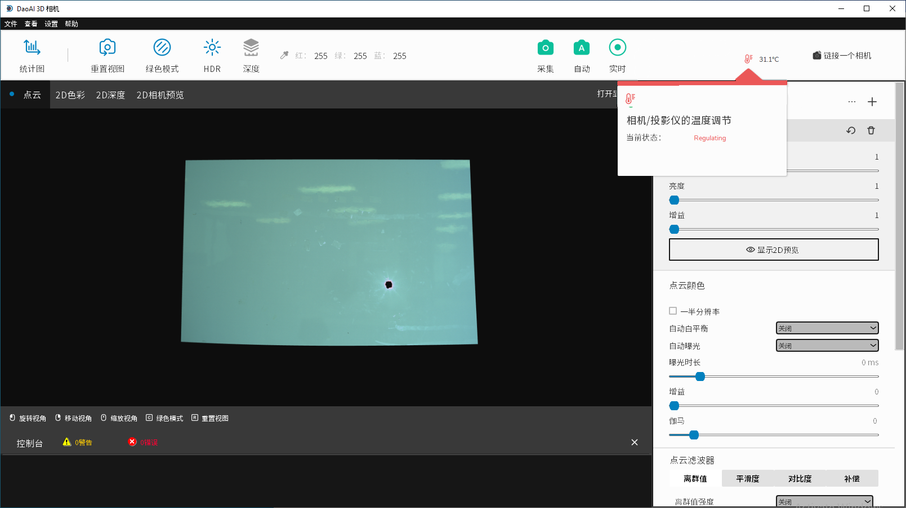
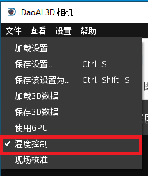

Temperature Regulation
-------------------------

If a temperature sensor is available in your 3D system, the system will display the corresponding temperature in the top right corner of the main menu. By default, if the 
temperature sensor is available, a temperature control system will be enabled. 

**Modes**
There are two modes for temperature control: normal and regulating

**Normal**: This is the regular mode in which all software features are enabled including captures, 2D previewing, etc. While the temperature control status is normal, the 
temperature icon in the main window will appear green.

    Temperature icon is green

**Regulating**: In this mode, the temperature of the system is abnormal and the main capture features (Auto, Live, Capture, Preview) are disabled in order for the system to 
regulate the temperature. When in this mode, a temperature control algorithm will be run in order to normalize the system again. While the temperature control status is 
regulating, the temperature icon in the main window will appear red.

    
    Notification that temperature regulation has started

    Temperature icon is red

While Camera Studio is regulating temperature, some functionality is disabled in order for the temperature regulating feature to work effectively. You will have to wait for the 
temperature to be regulated to a suitable level, or disable the temperature regulation feature before you can use these functionalities are re-enabled.

Disable Temperature Control
~~~~~~~~~~~~~~~~~~~~~~~~~~~~~

When camera's temperature sensor is malfunctioning, you can disable the temperature control to allow normal usage of Camera Studio.

You can click "Disable Temperature Regulation" when the warning dialgue is prompted to disable Temperature Control.

|

Or you can disable Temperature Control from the menu bar: Click on "files -> temperature control" and uncheck it to disable. 

|
