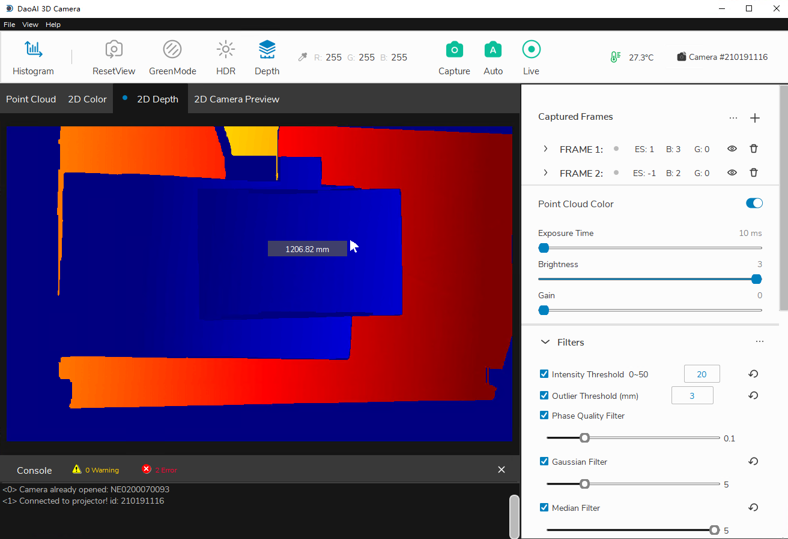
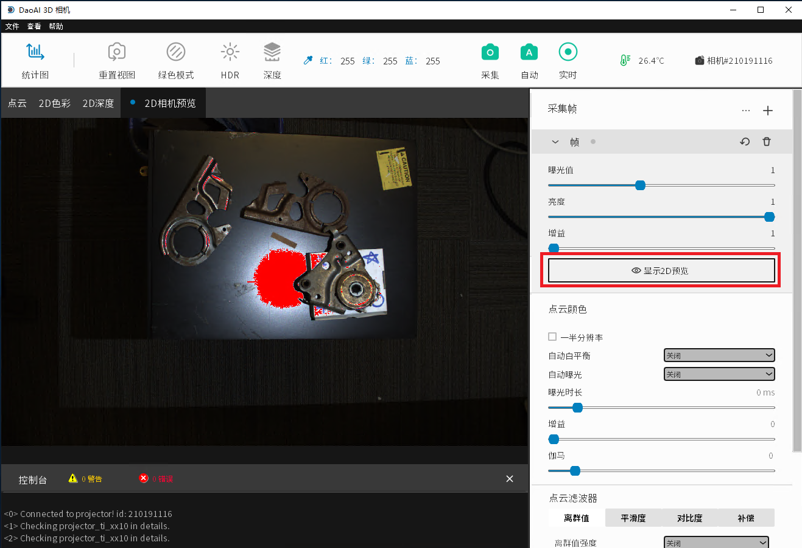
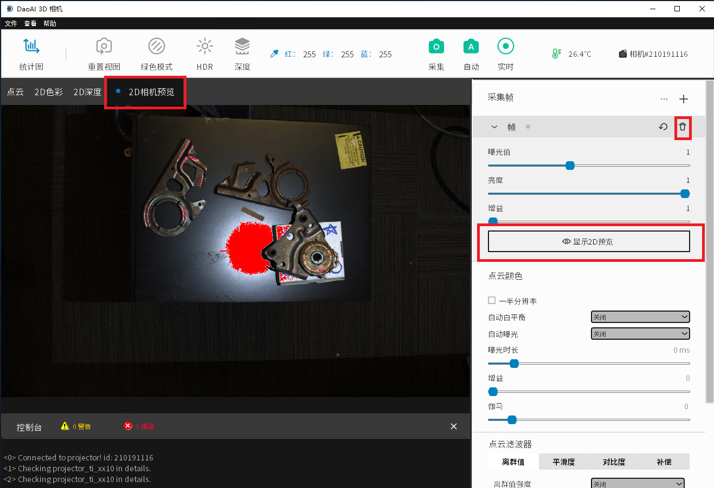
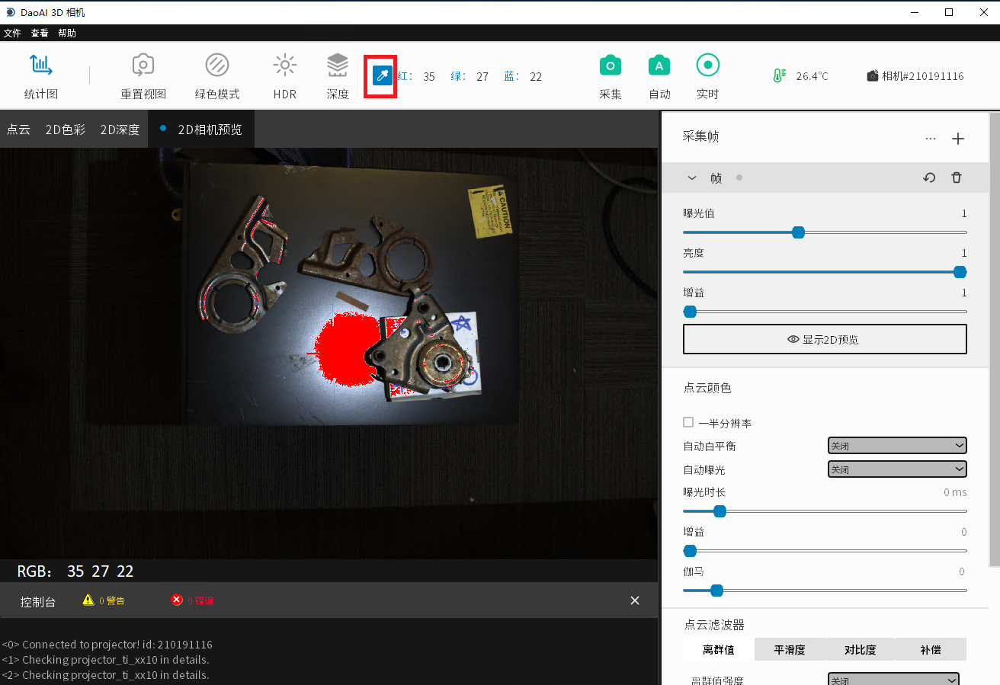
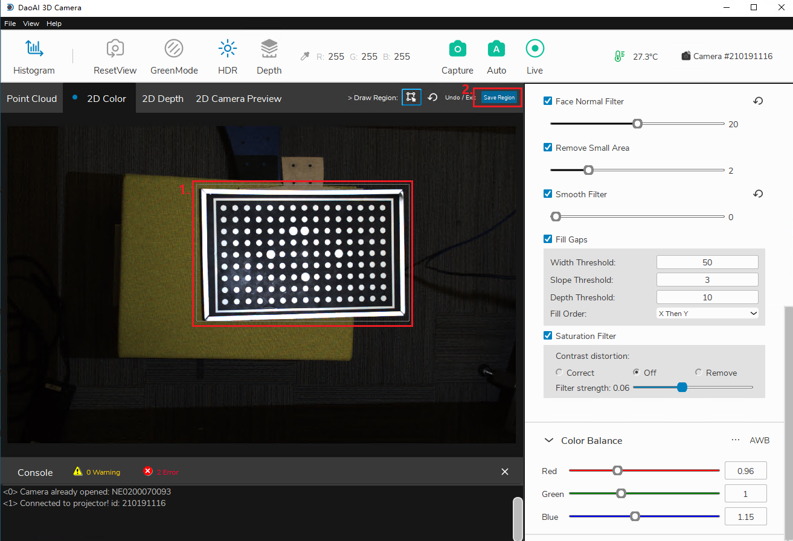
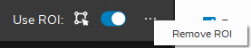

Available Views
================

We provide a variety of different display options to visualize the captured data:

.. contents::
   :local:

Point Cloud
------------
The Point Cloud tab displays the 3D point cloud model from the captured images. The point cloud view can be rotated and moved around using the mouse.

.. image:: images/tab_point_cloud.png
    :align: center

|

* The left mouse button rotates the point cloud.
* Right mouse button drags point cloud.
* Mouse wheel zooms in and out of point cloud.
* Keyboard button "c" toggles RGB point cloud and pure green point cloud.
* Keyboard button "r" restores the camera view to its original state. 

The point cloud can also be saved as a .daf, .ply, or .pcd file. This is done under “File” →  “Save 3D Data”. Saving the whiteboard object into ply format can be used to detect 
the accuracy of 3D camera depth measurement. Similarly, a point cloud can be loaded via “File” → “Load 3D Data” - once loaded, the point cloud will be displayed in this tab.

The point cloud's color can be switched between 5 different modes: default color, green mode, HDR, pseudocolor, and mixed color (a combination of the default and pseudocolor 
modes). To change the mode, click the display mode dropdown menu in the Point Cloud tab and select the color type.

.. image:: images/tab_point_cloud_5_modes.png
    :align: center

|

2D Color
----------

The 2D Color tab shows the captured image and in this tab, the HDR mode can be selected. HDR will change the color of the image to maximize its dynamic range. HDR is useful when 
we have multiple frames of with settings to capture the most dynamic range. 

.. image:: images/tab_2d_color.png
    :align: center

|

2D Depth
---------

The 2D Depth display tab encodes the depth values of each valid pixel as its color. Blue represents a short distance, red represents a long distance (in millimeters) from the 
camera. To analyze the specific values, you can toggle the “Depth” button and the depth chart legend will pop up.

.. image:: images/tab_2d_depth.png
    :align: center

|

You can also hover your mouse over the image to see depth value.

|

2D Preview 
-----------
The 2D camera preview is used to confirm the position of the photographed object and the RGB value of the image in advance. 
(For example, the picture is a preview of a binocular 
camera view, you can hover the cursor over to different locations in the picture to view the local RGB values.)

|

The 2D Preview feature is used to retrive a preview image of the scene before you perform a capture.

To perform a 2D Preview, click "Show 2D Preview" in the frame drop down menu corresponding to the one you want previewed. The preview will automatically appear in the “2D Camera 
Preview” visual tab. If the frame settings is collapsed, you can click the “eye” icon in order to preview that frame. In the “2D Camera Preview” tab, if the image has red spots, 
that means those pixels are overexposed under the current frame settings.

If there exists a 2D Camera Preview, you can click on the color picker icon in the top bar of the main window in order to find the RGB values of the pixel at your cursor's 
position in the image preview. The values will be updated on the top bar as well as displayed on the bottom left corner.

|

Regions of Interest
----------------------

.. image:: images/roi.png
    :align: center

|

Regions of interest can be set within the 2D Color tab to select a cropped region of the image to be displayed. You can click the button on the top right of the tab and draw a 
region on the image itself.

|

Once you've highlighted a region, you must click “Save Region” to save it. Now whenever ROI is toggled on, all future captures will remember this saved region and will only 
display that region in the “Point Cloud” and “2D Color” tab.

.. image:: images/roi_3.png
    :align: center

|

When you decide you no longer need this ROI, you can clear the saved region by clicking the three dots beside the toggle switch and clicking “Remove ROI”.

|