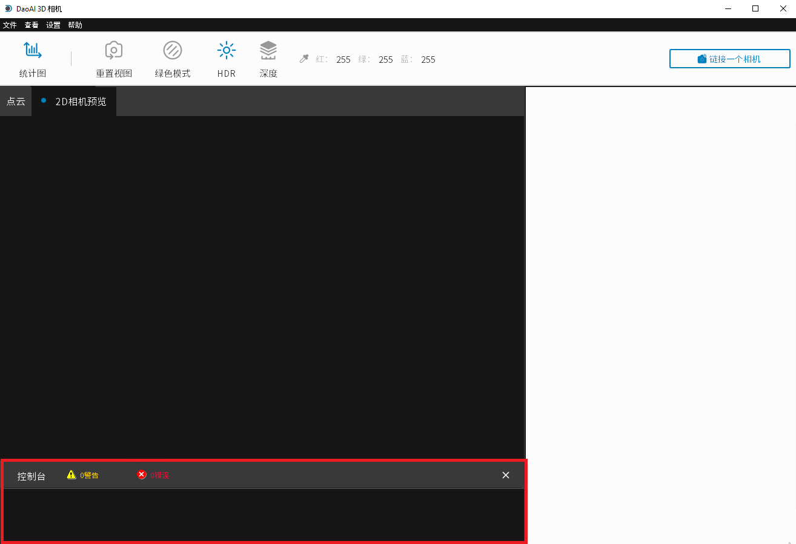
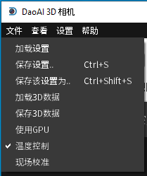

Toolbar
==========

Camera Studio allows you to save and load point cloud data as well as custom capture settings.

Save and Load
--------------

**Load Point Cloud File**

In the upper left corner click “File” →  “Load 3D Data” to select the point cloud file (ending with .daf). Note that the path cannot contain Chinese characters. When a point 
cloud is displayed, the load is successful.

**Save Point Cloud File**

In the upper left corner, after capturing the image to generate the point cloud, click "File" → "Save 3D data" , enter the name of the new file, and click Save.

Save Settings (Export Settings)
-------------------------------

Save settings file: click "File" →  ”Save Setting as" in the upper left corner, enter the name of the new settings file or select the overwritten settings file, and click Save.

Load Settings (Import Settings)
-------------------------------

Make sure the 3D camera is connected, click "File" and ”Load Setting" in the upper left corner, select the settings file (ending with .cfg). Note that the path cannot contain 
Chinese characters.

(The settings file saves the settings of the 3D camera when capturing images, including all the options in the main window and system settings)

Console
------------

|

System information, results, detailed informations, warnings and errors are displayed in the Console.

Message Filtering
~~~~~~~~~~~~~~~~~~~~~~~~~

Click on the yellow warning icon or the red error icon can filter out message other than warning or error. 

.. warning::
    Do not filter console when exporting log files. Log files contain messages from the console and will complete writing to disk upon program exits.  

Hide and Show the Console
~~~~~~~~~~~~~~~~~~~~~~~~~~

Click on the 'X' icon on the top-right corner of the console to hide it.

And from menu bar, click "View → Show Console" to bring it back.

|

Dropdown Menus
---------------

    
    File dropdown menu

|
