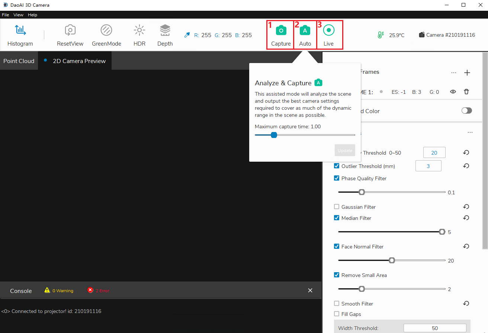

Capturing Images
====================

This page will provide instructions on how perform captures in Camera Studio.

There are three capture modes to choose from in Camera Studio:

|

1. **Capture** performs a single capture using the current frames.
2. **Auto** Use the "Maximum capture time" to allocate number of frames and exposure stop time
3. **Live** performs continuous captures using the current frames.