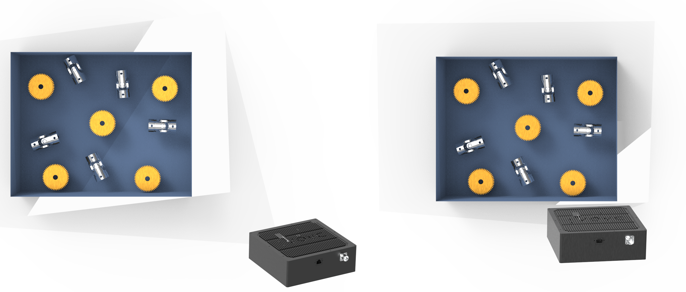

Mechanical Installation
=========================

.. contents:: 
   :local:

Mechanical interface
~~~~~~~~~~~~~~~~~~~~~~~~~~~~~~~~~~~~~~

Dimensions
---------------------------------

.. tabs::

   .. group-tab:: BP SMALL

      .. image:: images/mechanical_interface/amr_1.png
         :align: center
   
      .. image:: images/mechanical_interface/amr_2.png
         :align: center

   .. group-tab:: BP MEDIUM

        .. image:: images/mechanical_interface/medium_1.png
         :align: center
   
      .. image:: images/mechanical_interface/medium_2.png
         :align: center

   .. group-tab:: BP LARGE

       .. image:: images/mechanical_interface/large.png
         :align: center
   
      .. image:: images/mechanical_interface/bp-l.png
         :align: center
         :scale: 40%
   
   .. group-tab:: BP AMR

      .. image:: images/mechanical_interface/amr_1.png
         :align: center
   
      .. image:: images/mechanical_interface/amr_2.png
         :align: center

   .. group-tab:: BP AMR-GPU

      .. image:: images/mechanical_interface/amr_gpu_1.png
         :align: center
   
      .. image:: images/mechanical_interface/amr_gpu_2.png
         :align: center

   .. group-tab:: BP LASER

       .. image:: images/mechanical_interface/large.png
         :align: center
   
      .. image:: images/mechanical_interface/bp-l.png
         :align: center
         :scale: 40%

Mounting Specifications
--------------------------------------

.. tabs::

   .. group-tab:: BP SMALL

        The DaoAI BP SMALL camera has four M5 mounting holes, one Ø5 positioning hole, and one obround alignment hole. To ensure not to damage the threads, we recommend not exceeding the specified maximum torque value when fastening the screws.

       .. image:: images/mechanical_interface/amr_3.png
         :align: center

   .. group-tab:: BP MEDIUM

      The DaoAI BP MEDIUM camera has eight M5 mounting holes, one Ø5 positioning hole, and one obround alignment hole. To ensure not to damage the threads, we recommend not exceeding the specified maximum torque value when fastening the screws.

       .. image:: images/mechanical_interface/medium.png
         :align: center

   .. group-tab:: BP LARGE

      The DaoAI BP LARGE camera has eight M5 mounting holes, one Ø5 positioning hole, and one obround alignment hole. To ensure not to damage the threads, we recommend not exceeding the specified maximum torque value when fastening the screws.

       .. image:: images/mechanical_interface/bp-l_mounting.png
         :align: center

   .. group-tab:: BP AMR

      The DaoAI BP AMR camera has four M5 mounting holes, one Ø5 positioning hole, and one obround alignment hole. To ensure not to damage the threads, we recommend not exceeding the specified maximum torque value when fastening the screws.

       .. image:: images/mechanical_interface/amr_3.png
         :align: center   

   .. group-tab:: BP AMR-GPU

      The DaoAI BP AMR-GPU camera has four M5 mounting holes, one Ø5 positioning hole, and one obround alignment hole. To ensure not to damage the threads, we recommend not exceeding the specified maximum torque value when fastening the screws.

       .. image:: images/mechanical_interface/amr_gpu.png
         :align: center

   .. group-tab:: BP LASER

      The DaoAI BP LASER camera has eight M5 mounting holes, one Ø5 positioning hole, and one obround alignment hole. To ensure not to damage the threads, we recommend not exceeding the specified maximum torque value when fastening the screws.

       .. image:: images/mechanical_interface/bp-l_mounting.png
         :align: center

|

Positioning Correctly
~~~~~~~~~~~~~~~~~~~~~~~~~~~~~~~~~~~~~~
The camera and the projector have an angle with respect to the center axis. This should be considered if it is desired to have the camera perpendicular to the scene.

.. .. tabs::

..    .. group-tab:: BP SMALL

..     .. image:: images/small.png
..         :align: center

..    .. group-tab:: BP MEDIUM

..     .. image:: images/medium.png
..         :align: center

..    .. group-tab:: BP LARGE

..     .. image:: images/large.png
..         :align: center

   
..    .. group-tab:: BP AMR

..     .. image:: images/amr.png
..         :align: center
   

..    .. group-tab:: BP AMR-GPU

..     .. image:: images/amr.png
..         :align: center
   

If possible, mount the camera at a slight tilt angle to avoid reflections and interference from the background. This also frees up space above the scene for easier access for tools and robots. Check out available DaoAI mounts.

Ambient light might reduce performance. Consider blocking direct light affecting the scene.

.. note::
    Camera tilting is more important if the scene contains specular surfaces.

Please checkout  :ref:`Working Distance and Field-of-View`  Working Distance and Camera Positioning for more information on how to correctly position your camera.

In bin-picking applications
----------------------------------

For bin-picking applications, place the DaoAI BP camera projector above the back edge or above the rear corner of the bin (see images below). Pan and tilt it so that the 2D camera is looking at the center of the bin. The projector rays should not fall on the inner surfaces of the two walls closest to the projector; they should almost be parallel to those two walls. Mounting the camera this way minimizes inter reflections from the bin walls.

Cooling clearance
----------------------------------
DaoAI BP LARGE cameras use active and passive cooling, other BP cameras use passive cooling, they all allow some space around the device for airflow, and do not block the air opening on its front and rear sides. See the datasheets for the operating temperature range for your camera.

Signal protection
---------------------------------
Do not install DaoAI BP cameras and cables next to high voltage devices that can generate high levels of electromagnetic disturbance. Do not route camera cabling through the same trunks/conduits with AC power cables and cables emitting high levels of disturbance.

Continue reading about :ref:`Connectivity and Power Supply`.

|

Working Distance and Field-of-View
~~~~~~~~~~~~~~~~~~~~~~~~~~~~~~~~~~~~~~
This series has five bin-picking camera models for various workspace sizes and applications such as bin picking, palletizing, and part loading.

**BP ARM/AMR-GPU**

.. image:: images/wd_and_fov/amr_distance.png
   :align: center

**BP SMALL**

**BP MEDIUM**

.. image:: images/wd_and_fov/medium_distance.png
   :align: center

**BP LARGE**

.. image:: images/wd_and_fov/large_distance.png
   :align: center

**BP LASER**

.. image:: images/wd_and_fov/laser_distance.png
   :align: center   

|