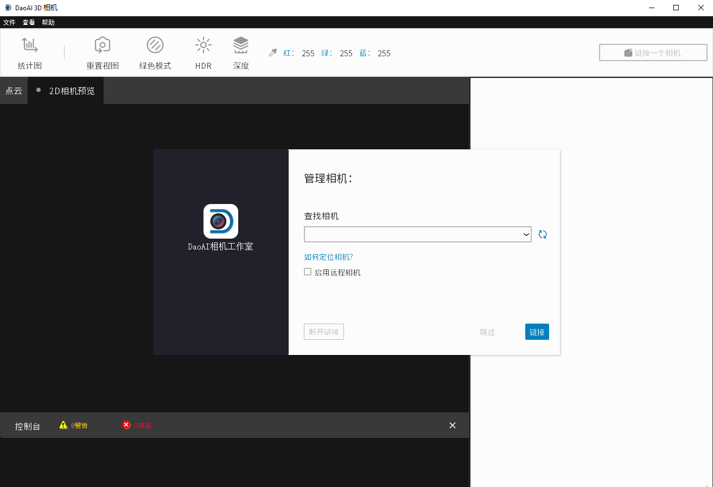

Software Installation
======================

Before Installing the DaoAI Camera Studio Software:

- Check the GPU Requirements
- Check GPU driver is up to date
- Verify that OpenCL driver is installed

Installation Steps:

1. Download the latest DaoAI Camera Studio Software Installer.

2. Run the full installer that starts with DaoAI_Studio. (e.g. DaoAI_Studio_2.22.10.0_103_full.exe)

3. Follow the steps. You can customize the settings as you see fit.

.. image:: images/software_installation_2.png

4. Click "Install", the the installation will begin. Note that the installation could take up to a few minutes to complete. 

.. image:: images/software_installation_3.png

5. Click "Finish", and the software installation process is completed.

.. image:: images/software_installation_4.png

6. If you have the "Launch DaoAI 3D EN.exe" checkbox selected (default), you will be greeted with the DaoAI Camera Studio startup window.

