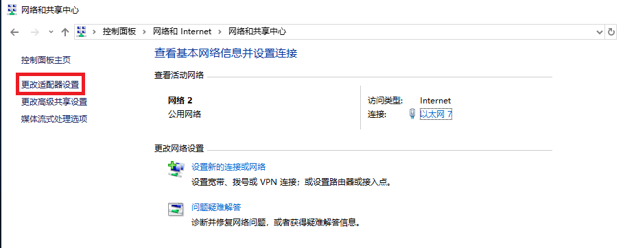
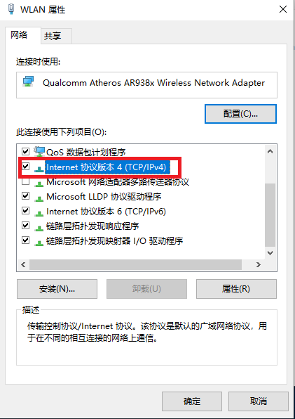
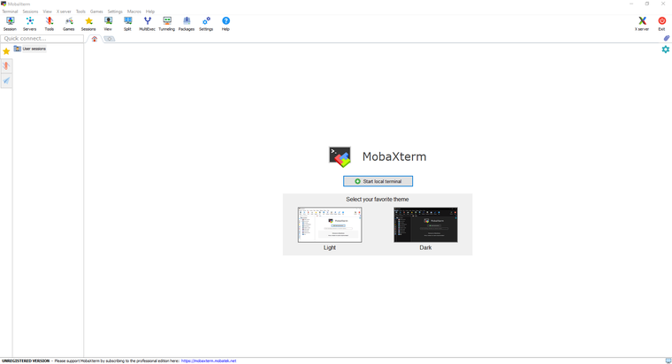

======================
Software Installation
======================

Before Installing the DaoAI Camera Studio Software:

- Check the GPU Requirements (GTX 1050 Ti)
- Check GPU driver is up to date

Installation Steps:

1. Download the latest DaoAI Camera Studio Software Installer.

2. Run the full installer that starts with DaoAI_Studio. (e.g. DaoAI_Studio_2.22.10.0_103_full.exe)

3. Follow the steps. You can customize the settings as you see fit.

.. image:: images/software_installation_2.png

4. Click "Install", the the installation will begin. Note that the installation could take up to a few minutes to complete. 

.. image:: images/software_installation_3.png

5. Click "Finish", and the software installation process is completed.

.. image:: images/software_installation_4.png

6. If you have the "Launch DaoAI 3D EN.exe" checkbox selected (default), you will be greeted with the DaoAI Camera Studio startup window.

.. image:: images/software_installation_5.png

|

Network Configuration
========================

Default Configuration
~~~~~~~~~~~~~~~~~~~~~~~~~~~~~~~

.. list-table::
   :widths: 25 25 25
   :header-rows: 1

   * -  
     - IP
     - Subnet mask
   * - BP-AMR
     - 192.168.1.12
     - 255.255.255.0
   * - Other BP Series
     - 192.168.1.2
     - 255.255.255.0
     
| Any IP address in the subnet range is valid (e.g. For BP series camera: 192.168.1.0 - 192.168.1.255).
| If you have not configured the camera IP address before, the camera's IP address will be the default IP address as in the above table.

Static IP Network Configuration - PC
~~~~~~~~~~~~~~~~~~~~~~~~~~~~~~~~~~~~~~

Navigate to: 

Control Panel → Network and Internet → Network and Sharing Center → Change Adapter Settings.

Right click → Properties.

.. image:: images/control_panel_change_adapter_settings_properties.png

Double click Internet Protocol Version 4 (TCP/IPv4).

| Select **Use the following IP address** → set the IP address to 192.168.1.x. 
| If this is the first time you are setting up the camera, the IP address should be any number other than 2 (e.g. enter 192.168.1.9).
| Enter Subnet mask: 255.255.255.0

.. image:: images/control_panel_change_adapter_settings_ipv4_OK.png

Click **OK** to finish configuration.

.. note:: 
  Please make sure the IP addresses of all connected cameras are different from each other, otherwise you may run into problem when trying to connect :ref:`multiple cameras <Using Multiple DaoAI Cameras>`.

|

Check Cameras' IP Addresses
~~~~~~~~~~~~~~~~~~~~~~~~~~~~~~~~~~~~~~
If you don't know a camera's IP address, you can use `MobaXterm <https://mobaxterm.mobatek.net/download-home-edition.html>`_ to check.

Open MobaXterm.

From **Tools** dropdown list, select **Network Scanner**.

.. image:: images/x_tools.png

Input **192.168.1.1 --> 254** in **IP Address Range**, then click **Start Scan**.

.. image:: images/x_scan.png

After scanning, it will list all discoverable IP addresses in the local network. 

|

    