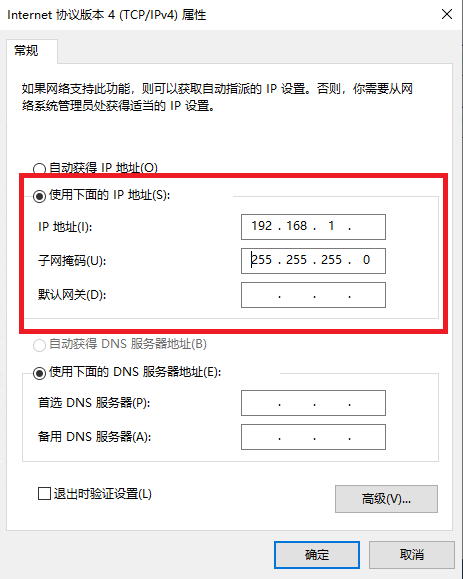

.. _Network Configuration:

Network Configuration
========================

Default Configuration
~~~~~~~~~~~~~~~~~~~~~~~~~~~~~~~

.. list-table::
   :widths: 25 25 25
   :header-rows: 1

   * -  
     - IP
     - Subnet mask
   * - BP Series
     - 192.168.1.2
     - 255.255.255.0
   * - IN Series
     - 
     - 

| Any IP address in the subnet range is valid (e.g. For BP series camera: 192.168.1.0 - 192.168.1.255).
| If you have not configured the camera IP address before, the camera's IP address will be the default IP address as in the above table.

Static IP Network Configuration - PC
~~~~~~~~~~~~~~~~~~~~~~~~~~~~~~~~~~~~~~

This step is necessary for using :ref:`multiple cameras <Using Multiple DaoAI Cameras>`. 

Navigate to: 

Control Panel → Network and Internet → Network and Sharing Center → Change Adapter Settings.

.. image:: images/control_panel_change_adapter_settings.png

Right click → Properties.

.. image:: images/control_panel_change_adapter_settings_properties.png

Double click Internet Protocol Version 4 (TCP/IPv4).

.. image:: images/control_panel_change_adapter_settings_ipv4.png

| Select **Use the following IP address** → set the IP address to 192.168.1.x. 
| If this is the first time you are setting up the camera, the IP address should be any number other than 2 (e.g. enter 192.168.1.9).
| Enter Subnet mask: 255.255.255.0

Click **OK** to finish configuration.

.. note:: 
  Please make sure the IP addresses of all connected cameras are different from each other, otherwise you may run into problem when trying to connect :ref:`multiple cameras <Using Multiple DaoAI Cameras>`.

Version History
~~~~~~~~~~~~~~~~~~~

.. list-table::
  :widths: 25 150
  :header-rows: 1

  * - SDK
    - 
  * - Changes
    - 