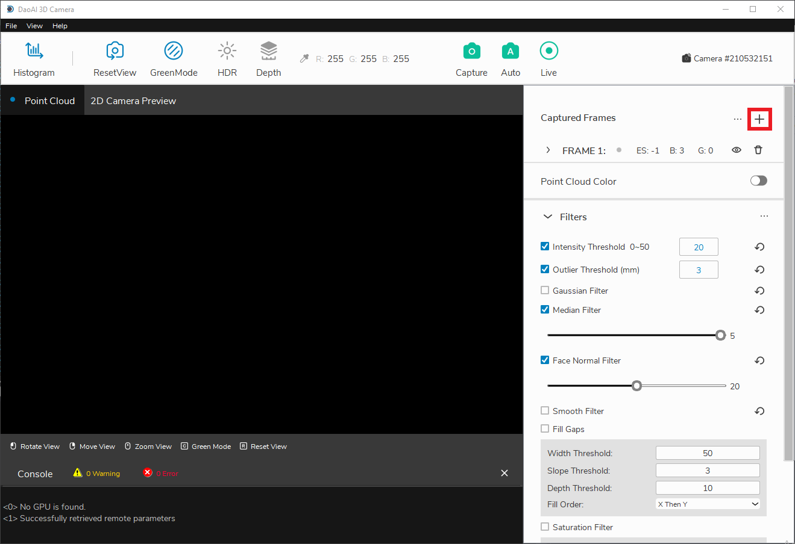
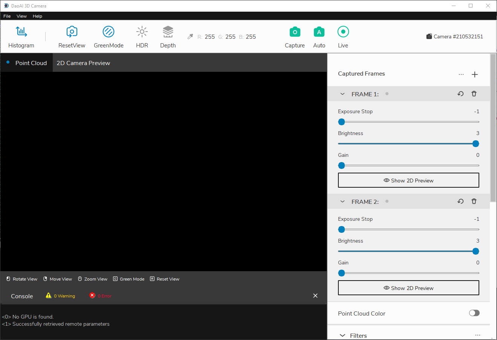

Adding Frames
==============

This page will provide instructions on how to add frames.

|

Frames are used to control the capture settings, allowing you to alter properties like exposure stop, brightness, and gain. By adding additional frames, you can capture multiple 
sets of images for each capture.

In the right panel of the main window, you should see the existing frames. If you haven't made any changes, there should be just one frame. To add another frame, click the plus 
button.

|

You can edit the settings of the existing frames by clicking their drop downs and adjusting the sliders.

|

After you have all the frames you need, you can start doing captures using these different frame settings.