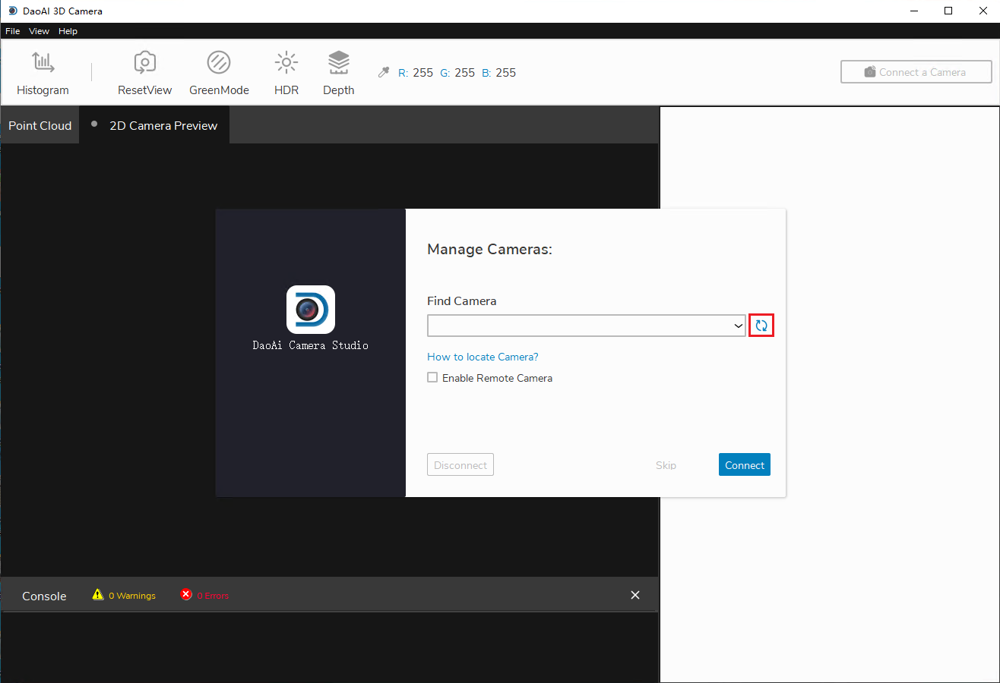

连接相机
===============

本页将提供有关如何将相机连接到三维视觉感知系统软件的说明。

|

连接
-----------

在连接三维感知视觉软件时首先应该可看到“相机管理”界面

.. image:: images/manage_cameras.png
    :align: center

|

刷新按钮会更新相机列表。

|

如果需要连接网口相机，需要使用相机软件远程功能的。勾选 “使用远程相机” 并且输入相机IP。

**网口相机的默认IP**
 - 192.168.1.12: BPL相机，BPM相机，BPS相机，BP-AMR-GPU相机，IN的所有相机;
 - 192.168.1.2: BP-AMR相机

.. image:: images/manage_cameras_remote.png
    :align: center

|

当探测到了想要连接的相机后， 点击连接按钮。如果有多个可连接相机的话，可以从列表里选择特定一个相机来连接。 

.. image:: images/manage_cameras_connect.png
    :align: center

|

连接后，应该可以看到主窗口。

|

断连
--------------

断连时首先要在主窗口的右上方的区域点击相对应的相机ID.

.. image:: images/main_window_camera_id.png
    :align: center

|

然后看到“管理相机” 窗口，点击断连。

.. image:: images/manage_cameras_disconnect.png
    :align: center

|
