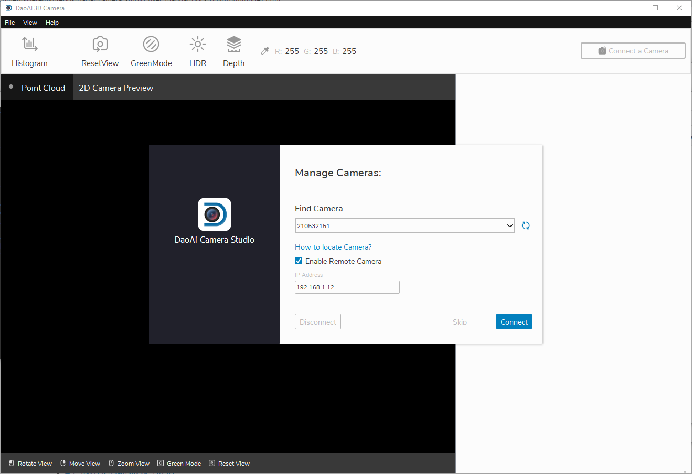
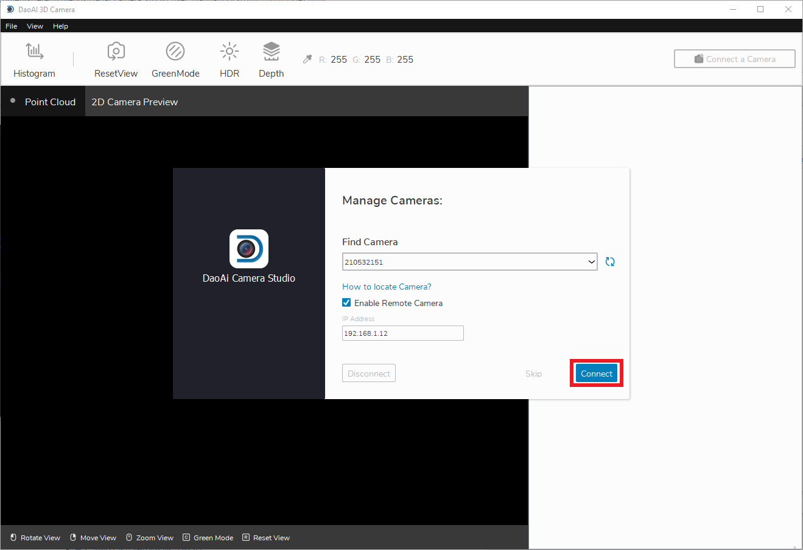

Connecting the Camera
===============

This page will provide instructions on how to connect the camera to the Camera Studio software.

|

When starting Camera Studio, at first you will see the *Manage Cameras* window.

.. image:: images/manage_cameras.png
    :scale: 50%	
    :align: center

|

If you are using a remote controlled camera, you will have check the *Enable Remote Cameras* checkbox and specify the camera's IP address.

|

To detect connected cameras, click the refresh button and wait for the camera list to be updated.

|

Once you find the camera you wish to connect, select it from the list and click the connect button.

|

After connected, you should see the main window.
