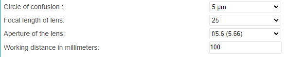
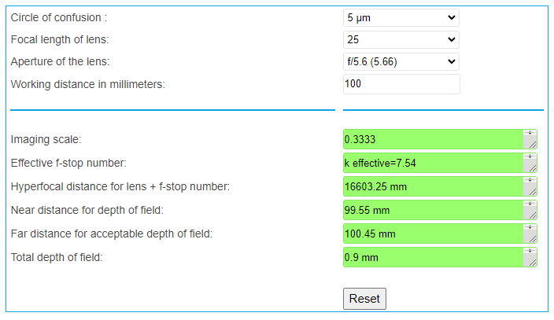

Calculator
=============

Calculate Depth of View
---------------------------

The depth of field (DOF) is the range within which the object can move away from or towards the camera without resulting in a blurred image. 
The calculator below estimates the depth of field, which can guide you to position your camera and object.

Inputs
~~~~~~~~~~~

- Circle of Confusion (in micrometers, μm)

.. note:: 
    If you have ``acceptable blur radius`` > 1, then you multiply the ``Circle of Confusion`` by ``acceptable blur radius``.

- Focal length of lens (in millimeters, mm)

- aperture of the lens

- Working distance in millimeters

How to Use the Calculator
~~~~~~~~~~~~~~~~~~~~~~~~~~~~~~~

Goto the `Calculator Page <https://www.vision-doctor.com/en/optical-calculations/calculation-depth-of-field.html>`_

Enter values for all input fields, and the result will be displayed as the following image.

You may refer to camera defualt settings for your inputs.

.. list-table:: 
   :header-rows: 1

   * - Models
     - BP AMR
     - BP AMR-GPU
     - BP-S
     - BP-M
     - BP-L
   * - Circle of Confusion
     - 
     - 
     - 
     - 
     -
   * - Focal Length of Lens
     - 
     - 
     - 
     - 
     -
   * - Aperture of the Lens
     - 
     - 
     - 
     - 
     -
   * - Working Distance (mm)
     - 500-1000
     - 500-1000
     - 500-1000
     - 800-1800
     - 1000-3000

Camera Selection Tool
------------------------

The following html page will help you figure out which camera is suitable for your need.

`Camera Selection Tool <../../_static/cameraSelect.html>`_