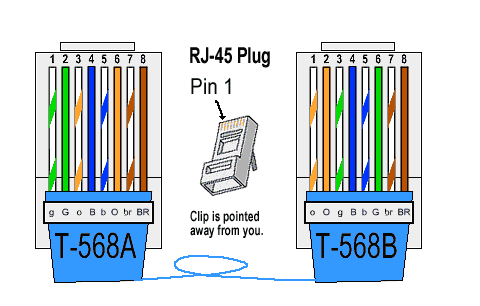
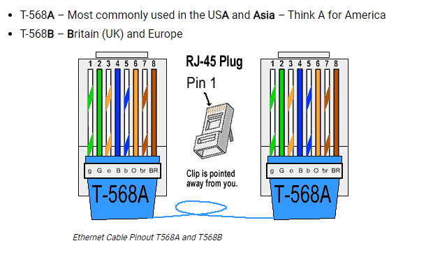
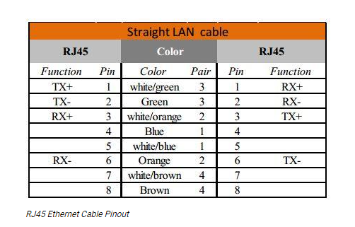

Ethernet cables
==================================

**What is a Cat6 Ethernet Cable?**

Cat6 Ethernet cables consist of four twisted pairs of copper wire and 250 MHz of bandwidth, supporting data transfer speeds of up to 10 Gbps (10GBASE-T) for distances up to approximately 180 feet.

Cat6 cables use the same RJ-45 jack as Cat5 cables and previous generations of Ethernet cables. In fact, Cat6 cables have backwards compatibility with Cat5/5e and Cat3 cables.

When used at 328 feet, the maximum data transfer speed drops to approximately 1 Gbps. They are up-to-spec for applications with substantial data transfer needs, including: Internet of Things (IoT) setups like smart homes, school/enterprise networking setups and data centers. Cat6 cables are now the global standard for Ethernet cables.

**What is a Cat6a Ethernet Cable?**

Cat6a (the “a” stands for “augmented”) cables have thicker, heavier construction than standard Cat6 cables, and individual pairs may also have metal shielding to reduce interference even further. Cat6a cables support 10 Gbps internet up to 328 feet at a maximum bandwidth of 500MHz, double the bandwidth of Cat6. These cables have stringent cable termination requirements and must comply with ANSI/TIA-568 standards. Cat6a have backwards compatibility with Cat6 and Cat6e cables due to their shared RJ-45 jack.

Cat6a cables shine when it comes to applications outside data and telephony; namely, automation and physical security systems like access control and CCTV. They're commonly used in networks with heavy data use but not necessarily needing the more expensive fiber optic cables, including healthcare and higher education. 

**What are the Advantages of a Cat6 Ethernet Cable?**
Compared to Cat5/5e cables, Cat6 cables have stricter performance specifications and significantly higher data transfer speeds at greater distances. They are more tightly wound than Cat5 cables, and the cable conductors and cable sheath are thicker as well.

These factors work in tandem to reduce interior and exterior signal/EMI interference to a greater extent than Cat5 cables. This could be a great solution for networking in industrial settings where motors, generators or wireless devices could be causing significant signal interference.

**What are the Disadvantages of a Cat6 Ethernet Cable?**

Cat6 cables are more expensive than Cat5 cables (usually about 10-20% more than Cat5e) and tend to be more than what most homes need today. However, that doesn't mean they won't be needed 5-10 years from now as connected IoT homes become more commonplace.

For networks transferring terabytes of data or experiencing excess signal noise, Cat6 cables are the way to go. If you want a cable with optimal performance and have the cash and want to futureproof your IT infrastructure, go Cat6. Keep in mind if space is limited, the additional thickness and insulation of Cat6 cables may be of concern: the additional stiffness/thickness also makes the cable less flexible and harder to work with. Cat6a cables are around 40-50% thicker and heavier than Cat6 and even more expensive.

**RJ45 Pinout Ethernet Cables**

**RJ45 Ethernet Cable Pinout**

Ethernet LAN cables can come in two types - Crossover or Straight through. Most modern communications equipment can auto-sense which type you are using, but some still need the correct cable pinout. The following are the pinouts for the RJ45 connectors so you can check which one you have or make up your own. It doesn't matter if you make up some Cat5e, Cat6, and Cat7 cables. The pinout is always the same for Ethernet cables.

**Straight Through LAN Cable Pinout**

Straight through LAN cables are the most common, and the pinout is the same if they are Cat5e, Cat6, or Cat 7. The different types of cables (category or cat) offer increasingly faster transmit and receive speeds. This is achieved by increasing the wire twists, better shielding, drain wire, and increased diameter.

There are two different pinout standards used worldwide, and depending on your location, you will determine which one you should use. An easy way to remember the two different RJ45 connector pinouts is T568A is used in America and Asia, and T568B is used in Britain(UK) and Europe. The different pinouts will still work if you mix them up.

**RJ45 Pinout for a LAN Cable**

- Pin 1 → White and Green (Transmit +) wire

- Pin 2 → Green (Transmit -) wire

- Pin 3 → White and Orange (Receive +) wire

- Pin 4 → Blue wire

- Pin 5 → White and Blue wire

- Pin 6 → Orange (Receive -) wire

- Pin 7 → White and Brown wire

- Pin 8 → Brown wire

**How to Crimp an RJ45 Ethernet Cable**
Follow these steps to make sure you make the perfectly crimped RJ45 connector:

1. Trim the outer sheath back about 10mm to expose the inner conductors.
2. Trim off any nylon strands or wire guides.
3. Straighten the wires.
4. Sort them out to the correct color codes for the pinout.
5. Snip the wires so they are all the same length.
6. Push the wires into the connector.
7. Make sure the outer sheath is inside the RJ45 crimp.
8. Crimp the connector.
9. Test the Ethernet cable.

**What is the Maximum Length of an Ethernet Cable?**
The recommended maximum length for any structured cabling is 100m. This includes 5m of patch cables at either end of the cable run, so the fixed cabling's actual distance is 90m. Anything over this distance will introduce interference and losses on the cable, which will be seen as errors, dropped traffic packets, and reduced throughput.

Structured Cabling = 90m

LAN Patch Cables = 2 x 5m

It's good installation practice to keep the cable runs as short as possible and avoid unnecessary excessive service loops of cable.

